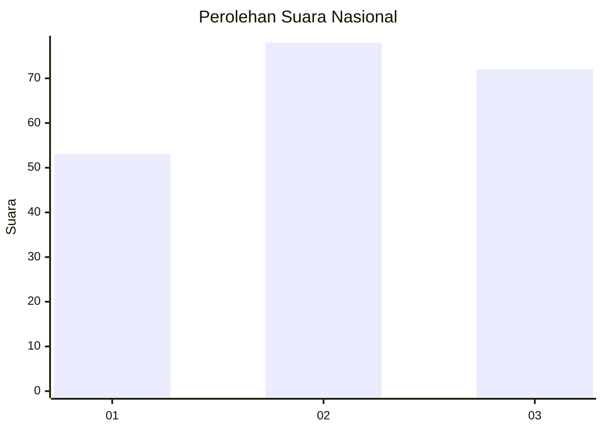
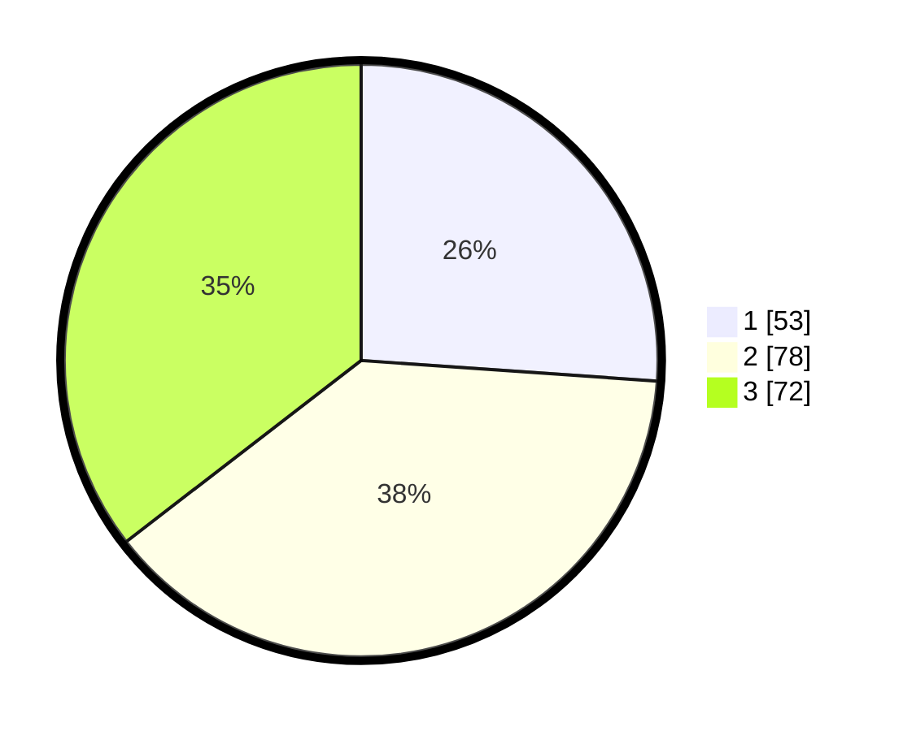

# Hasil

## Grafik

## Tabel

| No. | Nama Paslon    | Suara | Suara (raw) | Persentase |
|:--- |:-------------- | -----:| -----------:| ----------:|
| 1   | ANIES MUHAIMIN | 53    | [53][p-1]   | 26,11      |
| 2   | PRABOWO GIBRAN | 78    | [78][p-2]   | 38,42      |
| 3   | GANJAR MAHFUD  | 72    | [72][p-3]   | 35,47      |

[p-1]: https://github.com/gigit-pemilu/pemilu-2024/blob/main/pilpres/hitung-suara/sub/99-luar-negeri/sub/81-new-york-amerika-serikat/sub/01-new-york-amerika-serikat/sub/0001-new-york-amerika-serikat/sub/003-tps-002/sub/paslon-1.txt
[p-2]: https://github.com/gigit-pemilu/pemilu-2024/blob/main/pilpres/hitung-suara/sub/99-luar-negeri/sub/81-new-york-amerika-serikat/sub/01-new-york-amerika-serikat/sub/0001-new-york-amerika-serikat/sub/003-tps-002/sub/paslon-2.txt
[p-3]: https://github.com/gigit-pemilu/pemilu-2024/blob/main/pilpres/hitung-suara/sub/99-luar-negeri/sub/81-new-york-amerika-serikat/sub/01-new-york-amerika-serikat/sub/0001-new-york-amerika-serikat/sub/003-tps-002/sub/paslon-3.txt

## Foto C Plano

https://sirekap-obj-formc.kpu.go.id/afaa/pemilu/ppwp/99/81/01/00/01/9981010001003-20240216-071046--f057f1b2-1a17-4a86-94c4-09242d34f7a4.jpg

https://sirekap-obj-formc.kpu.go.id/afaa/pemilu/ppwp/99/81/01/00/01/9981010001003-20240216-071151--9e2ab95d-e40a-4402-a86d-c0a5d4371465.jpg

https://sirekap-obj-formc.kpu.go.id/afaa/pemilu/ppwp/99/81/01/00/01/9981010001003-20240216-071711--1cf71174-e7ec-43df-9b24-7b7cac48cd79.jpg

## Metadata

| Key        | Value               |
| ---------- | ------------------- |
| Time Stamp | 2024-02-16 08:00:28 |

## DATA PEMILIH TETAP

Jumlah pemilih dalam DPT: **499**.
 * L: **237**.
 * P: **262**.

## DATA PENGGUNA HAK PILIH

Jumlah pengguna hak pilih dalam DPT: **59**.
 * L: **23**.
 * P: **36**.

Jumlah pengguna hak pilih dalam DPTb: **61**.
 * L: **27**.
 * P: **34**.

Jumlah pengguna hak pilih dalam DPK: **94**.
 * L: **44**.
 * P: **50**.

Jumlah pengguna hak pilih: **214**.
 * L: **94**.
 * P: **120**.

## JUMLAH SUARA SAH DAN TIDAK SAH

JUMLAH SELURUH SUARA SAH: **203**.

JUMLAH SUARA TIDAK SAH: **11**.

JUMLAH SELURUH SUARA SAH DAN SUARA TIDAK SAH: **214**.

