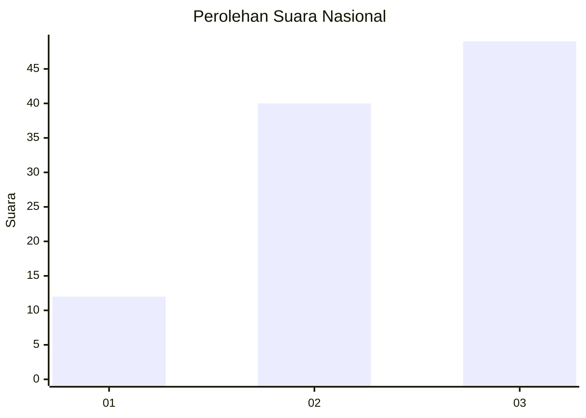
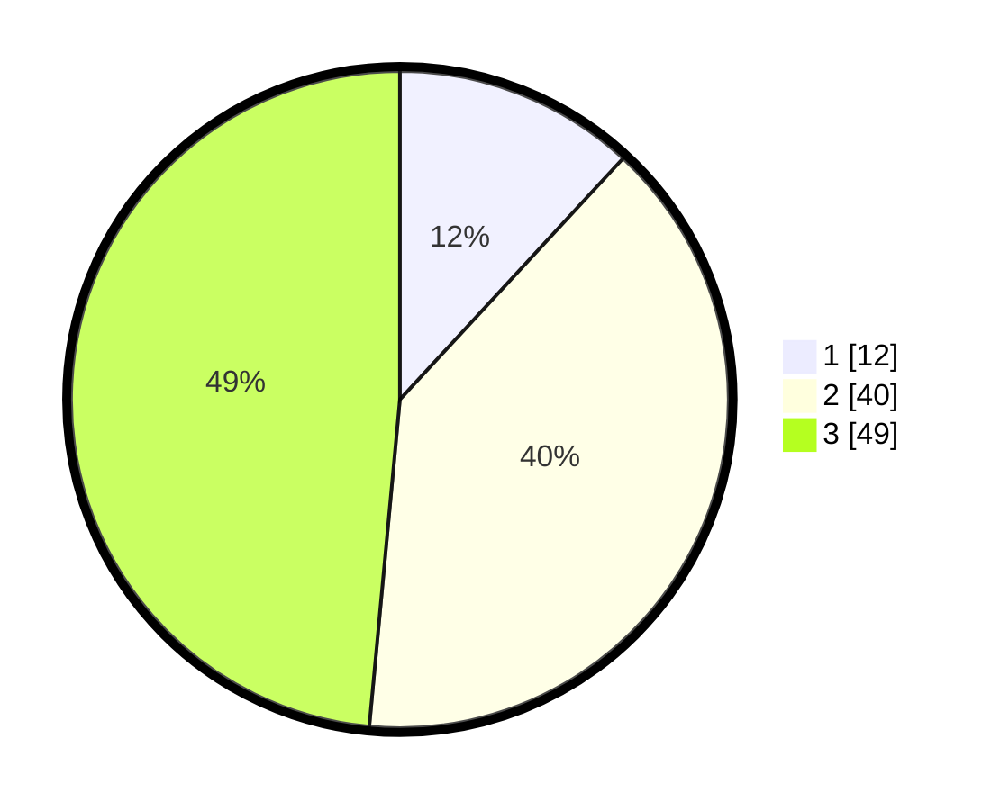

# Hasil

## Grafik

## Tabel

| No. | Nama Paslon    | Suara | Suara (raw) | Persentase |
|:--- |:-------------- | -----:| -----------:| ----------:|
| 1   | ANIES MUHAIMIN | 12    | [12][p-1]   | 11,88      |
| 2   | PRABOWO GIBRAN | 40    | [40][p-2]   | 39,60      |
| 3   | GANJAR MAHFUD  | 49    | [49][p-3]   | 48,51      |

[p-1]: https://github.com/gigit-pemilu/pemilu-2024/blob/main/pilpres/hitung-suara/sub/99-luar-negeri/sub/81-new-york-amerika-serikat/sub/01-new-york-amerika-serikat/sub/0001-new-york-amerika-serikat/sub/004-ksk-001/sub/paslon-1.txt
[p-2]: https://github.com/gigit-pemilu/pemilu-2024/blob/main/pilpres/hitung-suara/sub/99-luar-negeri/sub/81-new-york-amerika-serikat/sub/01-new-york-amerika-serikat/sub/0001-new-york-amerika-serikat/sub/004-ksk-001/sub/paslon-2.txt
[p-3]: https://github.com/gigit-pemilu/pemilu-2024/blob/main/pilpres/hitung-suara/sub/99-luar-negeri/sub/81-new-york-amerika-serikat/sub/01-new-york-amerika-serikat/sub/0001-new-york-amerika-serikat/sub/004-ksk-001/sub/paslon-3.txt

## Foto C Plano

https://sirekap-obj-formc.kpu.go.id/cf62/pemilu/ppwp/99/81/01/00/01/9981010001004-20240219-085031--faf0a7f3-97b0-4e29-9317-e14ac0eeeacf.jpg

https://sirekap-obj-formc.kpu.go.id/cf62/pemilu/ppwp/99/81/01/00/01/9981010001004-20240219-085033--0de38fdc-a798-4352-a999-1c886861d77b.jpg

https://sirekap-obj-formc.kpu.go.id/cf62/pemilu/ppwp/99/81/01/00/01/9981010001004-20240219-085032--2d93e8bb-3599-49de-9beb-2de9ed051b6c.jpg

## Metadata

| Key        | Value               |
| ---------- | ------------------- |
| Time Stamp | 2024-02-19 12:00:00 |

## DATA PEMILIH TETAP

Jumlah pemilih dalam DPT: **380**.
 * L: **170**.
 * P: **210**.

## DATA PENGGUNA HAK PILIH

Jumlah pengguna hak pilih dalam DPT: **29**.
 * L: **8**.
 * P: **21**.

Jumlah pengguna hak pilih dalam DPTb: **29**.
 * L: **11**.
 * P: **18**.

Jumlah pengguna hak pilih dalam DPK: **45**.
 * L: **17**.
 * P: **28**.

Jumlah pengguna hak pilih: **103**.
 * L: **36**.
 * P: **67**.

## JUMLAH SUARA SAH DAN TIDAK SAH

JUMLAH SELURUH SUARA SAH: **101**.

JUMLAH SUARA TIDAK SAH: **2**.

JUMLAH SELURUH SUARA SAH DAN SUARA TIDAK SAH: **103**.

