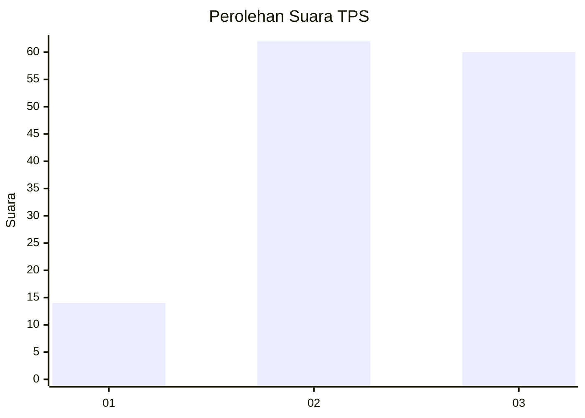
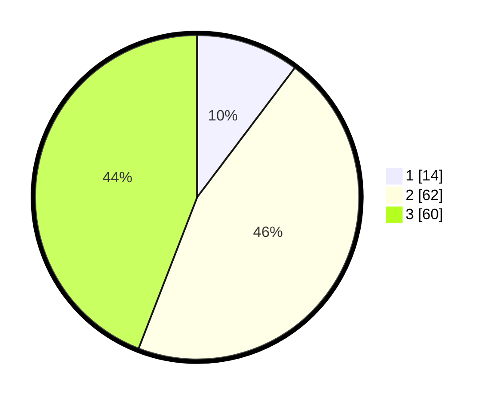

# Hasil

## Grafik

## Tabel

| No. | Nama Paslon    | Suara | Suara (raw) | Persentase |
|:--- |:-------------- | -----:| -----------:| ----------:|
| 1   | ANIES MUHAIMIN | 14    | [14][p-1]   | 10,29      |
| 2   | PRABOWO GIBRAN | 62    | [62][p-2]   | 45,59      |
| 3   | GANJAR MAHFUD  | 60    | [60][p-3]   | 44,12      |

[p-1]: https://github.com/gigit-pemilu/pemilu-2024-99-luar-negeri/blob/main/pilpres/hitung-suara/sub/99-luar-negeri/sub/81-new-york-amerika-serikat/sub/01-new-york-amerika-serikat/sub/0001-new-york-amerika-serikat/sub/005-ksk-002/sub/paslon-1.txt
[p-2]: https://github.com/gigit-pemilu/pemilu-2024-99-luar-negeri/blob/main/pilpres/hitung-suara/sub/99-luar-negeri/sub/81-new-york-amerika-serikat/sub/01-new-york-amerika-serikat/sub/0001-new-york-amerika-serikat/sub/005-ksk-002/sub/paslon-2.txt
[p-3]: https://github.com/gigit-pemilu/pemilu-2024-99-luar-negeri/blob/main/pilpres/hitung-suara/sub/99-luar-negeri/sub/81-new-york-amerika-serikat/sub/01-new-york-amerika-serikat/sub/0001-new-york-amerika-serikat/sub/005-ksk-002/sub/paslon-3.txt

## Foto C Plano

https://sirekap-obj-formc.kpu.go.id/1704/pemilu/ppwp/99/81/01/00/01/9981010001005-20240216-131216--0c7c8050-53de-4b47-9360-60dd844b20d5.jpg

https://sirekap-obj-formc.kpu.go.id/1704/pemilu/ppwp/99/81/01/00/01/9981010001005-20240216-131218--b8e6f195-98d8-4d68-bd78-1623048f78a1.jpg

https://sirekap-obj-formc.kpu.go.id/1704/pemilu/ppwp/99/81/01/00/01/9981010001005-20240216-131217--6a305139-dec9-40ca-b598-78fa97280dcc.jpg

## Metadata

| Key        | Value               |
| ---------- | ------------------- |
| Time Stamp | 2024-02-19 06:16:00 |

## DATA PEMILIH TETAP

Jumlah pemilih dalam DPT: **380**.
 * L: **162**.
 * P: **218**.

## DATA PENGGUNA HAK PILIH

Jumlah pengguna hak pilih dalam DPT: **74**.
 * L: **33**.
 * P: **41**.

Jumlah pengguna hak pilih dalam DPTb: **12**.
 * L: **6**.
 * P: **6**.

Jumlah pengguna hak pilih dalam DPK: **54**.
 * L: **29**.
 * P: **25**.

Jumlah pengguna hak pilih: **140**.
 * L: **68**.
 * P: **72**.

## JUMLAH SUARA SAH DAN TIDAK SAH

JUMLAH SELURUH SUARA SAH: **136**.

JUMLAH SUARA TIDAK SAH: **4**.

JUMLAH SELURUH SUARA SAH DAN SUARA TIDAK SAH: **140**.

