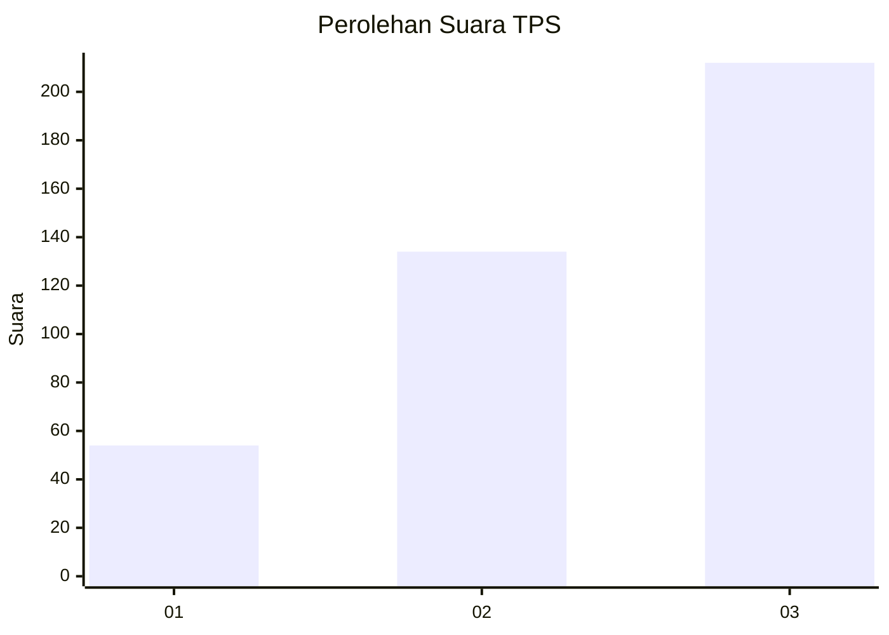
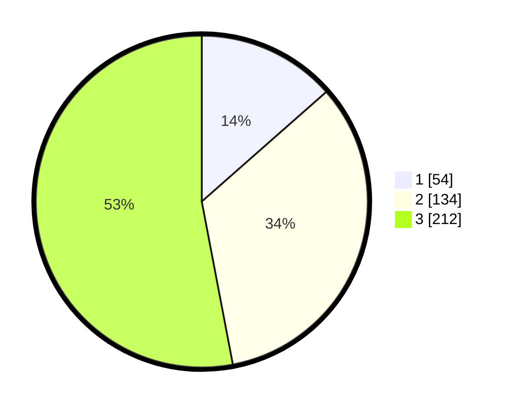

# Hasil

## Grafik

## Tabel

| No. | Nama Paslon    | Suara | Suara (raw) | Persentase |
|:--- |:-------------- | -----:| -----------:| ----------:|
| 1   | ANIES MUHAIMIN | 54    | [54][p-1]   | 13,50      |
| 2   | PRABOWO GIBRAN | 134   | [134][p-2]  | 33,50      |
| 3   | GANJAR MAHFUD  | 212   | [212][p-3]  | 53,00      |

[p-1]: https://github.com/gigit-pemilu/pemilu-2024-99-luar-negeri/blob/main/pilpres/hitung-suara/sub/99-luar-negeri/sub/81-new-york-amerika-serikat/sub/01-new-york-amerika-serikat/sub/0001-new-york-amerika-serikat/sub/009-pos-005/sub/paslon-1.txt
[p-2]: https://github.com/gigit-pemilu/pemilu-2024-99-luar-negeri/blob/main/pilpres/hitung-suara/sub/99-luar-negeri/sub/81-new-york-amerika-serikat/sub/01-new-york-amerika-serikat/sub/0001-new-york-amerika-serikat/sub/009-pos-005/sub/paslon-2.txt
[p-3]: https://github.com/gigit-pemilu/pemilu-2024-99-luar-negeri/blob/main/pilpres/hitung-suara/sub/99-luar-negeri/sub/81-new-york-amerika-serikat/sub/01-new-york-amerika-serikat/sub/0001-new-york-amerika-serikat/sub/009-pos-005/sub/paslon-3.txt

## Foto C Plano

https://sirekap-obj-formc.kpu.go.id/1fec/pemilu/ppwp/99/81/01/00/01/9981010001009-20240217-113305--70cd7638-5b85-4073-9810-d3c154e91937.jpg

https://sirekap-obj-formc.kpu.go.id/1fec/pemilu/ppwp/99/81/01/00/01/9981010001009-20240217-113722--6e82bb43-e87f-4d54-86c1-3af91aab253a.jpg

https://sirekap-obj-formc.kpu.go.id/1fec/pemilu/ppwp/99/81/01/00/01/9981010001009-20240217-113623--81a59f45-f0a0-4caa-aa5c-473abd766ba9.jpg

## Metadata

| Key        | Value               |
| ---------- | ------------------- |
| Time Stamp | 2024-02-17 12:00:00 |

## DATA PEMILIH TETAP

Jumlah pemilih dalam DPT: **1329**.
 * L: **523**.
 * P: **806**.

## DATA PENGGUNA HAK PILIH

Jumlah pengguna hak pilih dalam DPT: **404**.
 * L: **151**.
 * P: **253**.

Jumlah pengguna hak pilih dalam DPTb: **19**.
 * L: **10**.
 * P: **9**.

Jumlah pengguna hak pilih dalam DPK: **11**.
 * L: **6**.
 * P: **5**.

Jumlah pengguna hak pilih: **434**.
 * L: **163**.
 * P: **267**.

## JUMLAH SUARA SAH DAN TIDAK SAH

JUMLAH SELURUH SUARA SAH: **400**.

JUMLAH SUARA TIDAK SAH: **34**.

JUMLAH SELURUH SUARA SAH DAN SUARA TIDAK SAH: **434**.

