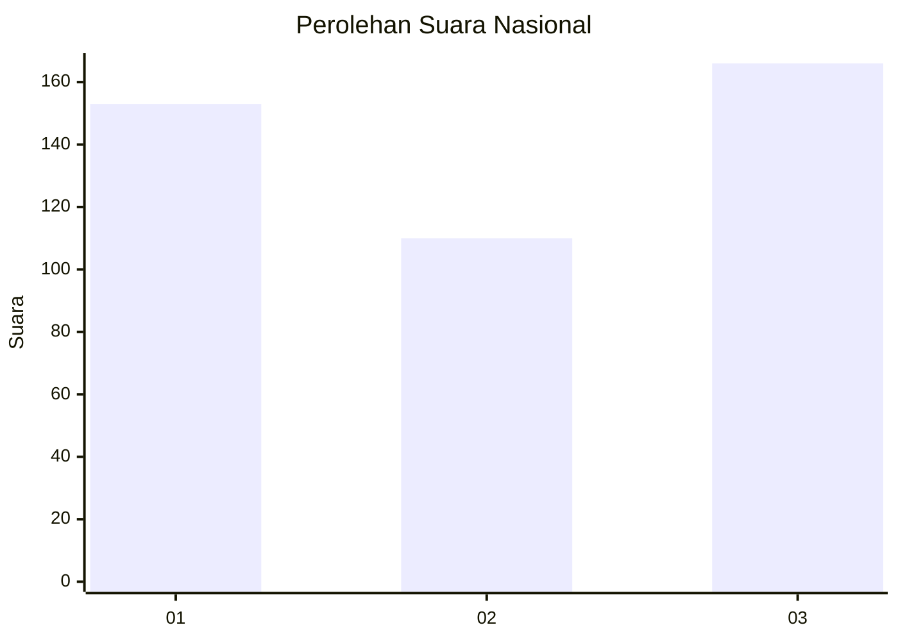
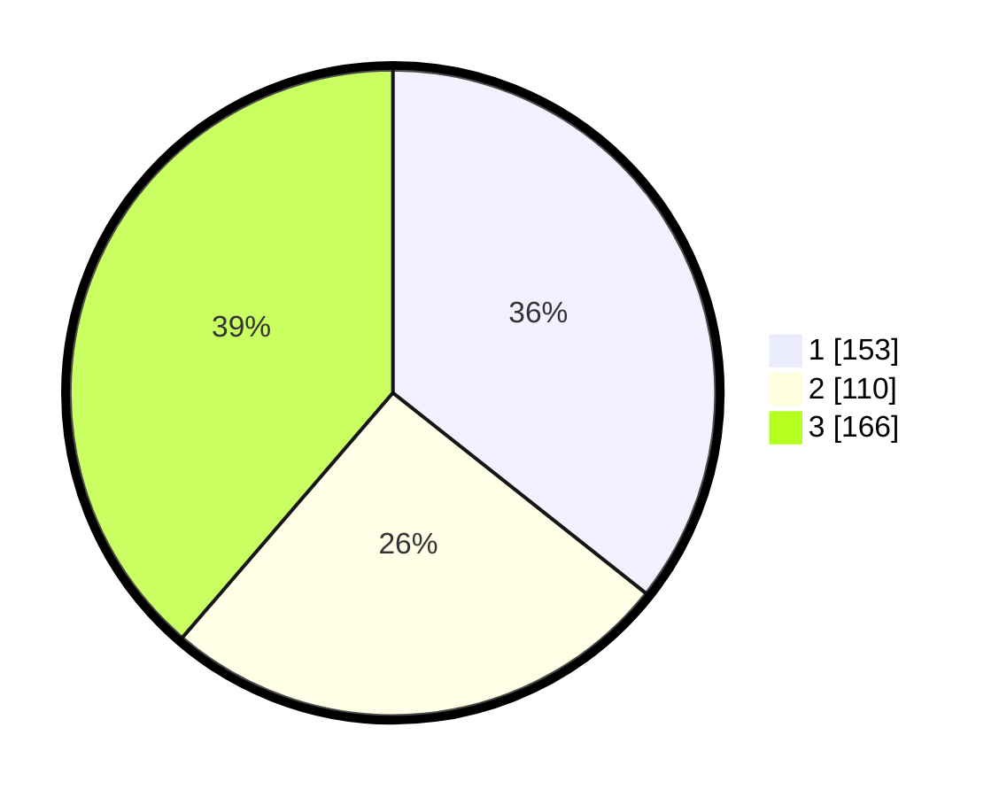

# Hasil

## Grafik

## Tabel

| No. | Nama Paslon    | Suara | Suara (raw) | Persentase |
|:--- |:-------------- | -----:| -----------:| ----------:|
| 1   | ANIES MUHAIMIN | 153   | [153][p-1]  | 35,66      |
| 2   | PRABOWO GIBRAN | 110   | [110][p-2]  | 25,64      |
| 3   | GANJAR MAHFUD  | 166   | [166][p-3]  | 38,69      |

[p-1]: https://github.com/gigit-pemilu/pemilu-2024/blob/main/pilpres/hitung-suara/sub/99-luar-negeri/sub/81-new-york-amerika-serikat/sub/01-new-york-amerika-serikat/sub/0001-new-york-amerika-serikat/sub/012-tps-005/sub/paslon-1.txt
[p-2]: https://github.com/gigit-pemilu/pemilu-2024/blob/main/pilpres/hitung-suara/sub/99-luar-negeri/sub/81-new-york-amerika-serikat/sub/01-new-york-amerika-serikat/sub/0001-new-york-amerika-serikat/sub/012-tps-005/sub/paslon-2.txt
[p-3]: https://github.com/gigit-pemilu/pemilu-2024/blob/main/pilpres/hitung-suara/sub/99-luar-negeri/sub/81-new-york-amerika-serikat/sub/01-new-york-amerika-serikat/sub/0001-new-york-amerika-serikat/sub/012-tps-005/sub/paslon-3.txt

## Foto C Plano

https://sirekap-obj-formc.kpu.go.id/aab6/pemilu/ppwp/99/81/01/00/01/9981010001012-20240216-132127--43e40706-7653-44ee-a746-44049d32ce47.jpg

https://sirekap-obj-formc.kpu.go.id/aab6/pemilu/ppwp/99/81/01/00/01/9981010001012-20240216-093445--7eac2080-777d-4a0c-9fcf-beafbf472c33.jpg

https://sirekap-obj-formc.kpu.go.id/aab6/pemilu/ppwp/99/81/01/00/01/9981010001012-20240216-132128--aa4db2b5-2787-46b0-b3e2-12057448ebea.jpg

## Metadata

| Key        | Value               |
| ---------- | ------------------- |
| Time Stamp | 2024-02-19 06:16:00 |

## DATA PEMILIH TETAP

Jumlah pemilih dalam DPT: **536**.
 * L: **212**.
 * P: **324**.

## DATA PENGGUNA HAK PILIH

Jumlah pengguna hak pilih dalam DPT: **307**.
 * L: **119**.
 * P: **188**.

Jumlah pengguna hak pilih dalam DPTb: **82**.
 * L: **41**.
 * P: **41**.

Jumlah pengguna hak pilih dalam DPK: **46**.
 * L: **18**.
 * P: **28**.

Jumlah pengguna hak pilih: **435**.
 * L: **178**.
 * P: **257**.

## JUMLAH SUARA SAH DAN TIDAK SAH

JUMLAH SELURUH SUARA SAH: **429**.

JUMLAH SUARA TIDAK SAH: **6**.

JUMLAH SELURUH SUARA SAH DAN SUARA TIDAK SAH: **435**.

