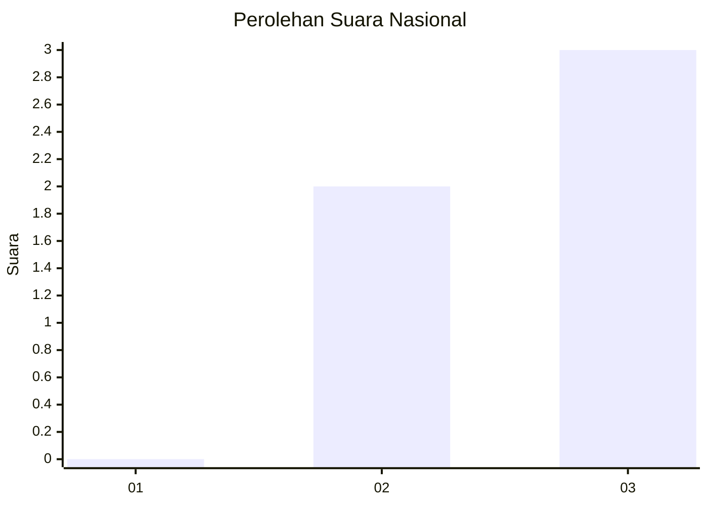
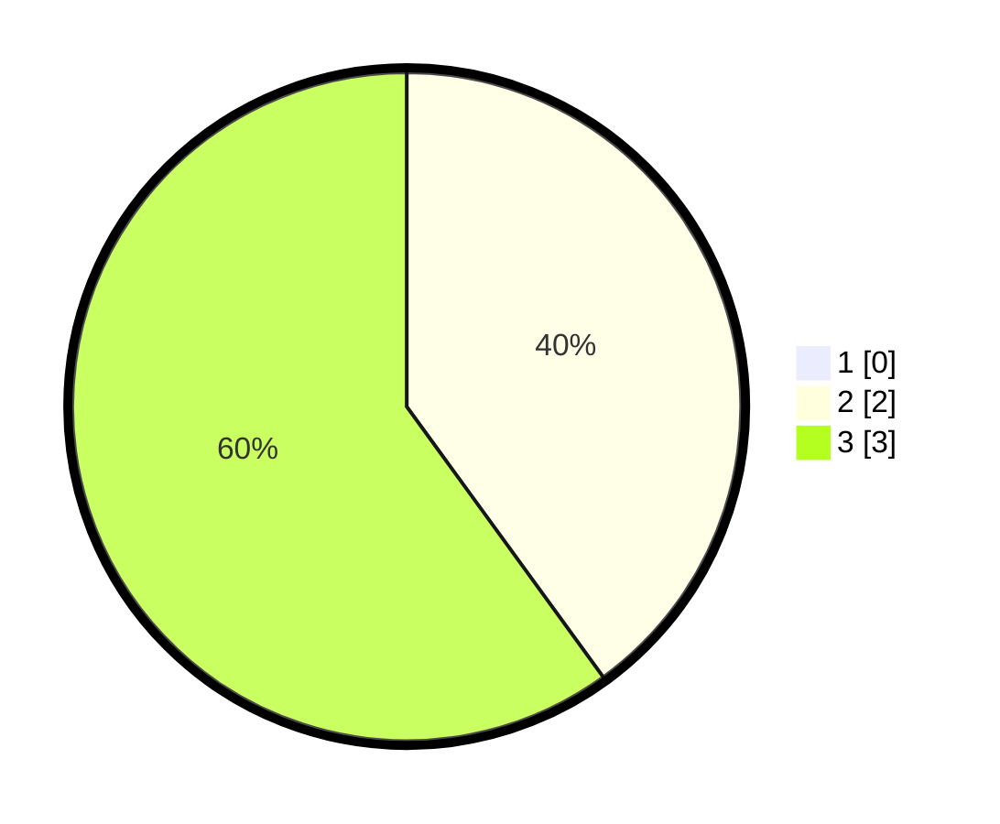

# Hasil

## Grafik

## Tabel

| No. | Nama Paslon    | Suara | Suara (raw) | Persentase |
|:--- |:-------------- | -----:| -----------:| ----------:|
| 1   | ANIES MUHAIMIN | 0     | [0][p-1]    | 0,00       |
| 2   | PRABOWO GIBRAN | 2     | [2][p-2]    | 40,00      |
| 3   | GANJAR MAHFUD  | 3     | [3][p-3]    | 60,00      |

[p-1]: https://github.com/gigit-pemilu/pemilu-2024/blob/main/pilpres/hitung-suara/sub/99-luar-negeri/sub/82-noumea-perancis/sub/01-noumea-perancis/sub/0001-noumea-perancis/sub/001-pos-001/sub/paslon-1.txt
[p-2]: https://github.com/gigit-pemilu/pemilu-2024/blob/main/pilpres/hitung-suara/sub/99-luar-negeri/sub/82-noumea-perancis/sub/01-noumea-perancis/sub/0001-noumea-perancis/sub/001-pos-001/sub/paslon-2.txt
[p-3]: https://github.com/gigit-pemilu/pemilu-2024/blob/main/pilpres/hitung-suara/sub/99-luar-negeri/sub/82-noumea-perancis/sub/01-noumea-perancis/sub/0001-noumea-perancis/sub/001-pos-001/sub/paslon-3.txt

## Foto C Plano

https://sirekap-obj-formc.kpu.go.id/1f40/pemilu/ppwp/99/82/01/00/01/9982010001001-20240215-142630--e27f9c48-06c1-4b26-ab89-82c3a522ab76.jpg

https://sirekap-obj-formc.kpu.go.id/1f40/pemilu/ppwp/99/82/01/00/01/9982010001001-20240215-143658--dc616777-c946-419c-8745-b9d0e11b17eb.jpg

https://sirekap-obj-formc.kpu.go.id/1f40/pemilu/ppwp/99/82/01/00/01/9982010001001-20240216-043120--778e0e18-ec89-4007-9ea1-577d833bfd68.jpg

## Metadata

| Key        | Value               |
| ---------- | ------------------- |
| Time Stamp | 2024-02-16 05:00:26 |

## DATA PEMILIH TETAP

Jumlah pemilih dalam DPT: **9**.
 * L: **3**.
 * P: **6**.

## DATA PENGGUNA HAK PILIH

Jumlah pengguna hak pilih dalam DPT: **9**.
 * L: **3**.
 * P: **6**.

Jumlah pengguna hak pilih dalam DPTb: **0**.
 * L: **0**.
 * P: **0**.

Jumlah pengguna hak pilih dalam DPK: **0**.
 * L: **0**.
 * P: **0**.

Jumlah pengguna hak pilih: **9**.
 * L: **3**.
 * P: **6**.

## JUMLAH SUARA SAH DAN TIDAK SAH

JUMLAH SELURUH SUARA SAH: **5**.

JUMLAH SUARA TIDAK SAH: **0**.

JUMLAH SELURUH SUARA SAH DAN SUARA TIDAK SAH: **5**.

