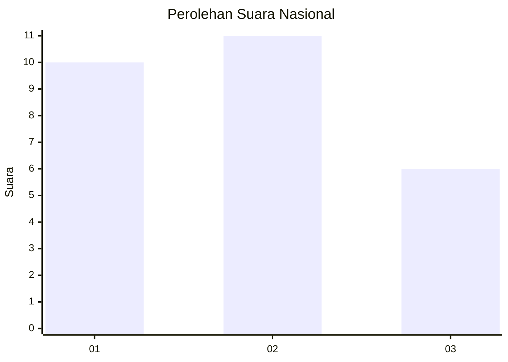
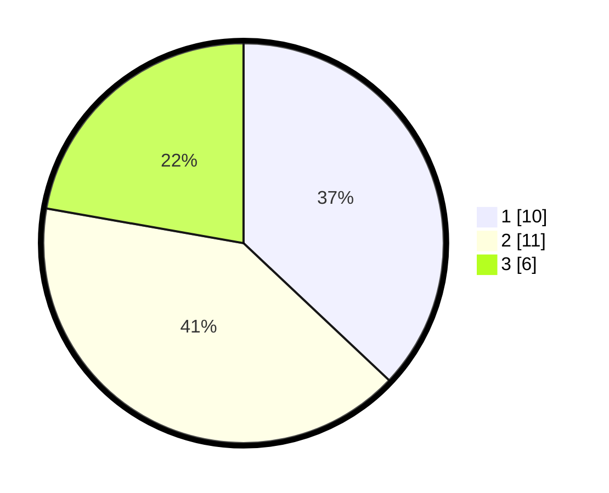

# Hasil

## Grafik

## Tabel

| No. | Nama Paslon    | Suara | Suara (raw) | Persentase |
|:--- |:-------------- | -----:| -----------:| ----------:|
| 1   | ANIES MUHAIMIN | 10    | [10][p-1]   | 37,04      |
| 2   | PRABOWO GIBRAN | 11    | [11][p-2]   | 40,74      |
| 3   | GANJAR MAHFUD  | 6     | [6][p-3]    | 22,22      |

[p-1]: https://github.com/gigit-pemilu/pemilu-2024/blob/main/pilpres/hitung-suara/sub/99-luar-negeri/sub/82-noumea-perancis/sub/01-noumea-perancis/sub/0001-noumea-perancis/sub/003-ksk-001/sub/paslon-1.txt
[p-2]: https://github.com/gigit-pemilu/pemilu-2024/blob/main/pilpres/hitung-suara/sub/99-luar-negeri/sub/82-noumea-perancis/sub/01-noumea-perancis/sub/0001-noumea-perancis/sub/003-ksk-001/sub/paslon-2.txt
[p-3]: https://github.com/gigit-pemilu/pemilu-2024/blob/main/pilpres/hitung-suara/sub/99-luar-negeri/sub/82-noumea-perancis/sub/01-noumea-perancis/sub/0001-noumea-perancis/sub/003-ksk-001/sub/paslon-3.txt

## Foto C Plano

https://sirekap-obj-formc.kpu.go.id/5a29/pemilu/ppwp/99/82/01/00/01/9982010001003-20240214-162327--06e624e1-a562-49f6-b216-f916f9f0b796.jpg

https://sirekap-obj-formc.kpu.go.id/5a29/pemilu/ppwp/99/82/01/00/01/9982010001003-20240214-162337--a70de4fb-4ca4-412b-aee4-9b51a69e505a.jpg

https://sirekap-obj-formc.kpu.go.id/5a29/pemilu/ppwp/99/82/01/00/01/9982010001003-20240214-162345--72b2e6c5-8598-466c-a07c-6dd3a0c30f60.jpg

## Metadata

| Key        | Value               |
| ---------- | ------------------- |
| Time Stamp | 2024-02-14 21:46:01 |

## DATA PEMILIH TETAP

Jumlah pemilih dalam DPT: **32**.
 * L: **11**.
 * P: **21**.

## DATA PENGGUNA HAK PILIH

Jumlah pengguna hak pilih dalam DPT: **27**.
 * L: **9**.
 * P: **18**.

Jumlah pengguna hak pilih dalam DPTb: **0**.
 * L: **0**.
 * P: **0**.

Jumlah pengguna hak pilih dalam DPK: **0**.
 * L: **0**.
 * P: **0**.

Jumlah pengguna hak pilih: **27**.
 * L: **9**.
 * P: **18**.

## JUMLAH SUARA SAH DAN TIDAK SAH

JUMLAH SELURUH SUARA SAH: **27**.

JUMLAH SUARA TIDAK SAH: **0**.

JUMLAH SELURUH SUARA SAH DAN SUARA TIDAK SAH: **27**.

