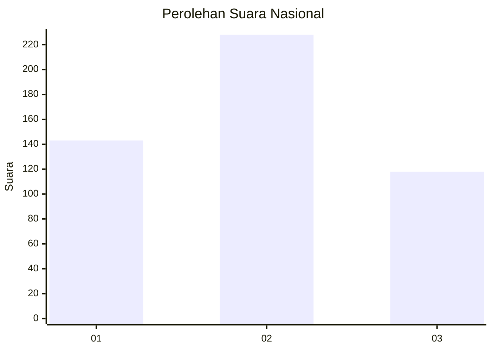
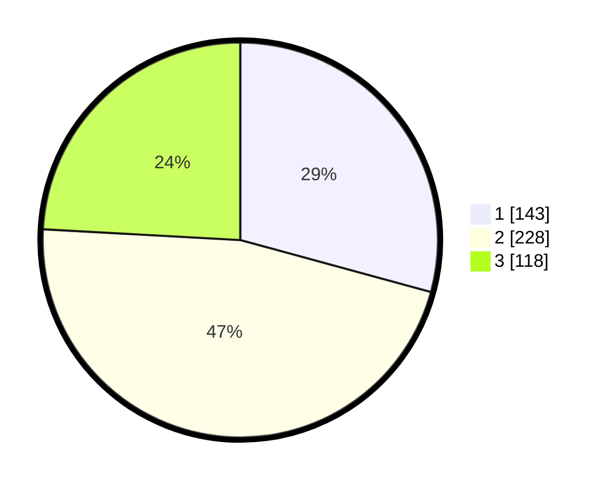

# Hasil

## Grafik

## Tabel

| No. | Nama Paslon    | Suara | Suara (raw) | Persentase |
|:--- |:-------------- | -----:| -----------:| ----------:|
| 1   | ANIES MUHAIMIN | 143   | [143][p-1]  | 29,24      |
| 2   | PRABOWO GIBRAN | 228   | [228][p-2]  | 46,63      |
| 3   | GANJAR MAHFUD  | 118   | [118][p-3]  | 24,13      |

[p-1]: https://github.com/gigit-pemilu/pemilu-2024/blob/main/pilpres/hitung-suara/sub/99-luar-negeri/sub/83-osaka-jepang/sub/01-osaka-jepang/sub/0001-osaka-jepang/sub/001-pos-001/sub/paslon-1.txt
[p-2]: https://github.com/gigit-pemilu/pemilu-2024/blob/main/pilpres/hitung-suara/sub/99-luar-negeri/sub/83-osaka-jepang/sub/01-osaka-jepang/sub/0001-osaka-jepang/sub/001-pos-001/sub/paslon-2.txt
[p-3]: https://github.com/gigit-pemilu/pemilu-2024/blob/main/pilpres/hitung-suara/sub/99-luar-negeri/sub/83-osaka-jepang/sub/01-osaka-jepang/sub/0001-osaka-jepang/sub/001-pos-001/sub/paslon-3.txt

## Foto C Plano

https://sirekap-obj-formc.kpu.go.id/6ff1/pemilu/ppwp/99/83/01/00/01/9983010001001-20240219-091600--06b5df81-fee9-40db-a642-c6ae9c68ee9e.jpg

https://sirekap-obj-formc.kpu.go.id/6ff1/pemilu/ppwp/99/83/01/00/01/9983010001001-20240219-190122--578f10a4-c6ca-4c20-9ae2-b2e6f8953455.jpg

https://sirekap-obj-formc.kpu.go.id/6ff1/pemilu/ppwp/99/83/01/00/01/9983010001001-20240219-103655--033981cf-7e06-4dfd-9581-ff5dbd9cf213.jpg

## Metadata

| Key        | Value               |
| ---------- | ------------------- |
| Time Stamp | 2024-02-24 22:31:28 |

## DATA PEMILIH TETAP

Jumlah pemilih dalam DPT: **778**.
 * L: **464**.
 * P: **314**.

## DATA PENGGUNA HAK PILIH

Jumlah pengguna hak pilih dalam DPT: **461**.
 * L: **250**.
 * P: **211**.

Jumlah pengguna hak pilih dalam DPTb: **40**.
 * L: **23**.
 * P: **17**.

Jumlah pengguna hak pilih dalam DPK: **0**.
 * L: **0**.
 * P: **0**.

Jumlah pengguna hak pilih: **501**.
 * L: **273**.
 * P: **228**.

## JUMLAH SUARA SAH DAN TIDAK SAH

JUMLAH SELURUH SUARA SAH: **489**.

JUMLAH SUARA TIDAK SAH: **12**.

JUMLAH SELURUH SUARA SAH DAN SUARA TIDAK SAH: **501**.

