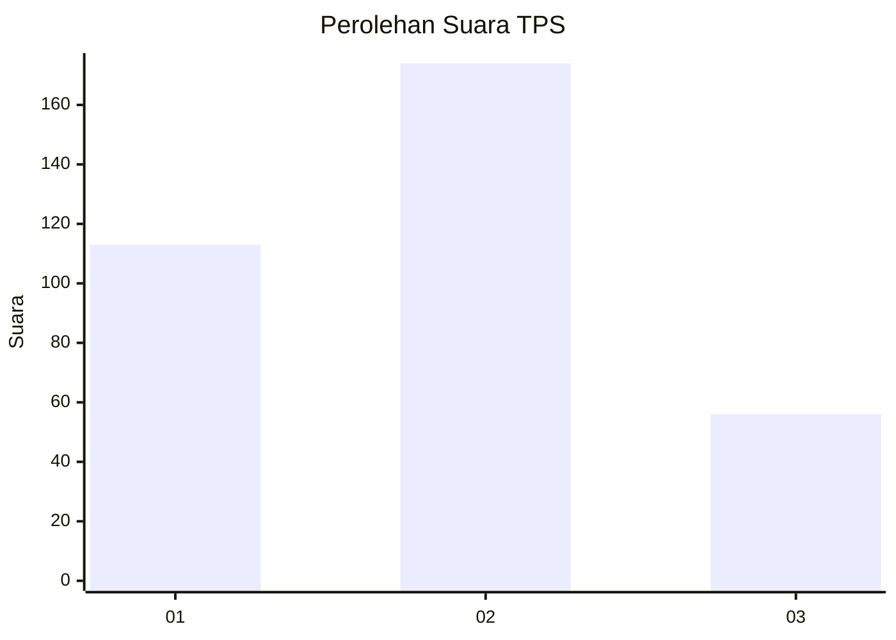
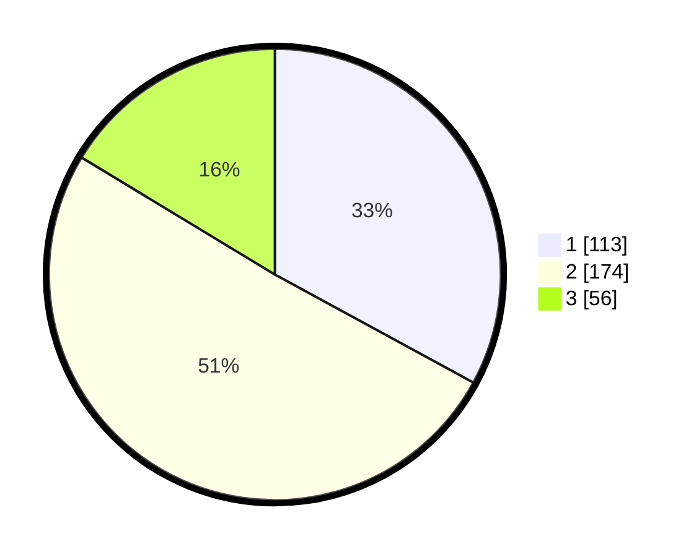

# Hasil

## Grafik

## Tabel

| No. | Nama Paslon    | Suara | Suara (raw) | Persentase |
|:--- |:-------------- | -----:| -----------:| ----------:|
| 1   | ANIES MUHAIMIN | 113   | [113][p-1]  | 32,94      |
| 2   | PRABOWO GIBRAN | 174   | [174][p-2]  | 50,73      |
| 3   | GANJAR MAHFUD  | 56    | [56][p-3]   | 16,33      |

[p-1]: https://github.com/gigit-pemilu/pemilu-2024-99-luar-negeri/blob/main/pilpres/hitung-suara/sub/99-luar-negeri/sub/83-osaka-jepang/sub/01-osaka-jepang/sub/0001-osaka-jepang/sub/002-pos-002/sub/paslon-1.txt
[p-2]: https://github.com/gigit-pemilu/pemilu-2024-99-luar-negeri/blob/main/pilpres/hitung-suara/sub/99-luar-negeri/sub/83-osaka-jepang/sub/01-osaka-jepang/sub/0001-osaka-jepang/sub/002-pos-002/sub/paslon-2.txt
[p-3]: https://github.com/gigit-pemilu/pemilu-2024-99-luar-negeri/blob/main/pilpres/hitung-suara/sub/99-luar-negeri/sub/83-osaka-jepang/sub/01-osaka-jepang/sub/0001-osaka-jepang/sub/002-pos-002/sub/paslon-3.txt

## Foto C Plano

https://sirekap-obj-formc.kpu.go.id/3947/pemilu/ppwp/99/83/01/00/01/9983010001002-20240219-130857--5246cc8c-95fe-4138-812b-7622ac442462.jpg

https://sirekap-obj-formc.kpu.go.id/3947/pemilu/ppwp/99/83/01/00/01/9983010001002-20240219-131821--5b04514f-9dd1-47aa-b517-b21b1657dba6.jpg

https://sirekap-obj-formc.kpu.go.id/3947/pemilu/ppwp/99/83/01/00/01/9983010001002-20240219-132221--aa2a225a-e03e-44e7-a180-9f43ce9fb494.jpg

## Metadata

| Key        | Value               |
| ---------- | ------------------- |
| Time Stamp | 2024-02-19 14:00:00 |

## DATA PEMILIH TETAP

Jumlah pemilih dalam DPT: **659**.
 * L: **382**.
 * P: **277**.

## DATA PENGGUNA HAK PILIH

Jumlah pengguna hak pilih dalam DPT: **359**.
 * L: **194**.
 * P: **165**.

Jumlah pengguna hak pilih dalam DPTb: **9**.
 * L: **5**.
 * P: **4**.

Jumlah pengguna hak pilih dalam DPK: **0**.
 * L: **0**.
 * P: **0**.

Jumlah pengguna hak pilih: **368**.
 * L: **199**.
 * P: **169**.

## JUMLAH SUARA SAH DAN TIDAK SAH

JUMLAH SELURUH SUARA SAH: **343**.

JUMLAH SUARA TIDAK SAH: **25**.

JUMLAH SELURUH SUARA SAH DAN SUARA TIDAK SAH: **368**.

