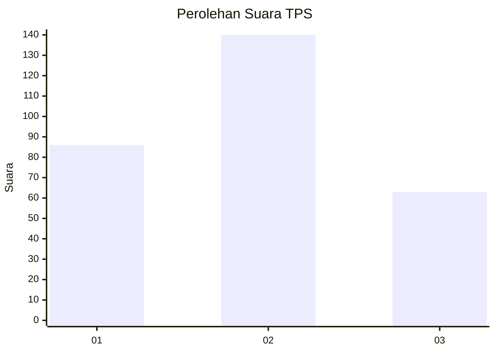
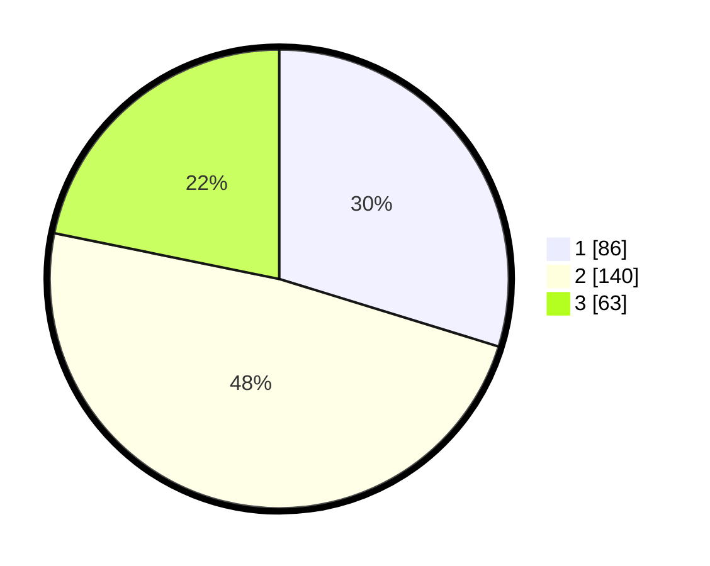

# Hasil

## Grafik

## Tabel

| No. | Nama Paslon    | Suara | Suara (raw) | Persentase |
|:--- |:-------------- | -----:| -----------:| ----------:|
| 1   | ANIES MUHAIMIN | 86    | [86][p-1]   | 29,76      |
| 2   | PRABOWO GIBRAN | 140   | [140][p-2]  | 48,44      |
| 3   | GANJAR MAHFUD  | 63    | [63][p-3]   | 21,80      |

[p-1]: https://github.com/gigit-pemilu/pemilu-2024-99-luar-negeri/blob/main/pilpres/hitung-suara/sub/99-luar-negeri/sub/83-osaka-jepang/sub/01-osaka-jepang/sub/0001-osaka-jepang/sub/004-pos-004/sub/paslon-1.txt
[p-2]: https://github.com/gigit-pemilu/pemilu-2024-99-luar-negeri/blob/main/pilpres/hitung-suara/sub/99-luar-negeri/sub/83-osaka-jepang/sub/01-osaka-jepang/sub/0001-osaka-jepang/sub/004-pos-004/sub/paslon-2.txt
[p-3]: https://github.com/gigit-pemilu/pemilu-2024-99-luar-negeri/blob/main/pilpres/hitung-suara/sub/99-luar-negeri/sub/83-osaka-jepang/sub/01-osaka-jepang/sub/0001-osaka-jepang/sub/004-pos-004/sub/paslon-3.txt

## Foto C Plano

https://sirekap-obj-formc.kpu.go.id/3352/pemilu/ppwp/99/83/01/00/01/9983010001004-20240218-205021--96311a7b-e1ce-4ed2-8a92-e1907ab8609f.jpg

https://sirekap-obj-formc.kpu.go.id/3352/pemilu/ppwp/99/83/01/00/01/9983010001004-20240218-211055--e405c07c-b40b-4a80-a0f3-48fc7fb0040c.jpg

https://sirekap-obj-formc.kpu.go.id/3352/pemilu/ppwp/99/83/01/00/01/9983010001004-20240218-205200--cbd8dab0-ddc2-48be-b050-61a02684e53e.jpg

## Metadata

| Key        | Value               |
| ---------- | ------------------- |
| Time Stamp | 2024-02-19 06:16:00 |

## DATA PEMILIH TETAP

Jumlah pemilih dalam DPT: **613**.
 * L: **347**.
 * P: **266**.

## DATA PENGGUNA HAK PILIH

Jumlah pengguna hak pilih dalam DPT: **293**.
 * L: **156**.
 * P: **137**.

Jumlah pengguna hak pilih dalam DPTb: **18**.
 * L: **7**.
 * P: **11**.

Jumlah pengguna hak pilih dalam DPK: **0**.
 * L: **0**.
 * P: **0**.

Jumlah pengguna hak pilih: **311**.
 * L: **163**.
 * P: **148**.

## JUMLAH SUARA SAH DAN TIDAK SAH

JUMLAH SELURUH SUARA SAH: **289**.

JUMLAH SUARA TIDAK SAH: **22**.

JUMLAH SELURUH SUARA SAH DAN SUARA TIDAK SAH: **311**.

