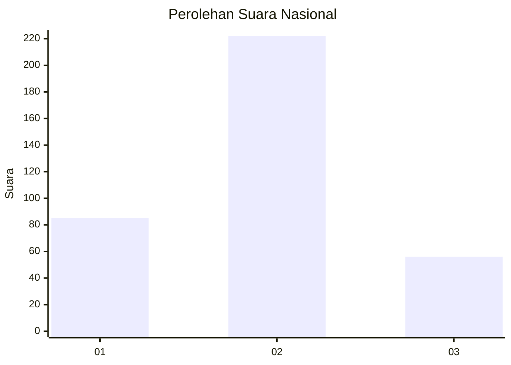
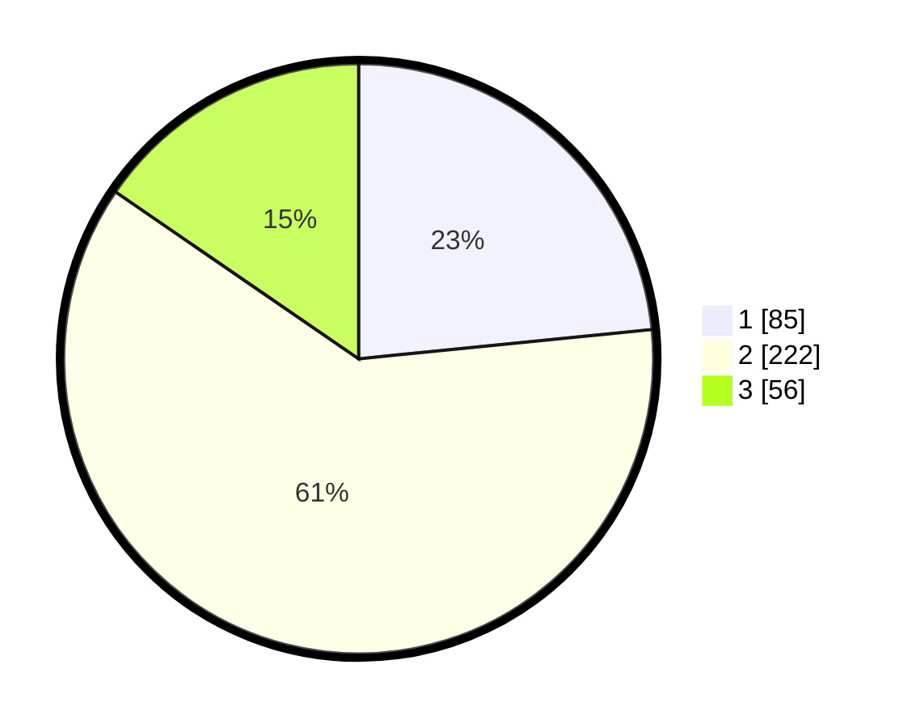

# Hasil

## Grafik

## Tabel

| No. | Nama Paslon    | Suara | Suara (raw) | Persentase |
|:--- |:-------------- | -----:| -----------:| ----------:|
| 1   | ANIES MUHAIMIN | 85    | [85][p-1]   | 23,42      |
| 2   | PRABOWO GIBRAN | 222   | [222][p-2]  | 61,16      |
| 3   | GANJAR MAHFUD  | 56    | [56][p-3]   | 15,43      |

[p-1]: https://github.com/gigit-pemilu/pemilu-2024/blob/main/pilpres/hitung-suara/sub/99-luar-negeri/sub/83-osaka-jepang/sub/01-osaka-jepang/sub/0001-osaka-jepang/sub/005-pos-005/sub/paslon-1.txt
[p-2]: https://github.com/gigit-pemilu/pemilu-2024/blob/main/pilpres/hitung-suara/sub/99-luar-negeri/sub/83-osaka-jepang/sub/01-osaka-jepang/sub/0001-osaka-jepang/sub/005-pos-005/sub/paslon-2.txt
[p-3]: https://github.com/gigit-pemilu/pemilu-2024/blob/main/pilpres/hitung-suara/sub/99-luar-negeri/sub/83-osaka-jepang/sub/01-osaka-jepang/sub/0001-osaka-jepang/sub/005-pos-005/sub/paslon-3.txt

## Foto C Plano

https://sirekap-obj-formc.kpu.go.id/e5e3/pemilu/ppwp/99/83/01/00/01/9983010001005-20240218-193239--c05f999b-0e3a-4867-b6f1-a5c4e61bf76e.jpg

https://sirekap-obj-formc.kpu.go.id/e5e3/pemilu/ppwp/99/83/01/00/01/9983010001005-20240218-193603--2a34d767-4cf4-4f49-88fe-d33393e8e1a6.jpg

https://sirekap-obj-formc.kpu.go.id/e5e3/pemilu/ppwp/99/83/01/00/01/9983010001005-20240218-193641--727cd9d9-4e04-4078-aca8-636a55216e61.jpg

## Metadata

| Key        | Value               |
| ---------- | ------------------- |
| Time Stamp | 2024-02-19 06:16:00 |

## DATA PEMILIH TETAP

Jumlah pemilih dalam DPT: **719**.
 * L: **494**.
 * P: **225**.

## DATA PENGGUNA HAK PILIH

Jumlah pengguna hak pilih dalam DPT: **368**.
 * L: **239**.
 * P: **129**.

Jumlah pengguna hak pilih dalam DPTb: **4**.
 * L: **2**.
 * P: **2**.

Jumlah pengguna hak pilih dalam DPK: **0**.
 * L: **0**.
 * P: **0**.

Jumlah pengguna hak pilih: **372**.
 * L: **241**.
 * P: **131**.

## JUMLAH SUARA SAH DAN TIDAK SAH

JUMLAH SELURUH SUARA SAH: **363**.

JUMLAH SUARA TIDAK SAH: **9**.

JUMLAH SELURUH SUARA SAH DAN SUARA TIDAK SAH: **372**.

