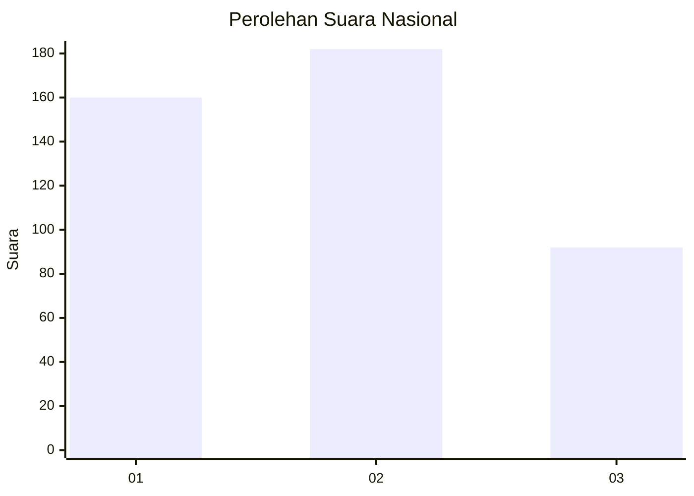
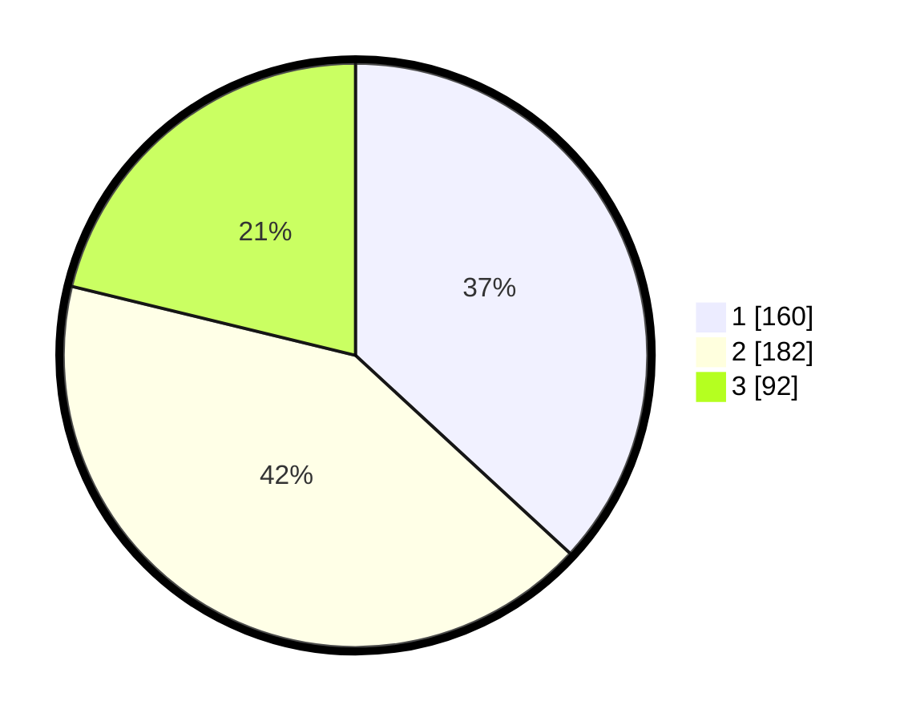

# Hasil

## Grafik

## Tabel

| No. | Nama Paslon    | Suara | Suara (raw) | Persentase |
|:--- |:-------------- | -----:| -----------:| ----------:|
| 1   | ANIES MUHAIMIN | 160   | [160][p-1]  | 36,87      |
| 2   | PRABOWO GIBRAN | 182   | [182][p-2]  | 41,94      |
| 3   | GANJAR MAHFUD  | 92    | [92][p-3]   | 21,20      |

[p-1]: https://github.com/gigit-pemilu/pemilu-2024/blob/main/pilpres/hitung-suara/sub/99-luar-negeri/sub/83-osaka-jepang/sub/01-osaka-jepang/sub/0001-osaka-jepang/sub/015-tps-003/sub/paslon-1.txt
[p-2]: https://github.com/gigit-pemilu/pemilu-2024/blob/main/pilpres/hitung-suara/sub/99-luar-negeri/sub/83-osaka-jepang/sub/01-osaka-jepang/sub/0001-osaka-jepang/sub/015-tps-003/sub/paslon-2.txt
[p-3]: https://github.com/gigit-pemilu/pemilu-2024/blob/main/pilpres/hitung-suara/sub/99-luar-negeri/sub/83-osaka-jepang/sub/01-osaka-jepang/sub/0001-osaka-jepang/sub/015-tps-003/sub/paslon-3.txt

## Foto C Plano

https://sirekap-obj-formc.kpu.go.id/27a9/pemilu/ppwp/99/83/01/00/01/9983010001015-20240215-082122--1dd83e5f-9a24-4ea3-b867-7169383614f1.jpg

https://sirekap-obj-formc.kpu.go.id/27a9/pemilu/ppwp/99/83/01/00/01/9983010001015-20240214-210350--8579a705-4b81-4815-9c45-9972c07eb30c.jpg

https://sirekap-obj-formc.kpu.go.id/27a9/pemilu/ppwp/99/83/01/00/01/9983010001015-20240214-210418--7b72b2ad-c51e-417a-b473-2d4bf44b79de.jpg

## Metadata

| Key        | Value               |
| ---------- | ------------------- |
| Time Stamp | 2024-02-15 19:00:26 |

## DATA PEMILIH TETAP

Jumlah pemilih dalam DPT: **589**.
 * L: **284**.
 * P: **305**.

## DATA PENGGUNA HAK PILIH

Jumlah pengguna hak pilih dalam DPT: **209**.
 * L: **118**.
 * P: **91**.

Jumlah pengguna hak pilih dalam DPTb: **176**.
 * L: **91**.
 * P: **85**.

Jumlah pengguna hak pilih dalam DPK: **53**.
 * L: **32**.
 * P: **21**.

Jumlah pengguna hak pilih: **438**.
 * L: **241**.
 * P: **197**.

## JUMLAH SUARA SAH DAN TIDAK SAH

JUMLAH SELURUH SUARA SAH: **434**.

JUMLAH SUARA TIDAK SAH: **4**.

JUMLAH SELURUH SUARA SAH DAN SUARA TIDAK SAH: **438**.

