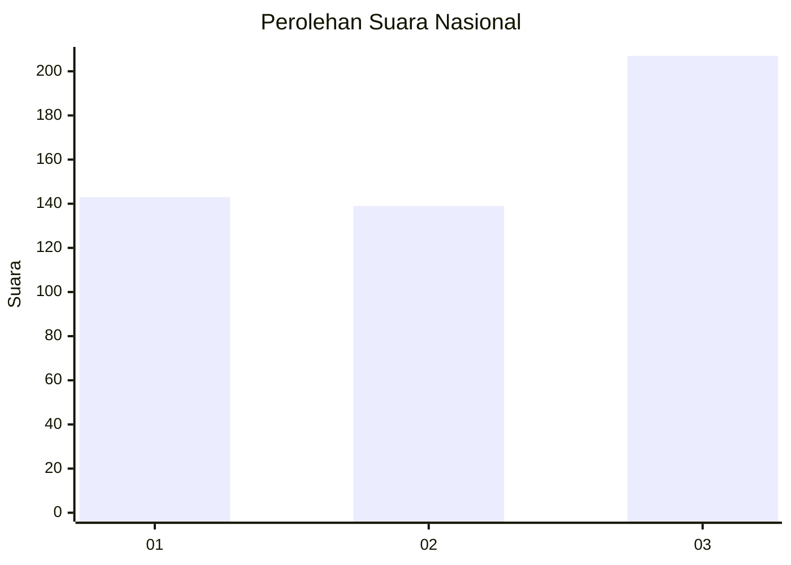
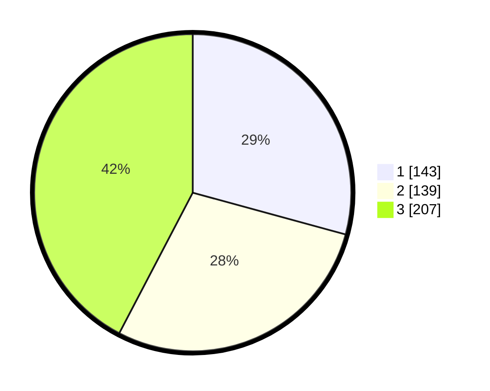

# Hasil

## Grafik

## Tabel

| No. | Nama Paslon    | Suara | Suara (raw) | Persentase |
|:--- |:-------------- | -----:| -----------:| ----------:|
| 1   | ANIES MUHAIMIN | 143   | [143][p-1]  | 29,24      |
| 2   | PRABOWO GIBRAN | 139   | [139][p-2]  | 28,43      |
| 3   | GANJAR MAHFUD  | 207   | [207][p-3]  | 42,33      |

[p-1]: https://github.com/gigit-pemilu/pemilu-2024/blob/main/pilpres/hitung-suara/sub/99-luar-negeri/sub/84-oslo-norwegia/sub/01-oslo-norwegia/sub/0001-oslo-norwegia/sub/001-pos-001/sub/paslon-1.txt
[p-2]: https://github.com/gigit-pemilu/pemilu-2024/blob/main/pilpres/hitung-suara/sub/99-luar-negeri/sub/84-oslo-norwegia/sub/01-oslo-norwegia/sub/0001-oslo-norwegia/sub/001-pos-001/sub/paslon-2.txt
[p-3]: https://github.com/gigit-pemilu/pemilu-2024/blob/main/pilpres/hitung-suara/sub/99-luar-negeri/sub/84-oslo-norwegia/sub/01-oslo-norwegia/sub/0001-oslo-norwegia/sub/001-pos-001/sub/paslon-3.txt

## Foto C Plano

https://sirekap-obj-formc.kpu.go.id/c94b/pemilu/ppwp/99/84/01/00/01/9984010001001-20240216-144022--70f1b415-741d-4195-af4f-56155e243cea.jpg

https://sirekap-obj-formc.kpu.go.id/c94b/pemilu/ppwp/99/84/01/00/01/9984010001001-20240216-144024--7d98704e-84a7-4be8-aa46-3e98466606a3.jpg

https://sirekap-obj-formc.kpu.go.id/c94b/pemilu/ppwp/99/84/01/00/01/9984010001001-20240216-144023--64b35435-883f-4b7a-be8d-ab52040ced99.jpg

## Metadata

| Key        | Value               |
| ---------- | ------------------- |
| Time Stamp | 2024-02-19 06:16:00 |

## DATA PEMILIH TETAP

Jumlah pemilih dalam DPT: **782**.
 * L: **222**.
 * P: **560**.

## DATA PENGGUNA HAK PILIH

Jumlah pengguna hak pilih dalam DPT: **507**.
 * L: **158**.
 * P: **349**.

Jumlah pengguna hak pilih dalam DPTb: **0**.
 * L: **0**.
 * P: **0**.

Jumlah pengguna hak pilih dalam DPK: **2**.
 * L: **1**.
 * P: **1**.

Jumlah pengguna hak pilih: **509**.
 * L: **159**.
 * P: **350**.

## JUMLAH SUARA SAH DAN TIDAK SAH

JUMLAH SELURUH SUARA SAH: **489**.

JUMLAH SUARA TIDAK SAH: **20**.

JUMLAH SELURUH SUARA SAH DAN SUARA TIDAK SAH: **509**.

