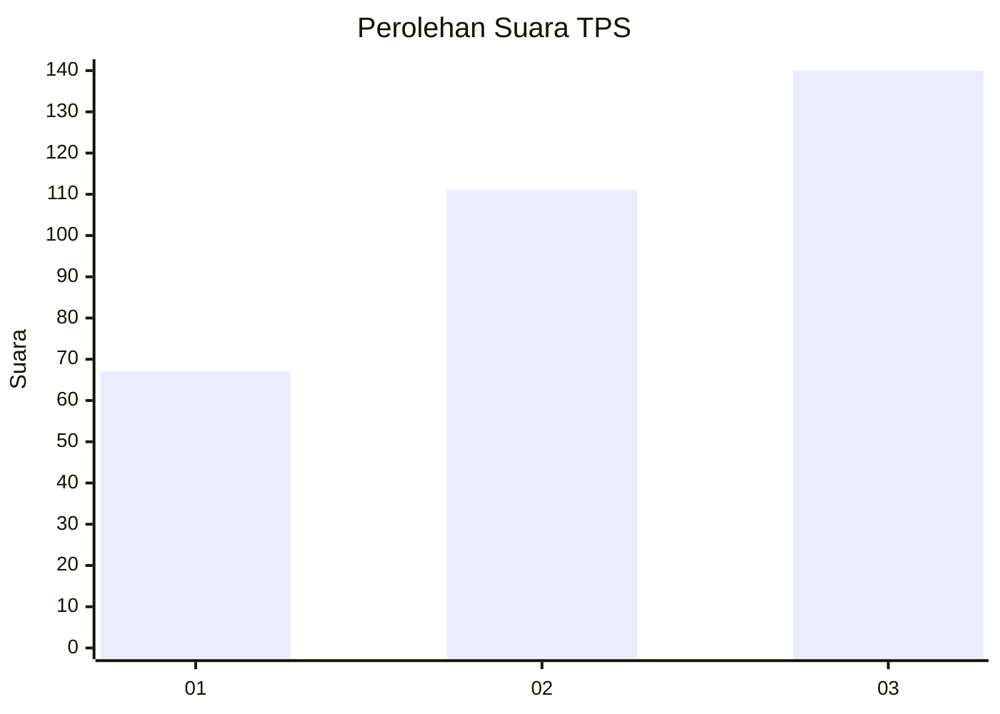
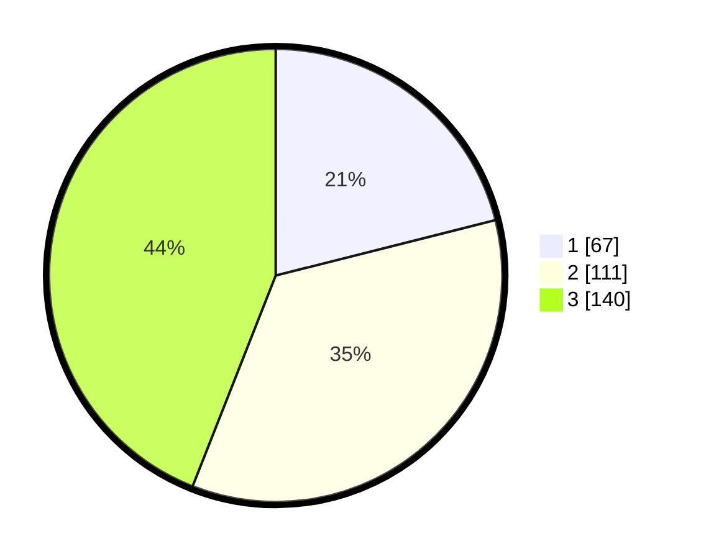

# Hasil

## Grafik

## Tabel

| No. | Nama Paslon    | Suara | Suara (raw) | Persentase |
|:--- |:-------------- | -----:| -----------:| ----------:|
| 1   | ANIES MUHAIMIN | 67    | [67][p-1]   | 21,07      |
| 2   | PRABOWO GIBRAN | 111   | [111][p-2]  | 34,91      |
| 3   | GANJAR MAHFUD  | 140   | [140][p-3]  | 44,03      |

[p-1]: https://github.com/gigit-pemilu/pemilu-2024-99-luar-negeri/blob/main/pilpres/hitung-suara/sub/99-luar-negeri/sub/85-ottawa-kanada/sub/01-ottawa-kanada/sub/0001-ottawa-kanada/sub/001-pos-001/sub/paslon-1.txt
[p-2]: https://github.com/gigit-pemilu/pemilu-2024-99-luar-negeri/blob/main/pilpres/hitung-suara/sub/99-luar-negeri/sub/85-ottawa-kanada/sub/01-ottawa-kanada/sub/0001-ottawa-kanada/sub/001-pos-001/sub/paslon-2.txt
[p-3]: https://github.com/gigit-pemilu/pemilu-2024-99-luar-negeri/blob/main/pilpres/hitung-suara/sub/99-luar-negeri/sub/85-ottawa-kanada/sub/01-ottawa-kanada/sub/0001-ottawa-kanada/sub/001-pos-001/sub/paslon-3.txt

## Foto C Plano

https://sirekap-obj-formc.kpu.go.id/ab07/pemilu/ppwp/99/85/01/00/01/9985010001001-20240219-040141--56d1a94a-954d-4fdd-a699-34fa133da317.jpg

https://sirekap-obj-formc.kpu.go.id/ab07/pemilu/ppwp/99/85/01/00/01/9985010001001-20240219-042455--2ec73ab9-0a9d-4287-828a-fbdc224255c8.jpg

https://sirekap-obj-formc.kpu.go.id/ab07/pemilu/ppwp/99/85/01/00/01/9985010001001-20240219-042643--2fb562f8-7b2a-40d7-b83d-3e6ead918202.jpg

## Metadata

| Key        | Value               |
| ---------- | ------------------- |
| Time Stamp | 2024-02-19 06:16:00 |

## DATA PEMILIH TETAP

Jumlah pemilih dalam DPT: **595**.
 * L: **193**.
 * P: **402**.

## DATA PENGGUNA HAK PILIH

Jumlah pengguna hak pilih dalam DPT: **323**.
 * L: **99**.
 * P: **224**.

Jumlah pengguna hak pilih dalam DPTb: **9**.
 * L: **3**.
 * P: **6**.

Jumlah pengguna hak pilih dalam DPK: **0**.
 * L: **0**.
 * P: **0**.

Jumlah pengguna hak pilih: **332**.
 * L: **102**.
 * P: **230**.

## JUMLAH SUARA SAH DAN TIDAK SAH

JUMLAH SELURUH SUARA SAH: **318**.

JUMLAH SUARA TIDAK SAH: **14**.

JUMLAH SELURUH SUARA SAH DAN SUARA TIDAK SAH: **332**.

