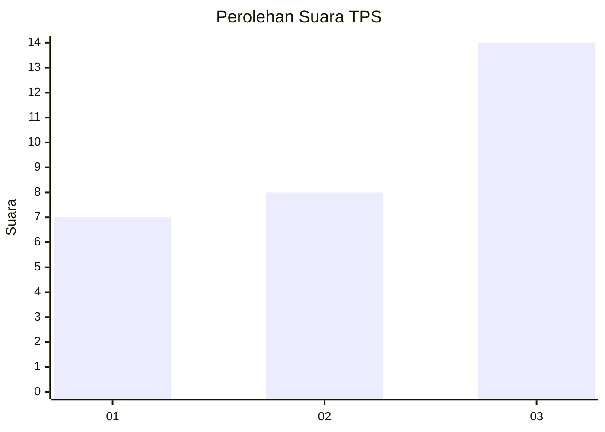
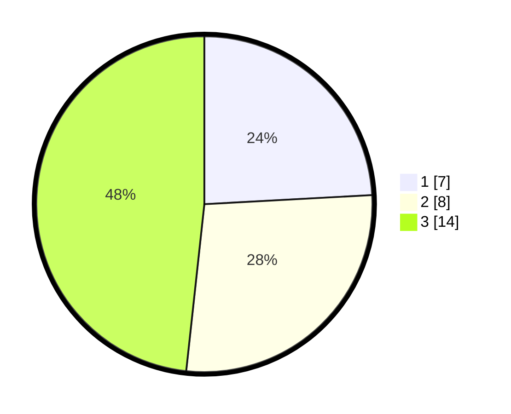

# Hasil

## Grafik

## Tabel

| No. | Nama Paslon    | Suara | Suara (raw) | Persentase |
|:--- |:-------------- | -----:| -----------:| ----------:|
| 1   | ANIES MUHAIMIN | 7     | [7][p-1]    | 24,14      |
| 2   | PRABOWO GIBRAN | 8     | [8][p-2]    | 27,59      |
| 3   | GANJAR MAHFUD  | 14    | [14][p-3]   | 48,28      |

[p-1]: https://github.com/gigit-pemilu/pemilu-2024-99-luar-negeri/blob/main/pilpres/hitung-suara/sub/99-luar-negeri/sub/85-ottawa-kanada/sub/01-ottawa-kanada/sub/0001-ottawa-kanada/sub/002-pos-002/sub/paslon-1.txt
[p-2]: https://github.com/gigit-pemilu/pemilu-2024-99-luar-negeri/blob/main/pilpres/hitung-suara/sub/99-luar-negeri/sub/85-ottawa-kanada/sub/01-ottawa-kanada/sub/0001-ottawa-kanada/sub/002-pos-002/sub/paslon-2.txt
[p-3]: https://github.com/gigit-pemilu/pemilu-2024-99-luar-negeri/blob/main/pilpres/hitung-suara/sub/99-luar-negeri/sub/85-ottawa-kanada/sub/01-ottawa-kanada/sub/0001-ottawa-kanada/sub/002-pos-002/sub/paslon-3.txt

## Foto C Plano

https://sirekap-obj-formc.kpu.go.id/d32a/pemilu/ppwp/99/85/01/00/01/9985010001002-20240219-023524--90cc06b9-7c29-4fbc-9947-420114b3cdb7.jpg

https://sirekap-obj-formc.kpu.go.id/d32a/pemilu/ppwp/99/85/01/00/01/9985010001002-20240219-023754--456299e6-03f2-4e10-ac33-712d635156ad.jpg

https://sirekap-obj-formc.kpu.go.id/d32a/pemilu/ppwp/99/85/01/00/01/9985010001002-20240219-023943--3b9e19af-b62b-4f6c-8e2f-35b172d52ca9.jpg

## Metadata

| Key        | Value               |
| ---------- | ------------------- |
| Time Stamp | 2024-02-19 06:16:00 |

## DATA PEMILIH TETAP

Jumlah pemilih dalam DPT: **121**.
 * L: **54**.
 * P: **67**.

## DATA PENGGUNA HAK PILIH

Jumlah pengguna hak pilih dalam DPT: **29**.
 * L: **11**.
 * P: **18**.

Jumlah pengguna hak pilih dalam DPTb: **0**.
 * L: **0**.
 * P: **0**.

Jumlah pengguna hak pilih dalam DPK: **0**.
 * L: **0**.
 * P: **0**.

Jumlah pengguna hak pilih: **29**.
 * L: **11**.
 * P: **18**.

## JUMLAH SUARA SAH DAN TIDAK SAH

JUMLAH SELURUH SUARA SAH: **29**.

JUMLAH SUARA TIDAK SAH: **0**.

JUMLAH SELURUH SUARA SAH DAN SUARA TIDAK SAH: **29**.

