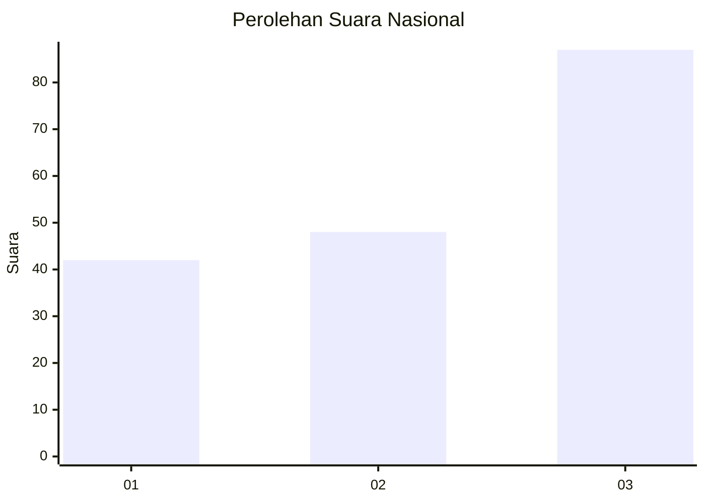
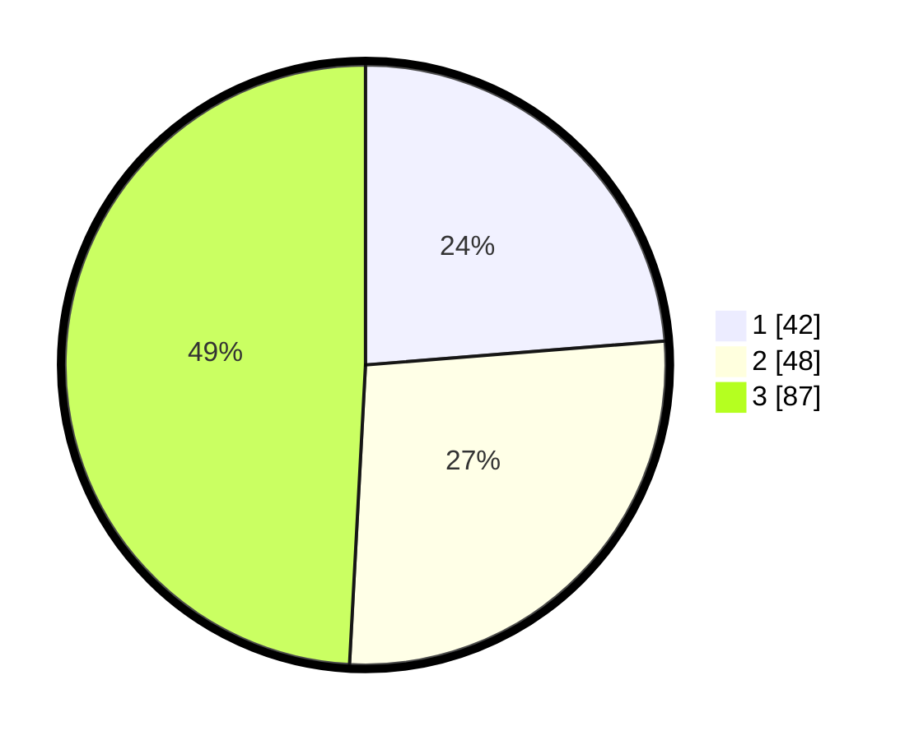

# Hasil

## Grafik

## Tabel

| No. | Nama Paslon    | Suara | Suara (raw) | Persentase |
|:--- |:-------------- | -----:| -----------:| ----------:|
| 1   | ANIES MUHAIMIN | 42    | [42][p-1]   | 23,73      |
| 2   | PRABOWO GIBRAN | 48    | [48][p-2]   | 27,12      |
| 3   | GANJAR MAHFUD  | 87    | [87][p-3]   | 49,15      |

[p-1]: https://github.com/gigit-pemilu/pemilu-2024/blob/main/pilpres/hitung-suara/sub/99-luar-negeri/sub/85-ottawa-kanada/sub/01-ottawa-kanada/sub/0001-ottawa-kanada/sub/003-tps-001/sub/paslon-1.txt
[p-2]: https://github.com/gigit-pemilu/pemilu-2024/blob/main/pilpres/hitung-suara/sub/99-luar-negeri/sub/85-ottawa-kanada/sub/01-ottawa-kanada/sub/0001-ottawa-kanada/sub/003-tps-001/sub/paslon-2.txt
[p-3]: https://github.com/gigit-pemilu/pemilu-2024/blob/main/pilpres/hitung-suara/sub/99-luar-negeri/sub/85-ottawa-kanada/sub/01-ottawa-kanada/sub/0001-ottawa-kanada/sub/003-tps-001/sub/paslon-3.txt

## Foto C Plano

https://sirekap-obj-formc.kpu.go.id/78bb/pemilu/ppwp/99/85/01/00/01/9985010001003-20240215-033614--9a2e368d-5055-4540-873f-7ae81a6a324b.jpg

https://sirekap-obj-formc.kpu.go.id/78bb/pemilu/ppwp/99/85/01/00/01/9985010001003-20240215-051502--3d877f07-20e2-4bc9-a800-86c46a92268f.jpg

https://sirekap-obj-formc.kpu.go.id/78bb/pemilu/ppwp/99/85/01/00/01/9985010001003-20240215-033723--2740ae2e-ab24-47fb-a9e5-f306a1a0b795.jpg

## Metadata

| Key        | Value               |
| ---------- | ------------------- |
| Time Stamp | 2024-02-15 20:30:46 |

## DATA PEMILIH TETAP

Jumlah pemilih dalam DPT: **1132**.
 * L: **433**.
 * P: **699**.

## DATA PENGGUNA HAK PILIH

Jumlah pengguna hak pilih dalam DPT: **128**.
 * L: **59**.
 * P: **69**.

Jumlah pengguna hak pilih dalam DPTb: **41**.
 * L: **14**.
 * P: **27**.

Jumlah pengguna hak pilih dalam DPK: **13**.
 * L: **2**.
 * P: **11**.

Jumlah pengguna hak pilih: **182**.
 * L: **75**.
 * P: **107**.

## JUMLAH SUARA SAH DAN TIDAK SAH

JUMLAH SELURUH SUARA SAH: **177**.

JUMLAH SUARA TIDAK SAH: **5**.

JUMLAH SELURUH SUARA SAH DAN SUARA TIDAK SAH: **182**.

