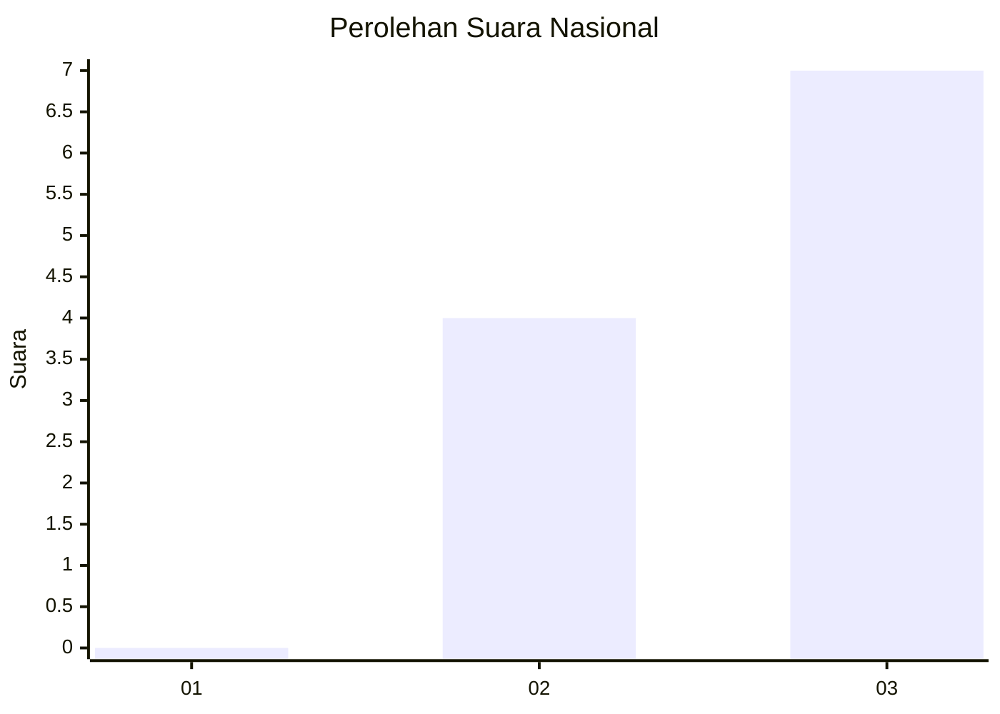
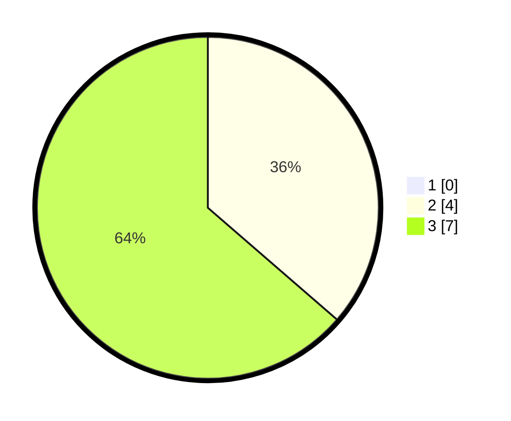

# Hasil

## Grafik

## Tabel

| No. | Nama Paslon    | Suara | Suara (raw) | Persentase |
|:--- |:-------------- | -----:| -----------:| ----------:|
| 1   | ANIES MUHAIMIN | 0     | [0][p-1]    | 0,00       |
| 2   | PRABOWO GIBRAN | 4     | [4][p-2]    | 36,36      |
| 3   | GANJAR MAHFUD  | 7     | [7][p-3]    | 63,64      |

[p-1]: https://github.com/gigit-pemilu/pemilu-2024/blob/main/pilpres/hitung-suara/sub/99-luar-negeri/sub/86-panama-city-panama/sub/01-panama-city-panama/sub/0001-panama-city-panama/sub/001-pos-001/sub/paslon-1.txt
[p-2]: https://github.com/gigit-pemilu/pemilu-2024/blob/main/pilpres/hitung-suara/sub/99-luar-negeri/sub/86-panama-city-panama/sub/01-panama-city-panama/sub/0001-panama-city-panama/sub/001-pos-001/sub/paslon-2.txt
[p-3]: https://github.com/gigit-pemilu/pemilu-2024/blob/main/pilpres/hitung-suara/sub/99-luar-negeri/sub/86-panama-city-panama/sub/01-panama-city-panama/sub/0001-panama-city-panama/sub/001-pos-001/sub/paslon-3.txt

## Foto C Plano

https://sirekap-obj-formc.kpu.go.id/ada5/pemilu/ppwp/99/86/01/00/01/9986010001001-20240216-003201--4a440af7-148c-4069-bea4-d880e25f6724.jpg

https://sirekap-obj-formc.kpu.go.id/ada5/pemilu/ppwp/99/86/01/00/01/9986010001001-20240216-003203--4508e7e9-e82c-4cdf-b0e3-789a4e38ee6f.jpg

https://sirekap-obj-formc.kpu.go.id/ada5/pemilu/ppwp/99/86/01/00/01/9986010001001-20240216-003202--868defeb-f163-4ccc-9807-c237e8a42843.jpg

## Metadata

| Key        | Value               |
| ---------- | ------------------- |
| Time Stamp | 2024-02-16 08:00:28 |

## DATA PEMILIH TETAP

Jumlah pemilih dalam DPT: **14**.
 * L: **7**.
 * P: **7**.

## DATA PENGGUNA HAK PILIH

Jumlah pengguna hak pilih dalam DPT: **11**.
 * L: **6**.
 * P: **5**.

Jumlah pengguna hak pilih dalam DPTb: **0**.
 * L: **0**.
 * P: **0**.

Jumlah pengguna hak pilih dalam DPK: **1**.
 * L: **1**.
 * P: **0**.

Jumlah pengguna hak pilih: **12**.
 * L: **7**.
 * P: **5**.

## JUMLAH SUARA SAH DAN TIDAK SAH

JUMLAH SELURUH SUARA SAH: **11**.

JUMLAH SUARA TIDAK SAH: **0**.

JUMLAH SELURUH SUARA SAH DAN SUARA TIDAK SAH: **11**.

