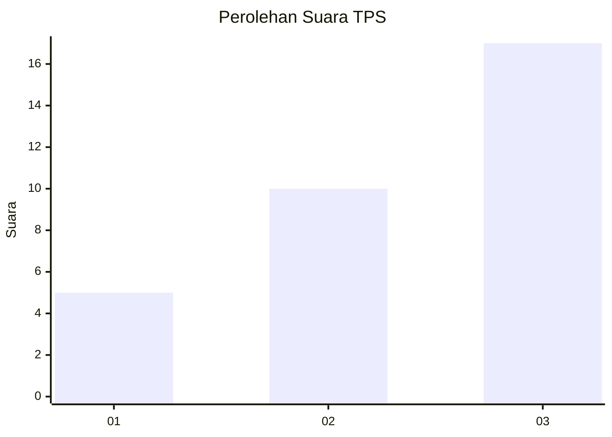
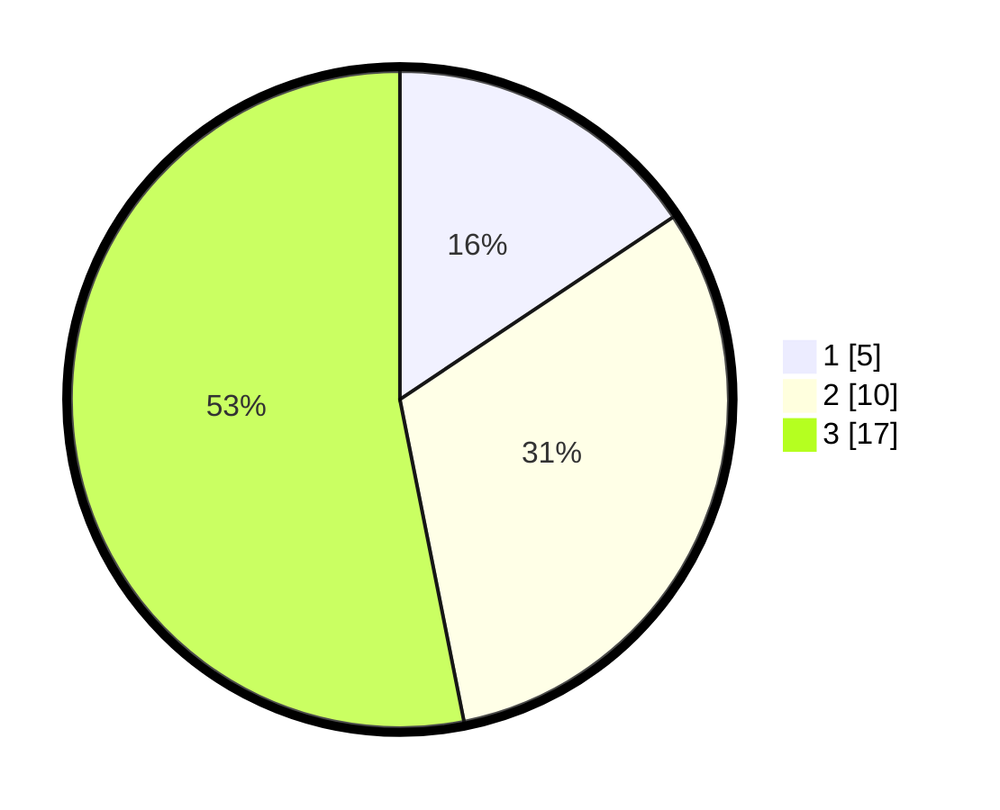

# Hasil

## Grafik

## Tabel

| No. | Nama Paslon    | Suara | Suara (raw) | Persentase |
|:--- |:-------------- | -----:| -----------:| ----------:|
| 1   | ANIES MUHAIMIN | 5     | [5][p-1]    | 15,63      |
| 2   | PRABOWO GIBRAN | 10    | [10][p-2]   | 31,25      |
| 3   | GANJAR MAHFUD  | 17    | [17][p-3]   | 53,13      |

[p-1]: https://github.com/gigit-pemilu/pemilu-2024-99-luar-negeri/blob/main/pilpres/hitung-suara/sub/99-luar-negeri/sub/86-panama-city-panama/sub/01-panama-city-panama/sub/0001-panama-city-panama/sub/002-tps-001/sub/paslon-1.txt
[p-2]: https://github.com/gigit-pemilu/pemilu-2024-99-luar-negeri/blob/main/pilpres/hitung-suara/sub/99-luar-negeri/sub/86-panama-city-panama/sub/01-panama-city-panama/sub/0001-panama-city-panama/sub/002-tps-001/sub/paslon-2.txt
[p-3]: https://github.com/gigit-pemilu/pemilu-2024-99-luar-negeri/blob/main/pilpres/hitung-suara/sub/99-luar-negeri/sub/86-panama-city-panama/sub/01-panama-city-panama/sub/0001-panama-city-panama/sub/002-tps-001/sub/paslon-3.txt

## Foto C Plano

https://sirekap-obj-formc.kpu.go.id/5b9e/pemilu/ppwp/99/86/01/00/01/9986010001002-20240216-125110--513ee997-66b6-418e-8037-9ab1fe173348.jpg

https://sirekap-obj-formc.kpu.go.id/5b9e/pemilu/ppwp/99/86/01/00/01/9986010001002-20240216-125113--280ecc1d-9b04-4693-b6c9-ea7feb1d1803.jpg

https://sirekap-obj-formc.kpu.go.id/5b9e/pemilu/ppwp/99/86/01/00/01/9986010001002-20240216-125111--1340166d-b22f-4e6d-8d2e-0e0bf43d6de5.jpg

## Metadata

| Key        | Value               |
| ---------- | ------------------- |
| Time Stamp | 2024-02-19 06:16:00 |

## DATA PEMILIH TETAP

Jumlah pemilih dalam DPT: **40**.
 * L: **19**.
 * P: **21**.

## DATA PENGGUNA HAK PILIH

Jumlah pengguna hak pilih dalam DPT: **32**.
 * L: **16**.
 * P: **16**.

Jumlah pengguna hak pilih dalam DPTb: **1**.
 * L: **1**.
 * P: **0**.

Jumlah pengguna hak pilih dalam DPK: **0**.
 * L: **0**.
 * P: **0**.

Jumlah pengguna hak pilih: **33**.
 * L: **17**.
 * P: **16**.

## JUMLAH SUARA SAH DAN TIDAK SAH

JUMLAH SELURUH SUARA SAH: **32**.

JUMLAH SUARA TIDAK SAH: **1**.

JUMLAH SELURUH SUARA SAH DAN SUARA TIDAK SAH: **33**.

