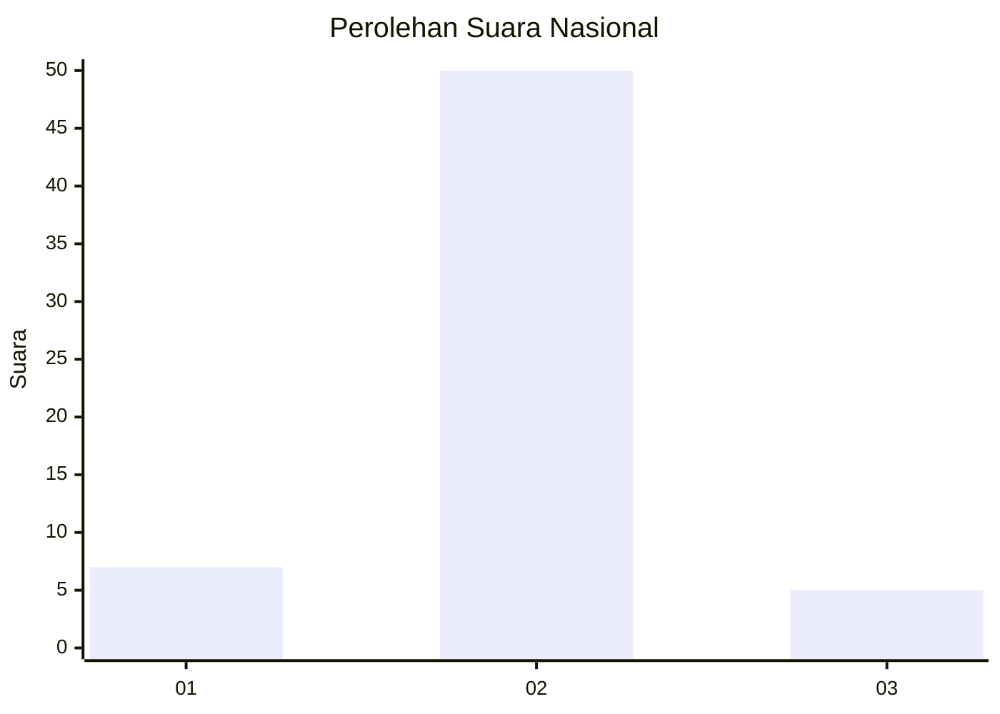
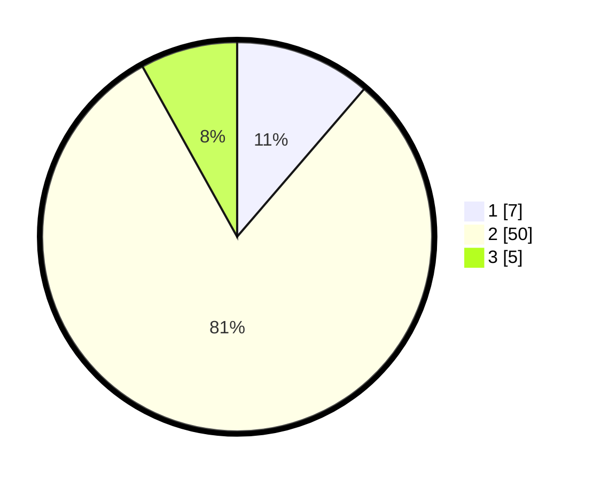

# Hasil

## Grafik

## Tabel

| No. | Nama Paslon    | Suara | Suara (raw) | Persentase |
|:--- |:-------------- | -----:| -----------:| ----------:|
| 1   | ANIES MUHAIMIN | 7     | [7][p-1]    | 11,29      |
| 2   | PRABOWO GIBRAN | 50    | [50][p-2]   | 80,65      |
| 3   | GANJAR MAHFUD  | 5     | [5][p-3]    | 8,06       |

[p-1]: https://github.com/gigit-pemilu/pemilu-2024/blob/main/pilpres/hitung-suara/sub/99-luar-negeri/sub/86-panama-city-panama/sub/01-panama-city-panama/sub/0001-panama-city-panama/sub/003-ksk-001/sub/paslon-1.txt
[p-2]: https://github.com/gigit-pemilu/pemilu-2024/blob/main/pilpres/hitung-suara/sub/99-luar-negeri/sub/86-panama-city-panama/sub/01-panama-city-panama/sub/0001-panama-city-panama/sub/003-ksk-001/sub/paslon-2.txt
[p-3]: https://github.com/gigit-pemilu/pemilu-2024/blob/main/pilpres/hitung-suara/sub/99-luar-negeri/sub/86-panama-city-panama/sub/01-panama-city-panama/sub/0001-panama-city-panama/sub/003-ksk-001/sub/paslon-3.txt

## Foto C Plano

https://sirekap-obj-formc.kpu.go.id/ee09/pemilu/ppwp/99/86/01/00/01/9986010001003-20240215-035629--4fa98323-9822-48b9-92b9-0e1284e75a0a.jpg

https://sirekap-obj-formc.kpu.go.id/ee09/pemilu/ppwp/99/86/01/00/01/9986010001003-20240216-130858--befa93f6-9d19-4b03-9b10-884631cccf66.jpg

https://sirekap-obj-formc.kpu.go.id/ee09/pemilu/ppwp/99/86/01/00/01/9986010001003-20240215-035824--1ec5bcc8-d47a-4afc-ace9-8075f9dee220.jpg

## Metadata

| Key        | Value               |
| ---------- | ------------------- |
| Time Stamp | 2024-02-19 06:16:00 |

## DATA PEMILIH TETAP

Jumlah pemilih dalam DPT: **88**.
 * L: **88**.
 * P: **0**.

## DATA PENGGUNA HAK PILIH

Jumlah pengguna hak pilih dalam DPT: **24**.
 * L: **24**.
 * P: **0**.

Jumlah pengguna hak pilih dalam DPTb: **27**.
 * L: **27**.
 * P: **0**.

Jumlah pengguna hak pilih dalam DPK: **11**.
 * L: **11**.
 * P: **0**.

Jumlah pengguna hak pilih: **62**.
 * L: **62**.
 * P: **0**.

## JUMLAH SUARA SAH DAN TIDAK SAH

JUMLAH SELURUH SUARA SAH: **62**.

JUMLAH SUARA TIDAK SAH: **0**.

JUMLAH SELURUH SUARA SAH DAN SUARA TIDAK SAH: **62**.

