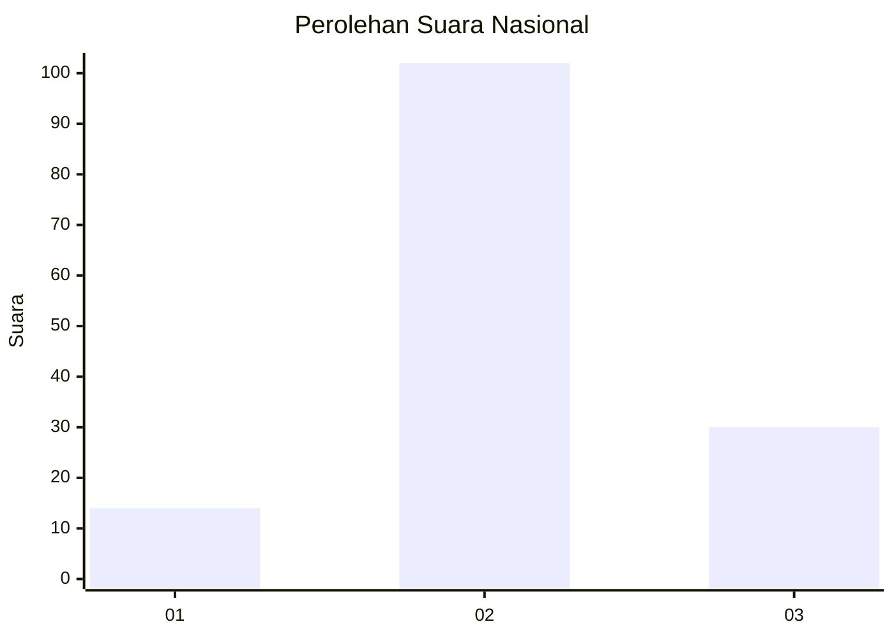
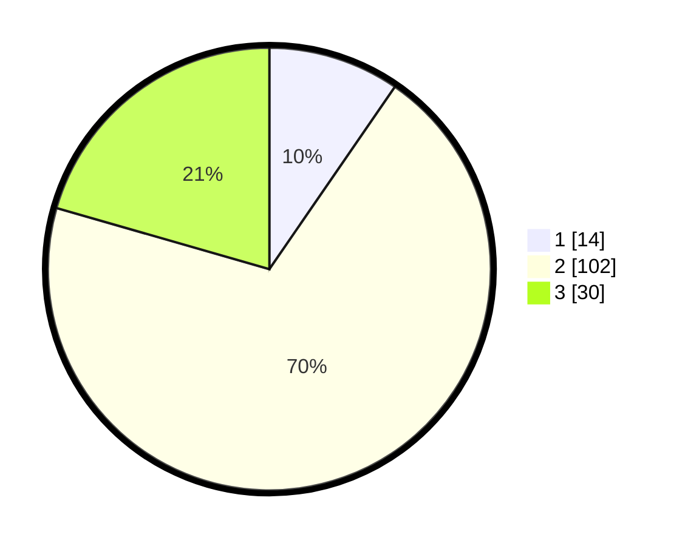

# Hasil

## Grafik

## Tabel

| No. | Nama Paslon    | Suara | Suara (raw) | Persentase |
|:--- |:-------------- | -----:| -----------:| ----------:|
| 1   | ANIES MUHAIMIN | 14    | [14][p-1]   | 9,59       |
| 2   | PRABOWO GIBRAN | 102   | [102][p-2]  | 69,86      |
| 3   | GANJAR MAHFUD  | 30    | [30][p-3]   | 20,55      |

[p-1]: https://github.com/gigit-pemilu/pemilu-2024/blob/main/pilpres/hitung-suara/sub/99-luar-negeri/sub/87-paramaribo-suriname/sub/01-paramaribo-suriname/sub/0001-paramaribo-suriname/sub/002-ksk-001/sub/paslon-1.txt
[p-2]: https://github.com/gigit-pemilu/pemilu-2024/blob/main/pilpres/hitung-suara/sub/99-luar-negeri/sub/87-paramaribo-suriname/sub/01-paramaribo-suriname/sub/0001-paramaribo-suriname/sub/002-ksk-001/sub/paslon-2.txt
[p-3]: https://github.com/gigit-pemilu/pemilu-2024/blob/main/pilpres/hitung-suara/sub/99-luar-negeri/sub/87-paramaribo-suriname/sub/01-paramaribo-suriname/sub/0001-paramaribo-suriname/sub/002-ksk-001/sub/paslon-3.txt

## Foto C Plano

https://sirekap-obj-formc.kpu.go.id/7d01/pemilu/ppwp/99/87/01/00/01/9987010001002-20240218-013839--547ad499-2545-4140-bfdc-a34cbba8b2ef.jpg

https://sirekap-obj-formc.kpu.go.id/7d01/pemilu/ppwp/99/87/01/00/01/9987010001002-20240218-013841--5cbdb30a-f283-452c-b255-6ae8e0ac17c9.jpg

https://sirekap-obj-formc.kpu.go.id/7d01/pemilu/ppwp/99/87/01/00/01/9987010001002-20240218-013840--222d2b34-81fd-4aae-8afc-02d1f8965425.jpg

## Metadata

| Key        | Value               |
| ---------- | ------------------- |
| Time Stamp | 2024-02-21 18:00:00 |

## DATA PEMILIH TETAP

Jumlah pemilih dalam DPT: **340**.
 * L: **340**.
 * P: **0**.

## DATA PENGGUNA HAK PILIH

Jumlah pengguna hak pilih dalam DPT: **73**.
 * L: **73**.
 * P: **0**.

Jumlah pengguna hak pilih dalam DPTb: **46**.
 * L: **46**.
 * P: **0**.

Jumlah pengguna hak pilih dalam DPK: **24**.
 * L: **23**.
 * P: **4**.

Jumlah pengguna hak pilih: **146**.
 * L: **142**.
 * P: **4**.

## JUMLAH SUARA SAH DAN TIDAK SAH

JUMLAH SELURUH SUARA SAH: **146**.

JUMLAH SUARA TIDAK SAH: **0**.

JUMLAH SELURUH SUARA SAH DAN SUARA TIDAK SAH: **146**.

