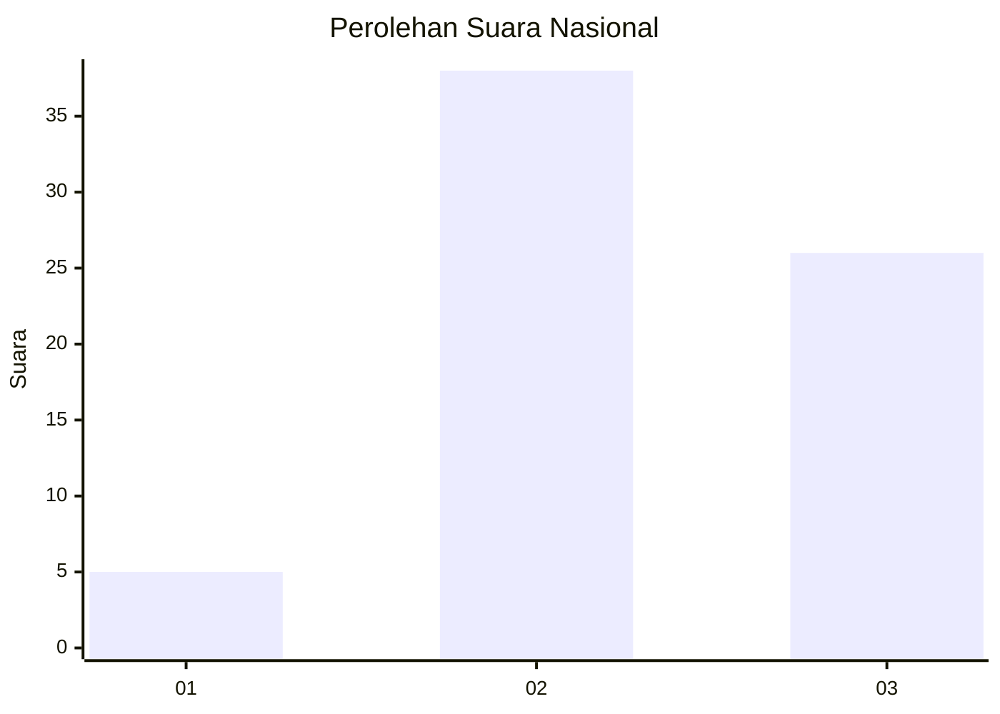
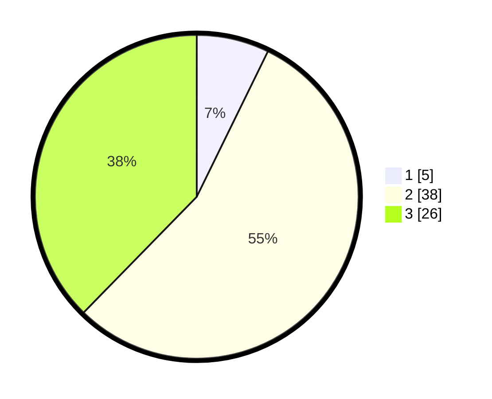

# Hasil

## Grafik

## Tabel

| No. | Nama Paslon    | Suara | Suara (raw) | Persentase |
|:--- |:-------------- | -----:| -----------:| ----------:|
| 1   | ANIES MUHAIMIN | 5     | [5][p-1]    | 7,25       |
| 2   | PRABOWO GIBRAN | 38    | [38][p-2]   | 55,07      |
| 3   | GANJAR MAHFUD  | 26    | [26][p-3]   | 37,68      |

[p-1]: https://github.com/gigit-pemilu/pemilu-2024/blob/main/pilpres/hitung-suara/sub/99-luar-negeri/sub/87-paramaribo-suriname/sub/01-paramaribo-suriname/sub/0001-paramaribo-suriname/sub/003-ksk-002/sub/paslon-1.txt
[p-2]: https://github.com/gigit-pemilu/pemilu-2024/blob/main/pilpres/hitung-suara/sub/99-luar-negeri/sub/87-paramaribo-suriname/sub/01-paramaribo-suriname/sub/0001-paramaribo-suriname/sub/003-ksk-002/sub/paslon-2.txt
[p-3]: https://github.com/gigit-pemilu/pemilu-2024/blob/main/pilpres/hitung-suara/sub/99-luar-negeri/sub/87-paramaribo-suriname/sub/01-paramaribo-suriname/sub/0001-paramaribo-suriname/sub/003-ksk-002/sub/paslon-3.txt

## Foto C Plano

https://sirekap-obj-formc.kpu.go.id/96b6/pemilu/ppwp/99/87/01/00/01/9987010001003-20240217-230957--49c72d24-74c6-4e7a-a789-79d0421bf8fb.jpg

https://sirekap-obj-formc.kpu.go.id/96b6/pemilu/ppwp/99/87/01/00/01/9987010001003-20240217-230959--083e818e-71a7-4f88-875e-edf8ea5d1bb9.jpg

https://sirekap-obj-formc.kpu.go.id/96b6/pemilu/ppwp/99/87/01/00/01/9987010001003-20240217-230958--2707fdba-94c6-4cce-9221-f7756d7b3ed5.jpg

## Metadata

| Key        | Value               |
| ---------- | ------------------- |
| Time Stamp | 2024-02-19 06:16:00 |

## DATA PEMILIH TETAP

Jumlah pemilih dalam DPT: **59**.
 * L: **58**.
 * P: **1**.

## DATA PENGGUNA HAK PILIH

Jumlah pengguna hak pilih dalam DPT: **30**.
 * L: **29**.
 * P: **1**.

Jumlah pengguna hak pilih dalam DPTb: **13**.
 * L: **13**.
 * P: **0**.

Jumlah pengguna hak pilih dalam DPK: **26**.
 * L: **26**.
 * P: **0**.

Jumlah pengguna hak pilih: **69**.
 * L: **68**.
 * P: **1**.

## JUMLAH SUARA SAH DAN TIDAK SAH

JUMLAH SELURUH SUARA SAH: **69**.

JUMLAH SUARA TIDAK SAH: **0**.

JUMLAH SELURUH SUARA SAH DAN SUARA TIDAK SAH: **69**.

