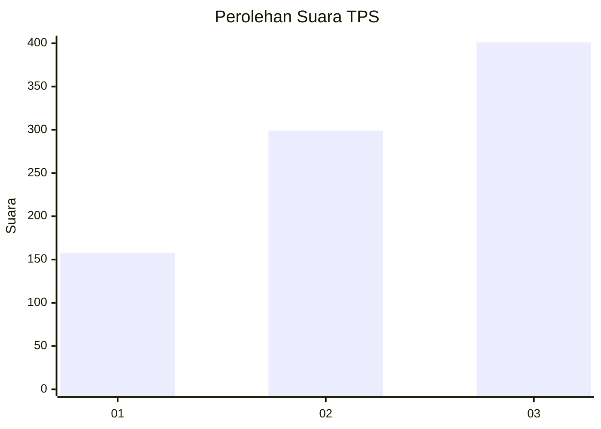
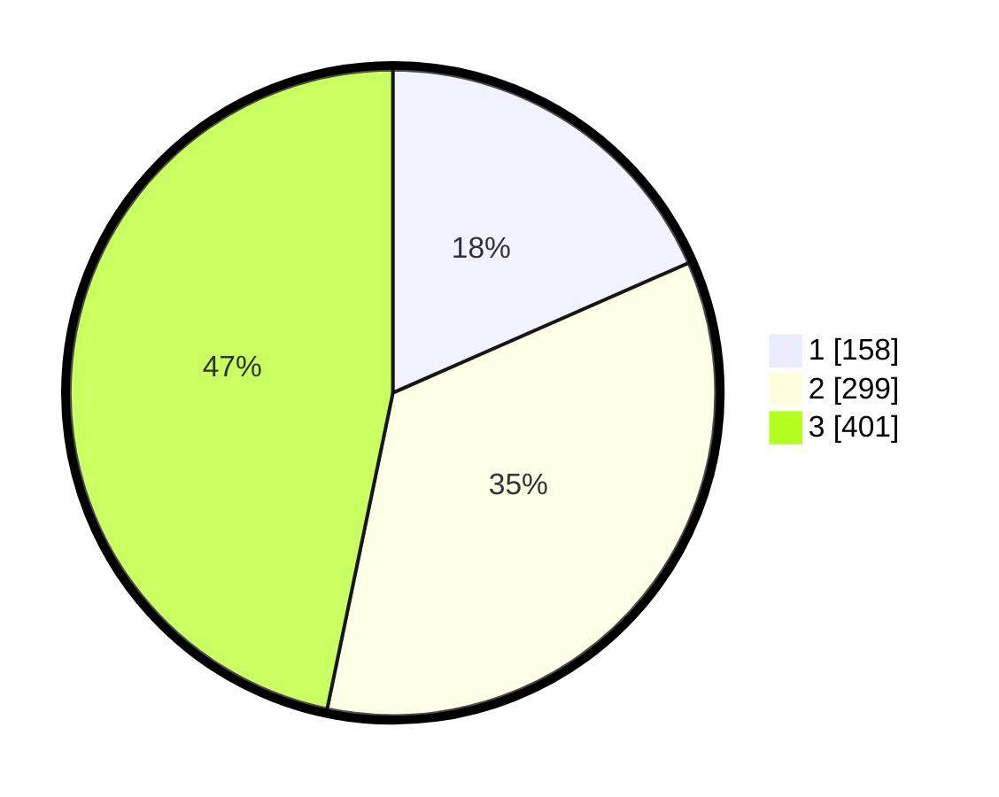

# Hasil

## Grafik

## Tabel

| No. | Nama Paslon    | Suara | Suara (raw) | Persentase |
|:--- |:-------------- | -----:| -----------:| ----------:|
| 1   | ANIES MUHAIMIN | 158   | [158][p-1]  | 18,41      |
| 2   | PRABOWO GIBRAN | 299   | [299][p-2]  | 34,85      |
| 3   | GANJAR MAHFUD  | 401   | [401][p-3]  | 46,74      |

[p-1]: https://github.com/gigit-pemilu/pemilu-2024-99-luar-negeri/blob/main/pilpres/hitung-suara/sub/99-luar-negeri/sub/88-paris-perancis/sub/01-paris-perancis/sub/0001-paris-perancis/sub/001-pos-001/sub/paslon-1.txt
[p-2]: https://github.com/gigit-pemilu/pemilu-2024-99-luar-negeri/blob/main/pilpres/hitung-suara/sub/99-luar-negeri/sub/88-paris-perancis/sub/01-paris-perancis/sub/0001-paris-perancis/sub/001-pos-001/sub/paslon-2.txt
[p-3]: https://github.com/gigit-pemilu/pemilu-2024-99-luar-negeri/blob/main/pilpres/hitung-suara/sub/99-luar-negeri/sub/88-paris-perancis/sub/01-paris-perancis/sub/0001-paris-perancis/sub/001-pos-001/sub/paslon-3.txt

## Foto C Plano

https://sirekap-obj-formc.kpu.go.id/c754/pemilu/ppwp/99/88/01/00/01/9988010001001-20240216-200734--d40c7603-c146-4df9-857c-4c8b9d4e2611.jpg

https://sirekap-obj-formc.kpu.go.id/c754/pemilu/ppwp/99/88/01/00/01/9988010001001-20240216-201520--6213bca9-ad6e-40d2-916c-24ceccc5cbc6.jpg

https://sirekap-obj-formc.kpu.go.id/c754/pemilu/ppwp/99/88/01/00/01/9988010001001-20240216-201828--90969e18-9525-4482-ae53-cc69eae46761.jpg

## Metadata

| Key        | Value               |
| ---------- | ------------------- |
| Time Stamp | 2024-02-19 06:16:00 |

## DATA PEMILIH TETAP

Jumlah pemilih dalam DPT: **1204**.
 * L: **224**.
 * P: **980**.

## DATA PENGGUNA HAK PILIH

Jumlah pengguna hak pilih dalam DPT: **852**.
 * L: **143**.
 * P: **709**.

Jumlah pengguna hak pilih dalam DPTb: **0**.
 * L: **0**.
 * P: **0**.

Jumlah pengguna hak pilih dalam DPK: **47**.
 * L: **7**.
 * P: **40**.

Jumlah pengguna hak pilih: **899**.
 * L: **150**.
 * P: **749**.

## JUMLAH SUARA SAH DAN TIDAK SAH

JUMLAH SELURUH SUARA SAH: **858**.

JUMLAH SUARA TIDAK SAH: **41**.

JUMLAH SELURUH SUARA SAH DAN SUARA TIDAK SAH: **899**.

