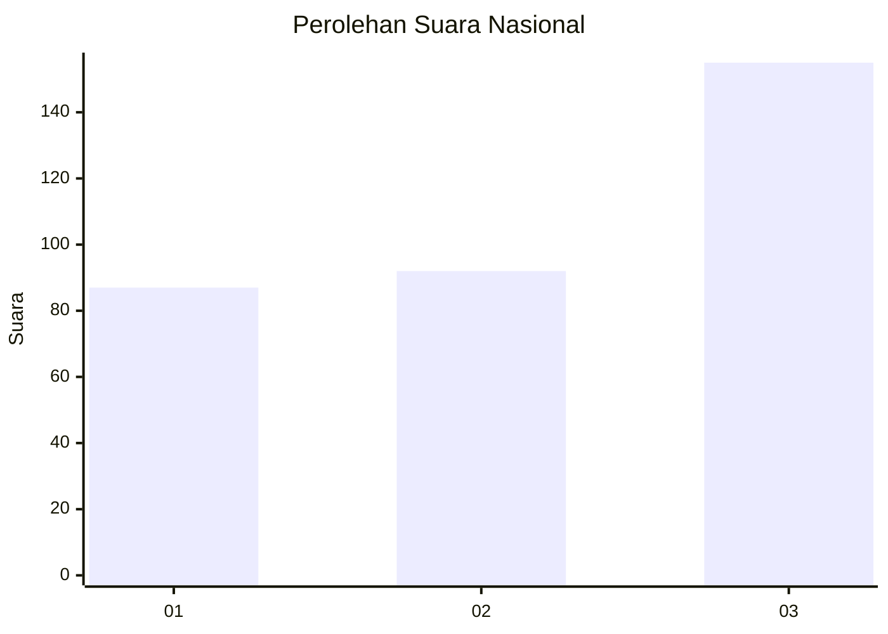
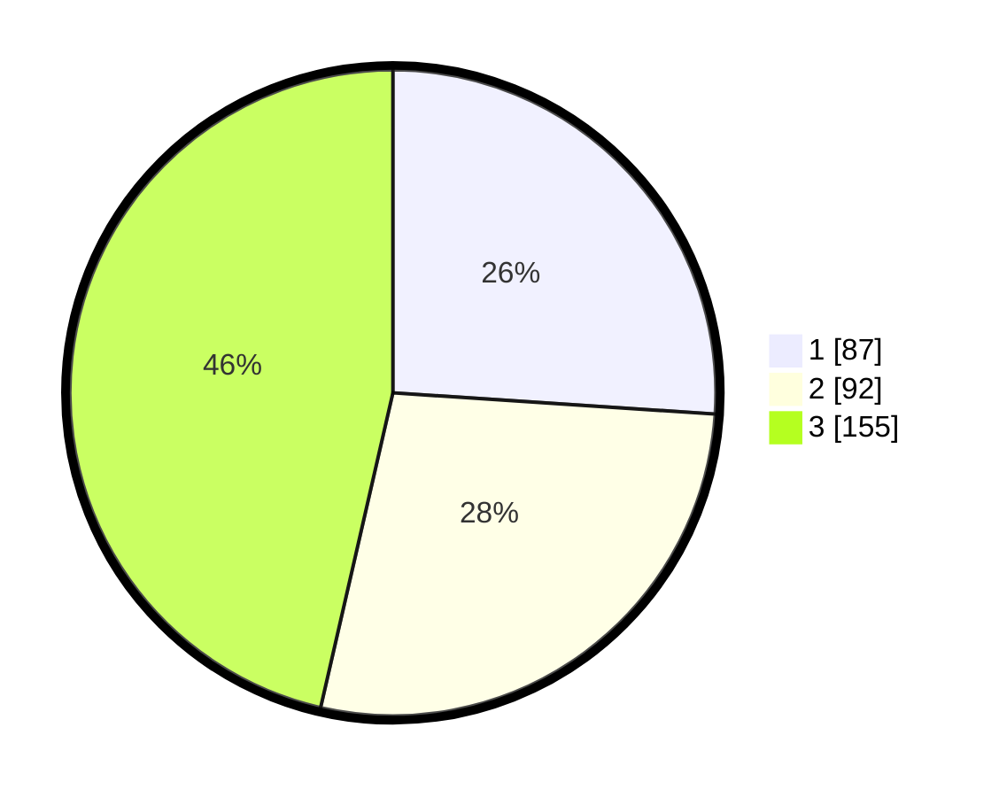

# Hasil

## Grafik

## Tabel

| No. | Nama Paslon    | Suara | Suara (raw) | Persentase |
|:--- |:-------------- | -----:| -----------:| ----------:|
| 1   | ANIES MUHAIMIN | 87    | [87][p-1]   | 26,05      |
| 2   | PRABOWO GIBRAN | 92    | [92][p-2]   | 27,54      |
| 3   | GANJAR MAHFUD  | 155   | [155][p-3]  | 46,41      |

[p-1]: https://github.com/gigit-pemilu/pemilu-2024/blob/main/pilpres/hitung-suara/sub/99-luar-negeri/sub/88-paris-perancis/sub/01-paris-perancis/sub/0001-paris-perancis/sub/002-tps-001/sub/paslon-1.txt
[p-2]: https://github.com/gigit-pemilu/pemilu-2024/blob/main/pilpres/hitung-suara/sub/99-luar-negeri/sub/88-paris-perancis/sub/01-paris-perancis/sub/0001-paris-perancis/sub/002-tps-001/sub/paslon-2.txt
[p-3]: https://github.com/gigit-pemilu/pemilu-2024/blob/main/pilpres/hitung-suara/sub/99-luar-negeri/sub/88-paris-perancis/sub/01-paris-perancis/sub/0001-paris-perancis/sub/002-tps-001/sub/paslon-3.txt

## Foto C Plano

https://sirekap-obj-formc.kpu.go.id/5a68/pemilu/ppwp/99/88/01/00/01/9988010001002-20240214-190708--b53eca83-f167-4b22-b771-e9dcc083191e.jpg

https://sirekap-obj-formc.kpu.go.id/5a68/pemilu/ppwp/99/88/01/00/01/9988010001002-20240214-190715--3b9fa9b5-6435-4b49-a5ea-d4abad6a210e.jpg

https://sirekap-obj-formc.kpu.go.id/5a68/pemilu/ppwp/99/88/01/00/01/9988010001002-20240214-190721--1e2a9894-0239-4bb0-b112-aace9adffaf1.jpg

## Metadata

| Key        | Value               |
| ---------- | ------------------- |
| Time Stamp | 2024-02-15 19:00:26 |

## DATA PEMILIH TETAP

Jumlah pemilih dalam DPT: **430**.
 * L: **137**.
 * P: **293**.

## DATA PENGGUNA HAK PILIH

Jumlah pengguna hak pilih dalam DPT: **267**.
 * L: **93**.
 * P: **174**.

Jumlah pengguna hak pilih dalam DPTb: **49**.
 * L: **21**.
 * P: **28**.

Jumlah pengguna hak pilih dalam DPK: **22**.
 * L: **6**.
 * P: **16**.

Jumlah pengguna hak pilih: **338**.
 * L: **120**.
 * P: **218**.

## JUMLAH SUARA SAH DAN TIDAK SAH

JUMLAH SELURUH SUARA SAH: **334**.

JUMLAH SUARA TIDAK SAH: **4**.

JUMLAH SELURUH SUARA SAH DAN SUARA TIDAK SAH: **338**.

