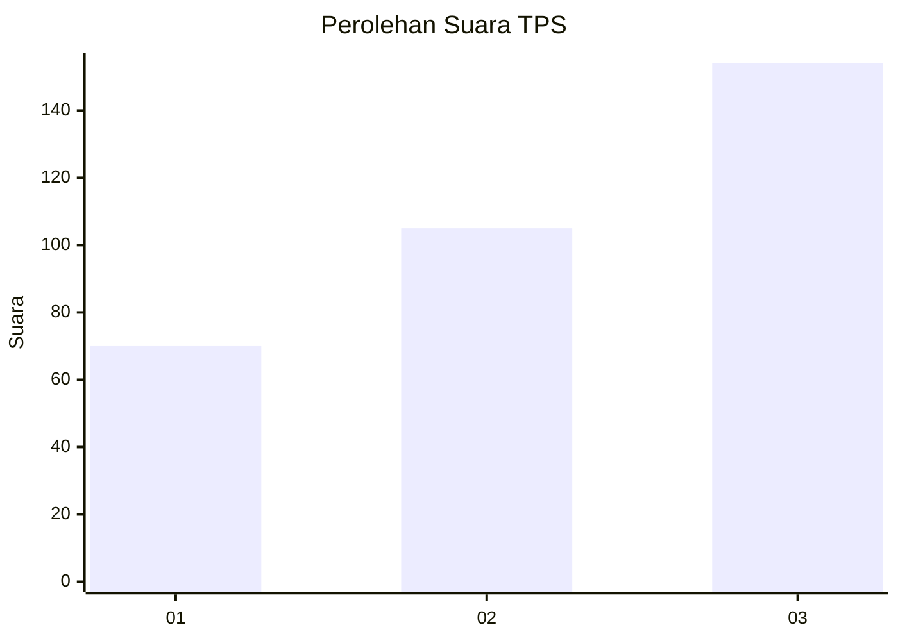
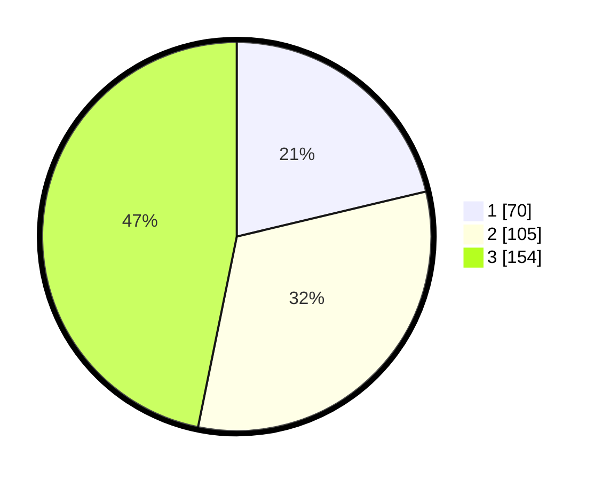

# Hasil

## Grafik

## Tabel

| No. | Nama Paslon    | Suara | Suara (raw) | Persentase |
|:--- |:-------------- | -----:| -----------:| ----------:|
| 1   | ANIES MUHAIMIN | 70    | [70][p-1]   | 21,28      |
| 2   | PRABOWO GIBRAN | 105   | [105][p-2]  | 31,91      |
| 3   | GANJAR MAHFUD  | 154   | [154][p-3]  | 46,81      |

[p-1]: https://github.com/gigit-pemilu/pemilu-2024-99-luar-negeri/blob/main/pilpres/hitung-suara/sub/99-luar-negeri/sub/88-paris-perancis/sub/01-paris-perancis/sub/0001-paris-perancis/sub/003-tps-002/sub/paslon-1.txt
[p-2]: https://github.com/gigit-pemilu/pemilu-2024-99-luar-negeri/blob/main/pilpres/hitung-suara/sub/99-luar-negeri/sub/88-paris-perancis/sub/01-paris-perancis/sub/0001-paris-perancis/sub/003-tps-002/sub/paslon-2.txt
[p-3]: https://github.com/gigit-pemilu/pemilu-2024-99-luar-negeri/blob/main/pilpres/hitung-suara/sub/99-luar-negeri/sub/88-paris-perancis/sub/01-paris-perancis/sub/0001-paris-perancis/sub/003-tps-002/sub/paslon-3.txt

## Foto C Plano

https://sirekap-obj-formc.kpu.go.id/2531/pemilu/ppwp/99/88/01/00/01/9988010001003-20240215-003940--56e4fcb5-f1f8-4836-bb3a-6758a1087f21.jpg

https://sirekap-obj-formc.kpu.go.id/2531/pemilu/ppwp/99/88/01/00/01/9988010001003-20240215-004122--ec281e79-f815-47b7-8402-24bbf016f5a5.jpg

https://sirekap-obj-formc.kpu.go.id/2531/pemilu/ppwp/99/88/01/00/01/9988010001003-20240216-180716--c4a1c53d-821e-42f1-af8e-d2ee1977c1a2.jpg

## Metadata

| Key        | Value               |
| ---------- | ------------------- |
| Time Stamp | 2024-02-16 21:01:00 |

## DATA PEMILIH TETAP

Jumlah pemilih dalam DPT: **442**.
 * L: **126**.
 * P: **316**.

## DATA PENGGUNA HAK PILIH

Jumlah pengguna hak pilih dalam DPT: **260**.
 * L: **80**.
 * P: **180**.

Jumlah pengguna hak pilih dalam DPTb: **52**.
 * L: **23**.
 * P: **29**.

Jumlah pengguna hak pilih dalam DPK: **22**.
 * L: **8**.
 * P: **14**.

Jumlah pengguna hak pilih: **334**.
 * L: **111**.
 * P: **223**.

## JUMLAH SUARA SAH DAN TIDAK SAH

JUMLAH SELURUH SUARA SAH: **329**.

JUMLAH SUARA TIDAK SAH: **5**.

JUMLAH SELURUH SUARA SAH DAN SUARA TIDAK SAH: **334**.

