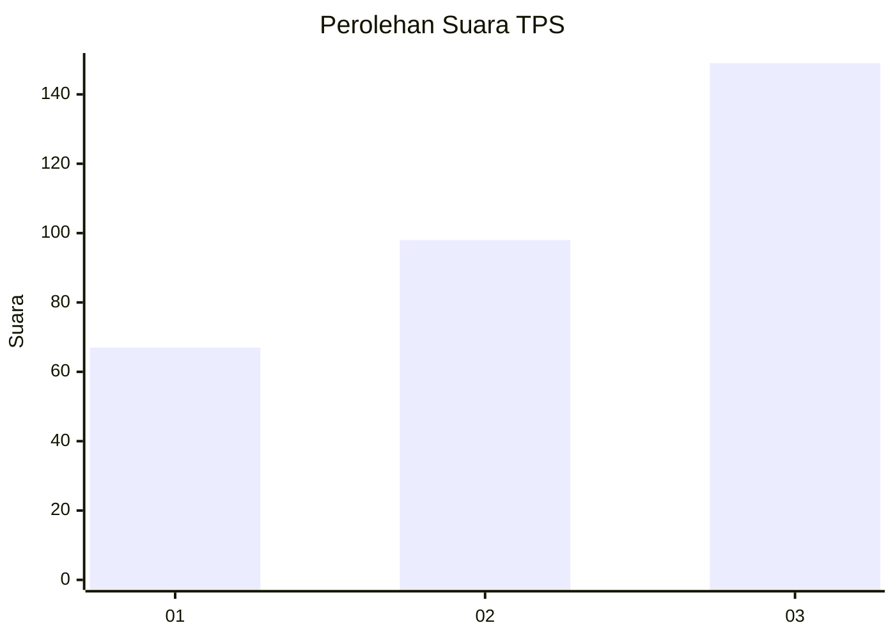
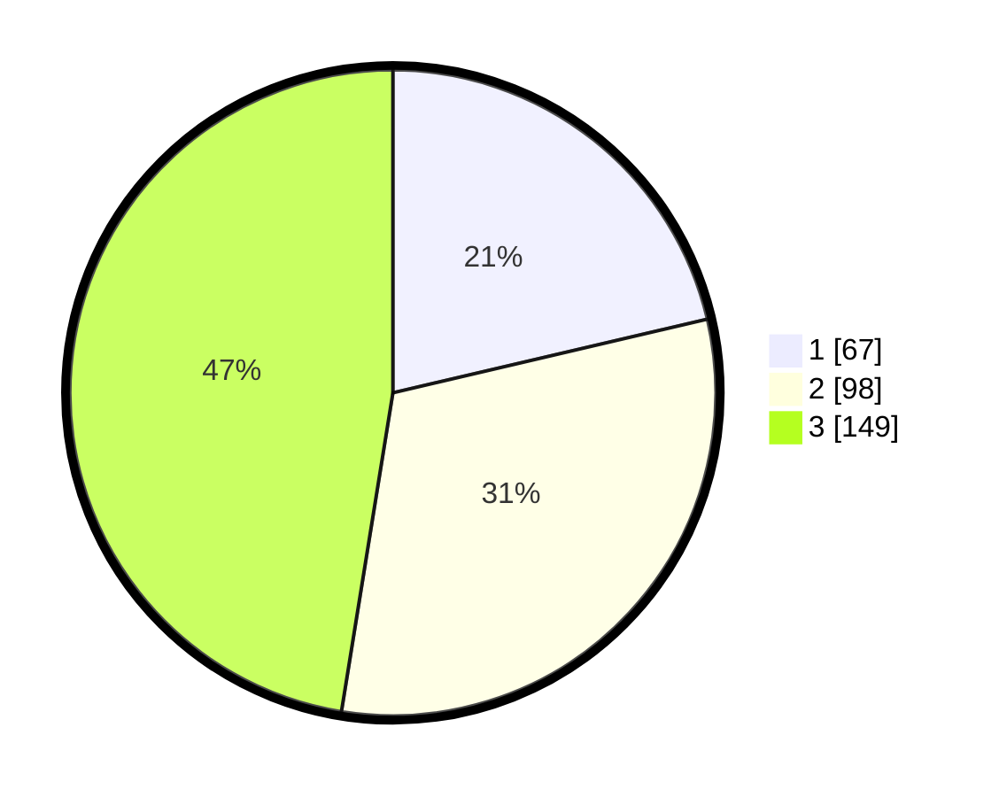

# Hasil

## Grafik

## Tabel

| No. | Nama Paslon    | Suara | Suara (raw) | Persentase |
|:--- |:-------------- | -----:| -----------:| ----------:|
| 1   | ANIES MUHAIMIN | 67    | [67][p-1]   | 21,34      |
| 2   | PRABOWO GIBRAN | 98    | [98][p-2]   | 31,21      |
| 3   | GANJAR MAHFUD  | 149   | [149][p-3]  | 47,45      |

[p-1]: https://github.com/gigit-pemilu/pemilu-2024-99-luar-negeri/blob/main/pilpres/hitung-suara/sub/99-luar-negeri/sub/88-paris-perancis/sub/01-paris-perancis/sub/0001-paris-perancis/sub/004-tps-003/sub/paslon-1.txt
[p-2]: https://github.com/gigit-pemilu/pemilu-2024-99-luar-negeri/blob/main/pilpres/hitung-suara/sub/99-luar-negeri/sub/88-paris-perancis/sub/01-paris-perancis/sub/0001-paris-perancis/sub/004-tps-003/sub/paslon-2.txt
[p-3]: https://github.com/gigit-pemilu/pemilu-2024-99-luar-negeri/blob/main/pilpres/hitung-suara/sub/99-luar-negeri/sub/88-paris-perancis/sub/01-paris-perancis/sub/0001-paris-perancis/sub/004-tps-003/sub/paslon-3.txt

## Foto C Plano

https://sirekap-obj-formc.kpu.go.id/3ee4/pemilu/ppwp/99/88/01/00/01/9988010001004-20240214-191510--f223ef19-3c51-43db-9f2e-6601b7640e93.jpg

https://sirekap-obj-formc.kpu.go.id/3ee4/pemilu/ppwp/99/88/01/00/01/9988010001004-20240214-191517--2091e422-2e1d-43ad-b091-11b5d28f3d2f.jpg

https://sirekap-obj-formc.kpu.go.id/3ee4/pemilu/ppwp/99/88/01/00/01/9988010001004-20240214-191525--06305b3a-8956-44a2-a4bd-e192ac0bde44.jpg

## Metadata

| Key        | Value               |
| ---------- | ------------------- |
| Time Stamp | 2024-02-16 21:01:00 |

## DATA PEMILIH TETAP

Jumlah pemilih dalam DPT: **454**.
 * L: **100**.
 * P: **354**.

## DATA PENGGUNA HAK PILIH

Jumlah pengguna hak pilih dalam DPT: **242**.
 * L: **55**.
 * P: **187**.

Jumlah pengguna hak pilih dalam DPTb: **51**.
 * L: **20**.
 * P: **31**.

Jumlah pengguna hak pilih dalam DPK: **22**.
 * L: **3**.
 * P: **19**.

Jumlah pengguna hak pilih: **315**.
 * L: **78**.
 * P: **237**.

## JUMLAH SUARA SAH DAN TIDAK SAH

JUMLAH SELURUH SUARA SAH: **314**.

JUMLAH SUARA TIDAK SAH: **1**.

JUMLAH SELURUH SUARA SAH DAN SUARA TIDAK SAH: **315**.

