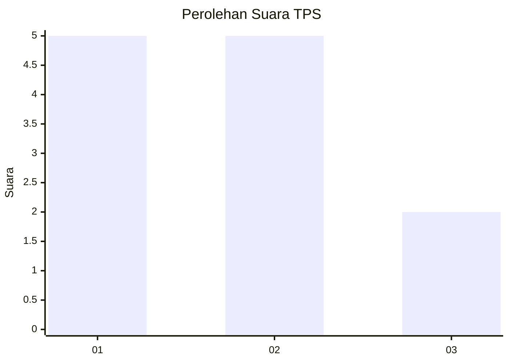
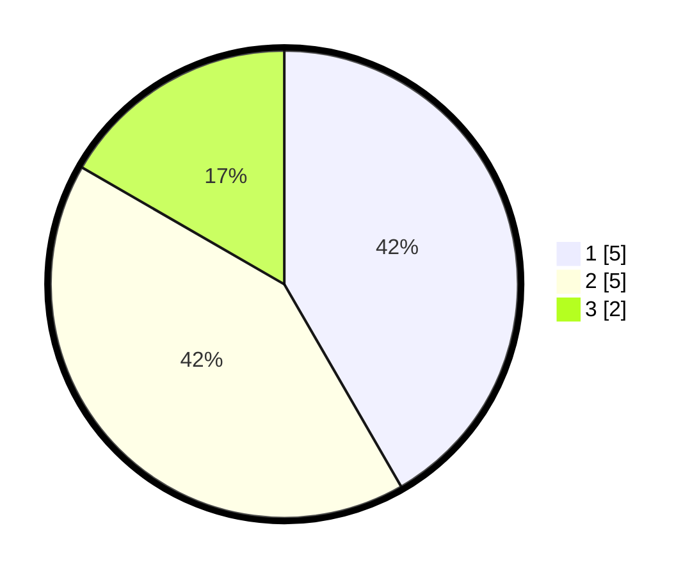

# Hasil

## Grafik

## Tabel

| No. | Nama Paslon    | Suara | Suara (raw) | Persentase |
|:--- |:-------------- | -----:| -----------:| ----------:|
| 1   | ANIES MUHAIMIN | 5     | [5][p-1]    | 41,67      |
| 2   | PRABOWO GIBRAN | 5     | [5][p-2]    | 41,67      |
| 3   | GANJAR MAHFUD  | 2     | [2][p-3]    | 16,67      |

[p-1]: https://github.com/gigit-pemilu/pemilu-2024-99-luar-negeri/blob/main/pilpres/hitung-suara/sub/99-luar-negeri/sub/89-penang-malaysia/sub/01-penang-malaysia/sub/0001-penang-malaysia/sub/001-pos-001/sub/paslon-1.txt
[p-2]: https://github.com/gigit-pemilu/pemilu-2024-99-luar-negeri/blob/main/pilpres/hitung-suara/sub/99-luar-negeri/sub/89-penang-malaysia/sub/01-penang-malaysia/sub/0001-penang-malaysia/sub/001-pos-001/sub/paslon-2.txt
[p-3]: https://github.com/gigit-pemilu/pemilu-2024-99-luar-negeri/blob/main/pilpres/hitung-suara/sub/99-luar-negeri/sub/89-penang-malaysia/sub/01-penang-malaysia/sub/0001-penang-malaysia/sub/001-pos-001/sub/paslon-3.txt

## Foto C Plano

https://sirekap-obj-formc.kpu.go.id/9c76/pemilu/ppwp/99/89/01/00/01/9989010001001-20240218-070545--72de1a7a-527f-48c8-8865-a0fb8424d8ba.jpg

https://sirekap-obj-formc.kpu.go.id/9c76/pemilu/ppwp/99/89/01/00/01/9989010001001-20240218-070907--1f59c1dd-f97f-45d1-ae51-775d19634d68.jpg

https://sirekap-obj-formc.kpu.go.id/9c76/pemilu/ppwp/99/89/01/00/01/9989010001001-20240218-071007--4358a402-2c22-4f28-a660-58d3fd9c3558.jpg

## Metadata

| Key        | Value               |
| ---------- | ------------------- |
| Time Stamp | 2024-02-19 06:16:00 |

## DATA PEMILIH TETAP

Jumlah pemilih dalam DPT: **123**.
 * L: **52**.
 * P: **71**.

## DATA PENGGUNA HAK PILIH

Jumlah pengguna hak pilih dalam DPT: **17**.
 * L: **3**.
 * P: **14**.

Jumlah pengguna hak pilih dalam DPTb: **0**.
 * L: **0**.
 * P: **0**.

Jumlah pengguna hak pilih dalam DPK: **0**.
 * L: **0**.
 * P: **0**.

Jumlah pengguna hak pilih: **17**.
 * L: **3**.
 * P: **14**.

## JUMLAH SUARA SAH DAN TIDAK SAH

JUMLAH SELURUH SUARA SAH: **12**.

JUMLAH SUARA TIDAK SAH: **5**.

JUMLAH SELURUH SUARA SAH DAN SUARA TIDAK SAH: **17**.

