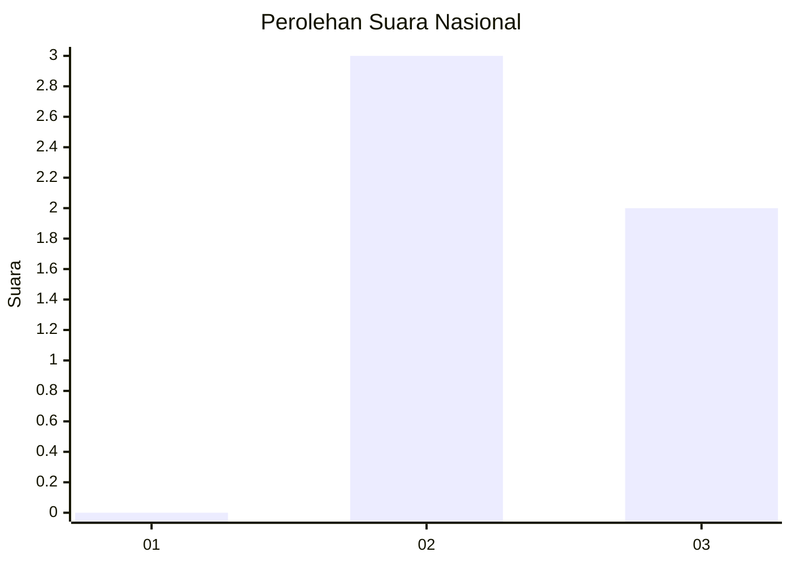
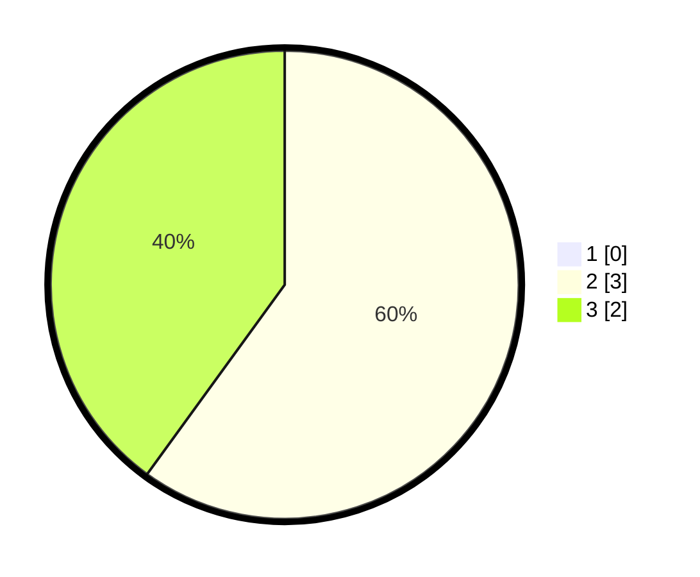

# Hasil

## Grafik

## Tabel

| No. | Nama Paslon    | Suara | Suara (raw) | Persentase |
|:--- |:-------------- | -----:| -----------:| ----------:|
| 1   | ANIES MUHAIMIN | 0     | [0][p-1]    | 0,00       |
| 2   | PRABOWO GIBRAN | 3     | [3][p-2]    | 60,00      |
| 3   | GANJAR MAHFUD  | 2     | [2][p-3]    | 40,00      |

[p-1]: https://github.com/gigit-pemilu/pemilu-2024/blob/main/pilpres/hitung-suara/sub/99-luar-negeri/sub/89-penang-malaysia/sub/01-penang-malaysia/sub/0001-penang-malaysia/sub/002-pos-002/sub/paslon-1.txt
[p-2]: https://github.com/gigit-pemilu/pemilu-2024/blob/main/pilpres/hitung-suara/sub/99-luar-negeri/sub/89-penang-malaysia/sub/01-penang-malaysia/sub/0001-penang-malaysia/sub/002-pos-002/sub/paslon-2.txt
[p-3]: https://github.com/gigit-pemilu/pemilu-2024/blob/main/pilpres/hitung-suara/sub/99-luar-negeri/sub/89-penang-malaysia/sub/01-penang-malaysia/sub/0001-penang-malaysia/sub/002-pos-002/sub/paslon-3.txt

## Foto C Plano

https://sirekap-obj-formc.kpu.go.id/0b0a/pemilu/ppwp/99/89/01/00/01/9989010001002-20240218-075402--0da65277-ac49-48dd-9ba2-bd9183b91cbf.jpg

https://sirekap-obj-formc.kpu.go.id/0b0a/pemilu/ppwp/99/89/01/00/01/9989010001002-20240218-075537--10e4e7fa-d4c2-4cde-ae18-bcdec4679864.jpg

https://sirekap-obj-formc.kpu.go.id/0b0a/pemilu/ppwp/99/89/01/00/01/9989010001002-20240218-075644--746acbe5-e4bc-4d36-89e1-a81d800d17eb.jpg

## Metadata

| Key        | Value               |
| ---------- | ------------------- |
| Time Stamp | 2024-02-19 06:16:00 |

## DATA PEMILIH TETAP

Jumlah pemilih dalam DPT: **70**.
 * L: **37**.
 * P: **33**.

## DATA PENGGUNA HAK PILIH

Jumlah pengguna hak pilih dalam DPT: **8**.
 * L: **4**.
 * P: **4**.

Jumlah pengguna hak pilih dalam DPTb: **0**.
 * L: **0**.
 * P: **0**.

Jumlah pengguna hak pilih dalam DPK: **0**.
 * L: **0**.
 * P: **0**.

Jumlah pengguna hak pilih: **8**.
 * L: **4**.
 * P: **4**.

## JUMLAH SUARA SAH DAN TIDAK SAH

JUMLAH SELURUH SUARA SAH: **5**.

JUMLAH SUARA TIDAK SAH: **2**.

JUMLAH SELURUH SUARA SAH DAN SUARA TIDAK SAH: **7**.

