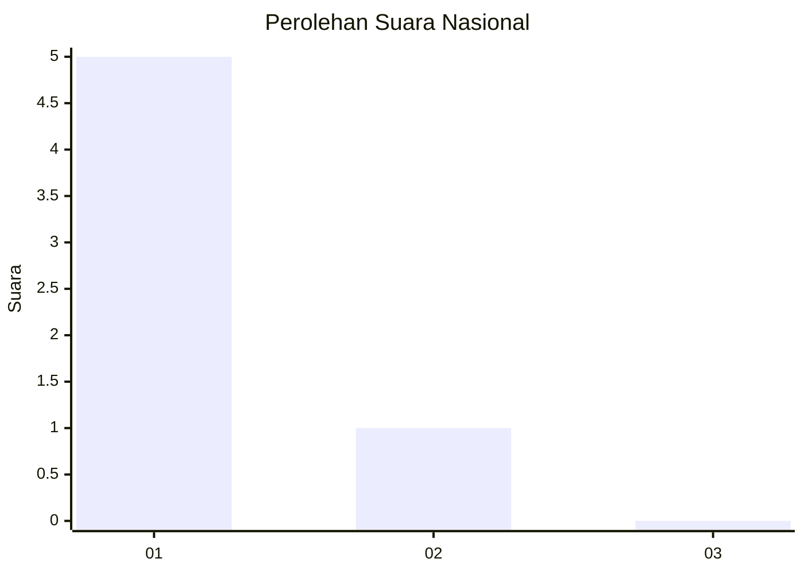
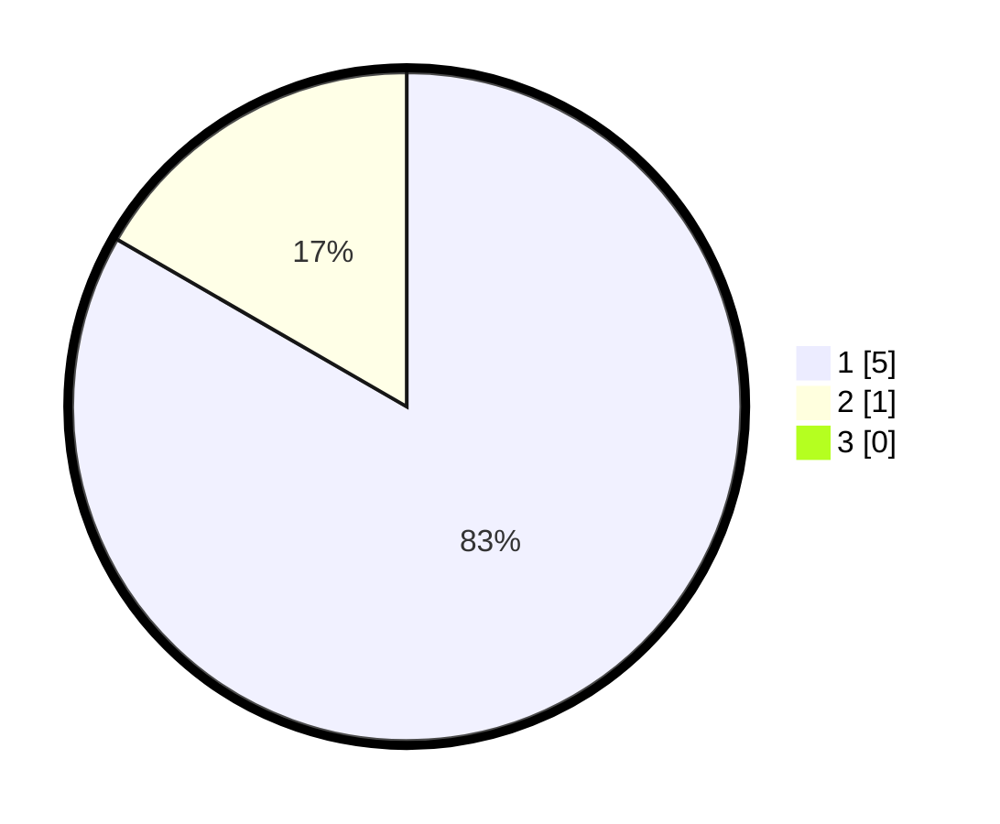

# Hasil

## Grafik

## Tabel

| No. | Nama Paslon    | Suara | Suara (raw) | Persentase |
|:--- |:-------------- | -----:| -----------:| ----------:|
| 1   | ANIES MUHAIMIN | 5     | [5][p-1]    | 83,33      |
| 2   | PRABOWO GIBRAN | 1     | [1][p-2]    | 16,67      |
| 3   | GANJAR MAHFUD  | 0     | [0][p-3]    | 0,00       |

[p-1]: https://github.com/gigit-pemilu/pemilu-2024/blob/main/pilpres/hitung-suara/sub/99-luar-negeri/sub/89-penang-malaysia/sub/01-penang-malaysia/sub/0001-penang-malaysia/sub/003-pos-003/sub/paslon-1.txt
[p-2]: https://github.com/gigit-pemilu/pemilu-2024/blob/main/pilpres/hitung-suara/sub/99-luar-negeri/sub/89-penang-malaysia/sub/01-penang-malaysia/sub/0001-penang-malaysia/sub/003-pos-003/sub/paslon-2.txt
[p-3]: https://github.com/gigit-pemilu/pemilu-2024/blob/main/pilpres/hitung-suara/sub/99-luar-negeri/sub/89-penang-malaysia/sub/01-penang-malaysia/sub/0001-penang-malaysia/sub/003-pos-003/sub/paslon-3.txt

## Foto C Plano

https://sirekap-obj-formc.kpu.go.id/e847/pemilu/ppwp/99/89/01/00/01/9989010001003-20240218-083004--30cf96f6-18a9-46fe-845d-ca383c910910.jpg

https://sirekap-obj-formc.kpu.go.id/e847/pemilu/ppwp/99/89/01/00/01/9989010001003-20240218-083305--77c79e21-75e1-4c71-b39c-adfe78fd5b05.jpg

https://sirekap-obj-formc.kpu.go.id/e847/pemilu/ppwp/99/89/01/00/01/9989010001003-20240218-083351--22c5dc5b-7968-436a-a2d3-954674eec9b2.jpg

## Metadata

| Key        | Value               |
| ---------- | ------------------- |
| Time Stamp | 2024-02-19 06:16:00 |

## DATA PEMILIH TETAP

Jumlah pemilih dalam DPT: **80**.
 * L: **31**.
 * P: **49**.

## DATA PENGGUNA HAK PILIH

Jumlah pengguna hak pilih dalam DPT: **8**.
 * L: **2**.
 * P: **6**.

Jumlah pengguna hak pilih dalam DPTb: **0**.
 * L: **0**.
 * P: **0**.

Jumlah pengguna hak pilih dalam DPK: **0**.
 * L: **0**.
 * P: **0**.

Jumlah pengguna hak pilih: **8**.
 * L: **2**.
 * P: **6**.

## JUMLAH SUARA SAH DAN TIDAK SAH

JUMLAH SELURUH SUARA SAH: **6**.

JUMLAH SUARA TIDAK SAH: **2**.

JUMLAH SELURUH SUARA SAH DAN SUARA TIDAK SAH: **8**.

