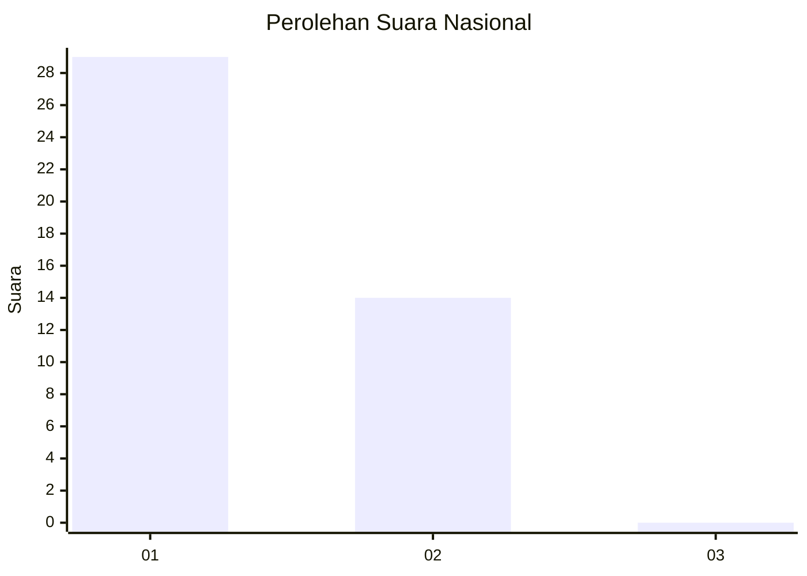
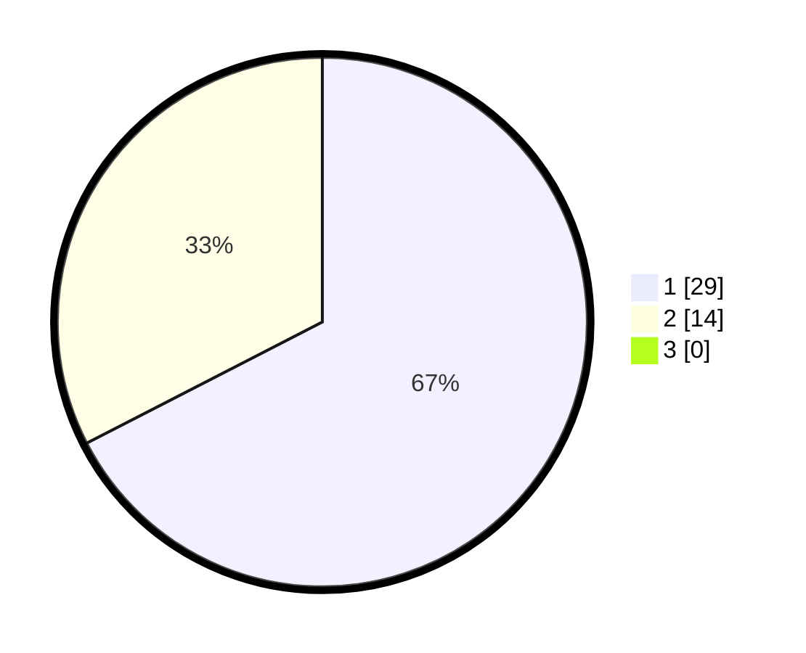

# Hasil

## Grafik

## Tabel

| No. | Nama Paslon    | Suara | Suara (raw) | Persentase |
|:--- |:-------------- | -----:| -----------:| ----------:|
| 1   | ANIES MUHAIMIN | 29    | [29][p-1]   | 67,44      |
| 2   | PRABOWO GIBRAN | 14    | [14][p-2]   | 32,56      |
| 3   | GANJAR MAHFUD  | 0     | [0][p-3]    | 0,00       |

[p-1]: https://github.com/gigit-pemilu/pemilu-2024/blob/main/pilpres/hitung-suara/sub/99-luar-negeri/sub/89-penang-malaysia/sub/01-penang-malaysia/sub/0001-penang-malaysia/sub/004-pos-004/sub/paslon-1.txt
[p-2]: https://github.com/gigit-pemilu/pemilu-2024/blob/main/pilpres/hitung-suara/sub/99-luar-negeri/sub/89-penang-malaysia/sub/01-penang-malaysia/sub/0001-penang-malaysia/sub/004-pos-004/sub/paslon-2.txt
[p-3]: https://github.com/gigit-pemilu/pemilu-2024/blob/main/pilpres/hitung-suara/sub/99-luar-negeri/sub/89-penang-malaysia/sub/01-penang-malaysia/sub/0001-penang-malaysia/sub/004-pos-004/sub/paslon-3.txt

## Foto C Plano

https://sirekap-obj-formc.kpu.go.id/acd9/pemilu/ppwp/99/89/01/00/01/9989010001004-20240218-092255--650fde4c-9aab-46bc-a578-45f4a3e5d4fb.jpg

https://sirekap-obj-formc.kpu.go.id/acd9/pemilu/ppwp/99/89/01/00/01/9989010001004-20240218-092520--176a6465-ef8a-4945-adcf-163a4ff79a1d.jpg

https://sirekap-obj-formc.kpu.go.id/acd9/pemilu/ppwp/99/89/01/00/01/9989010001004-20240218-092627--fc1afa06-31da-4952-a92c-02e6b1df90fc.jpg

## Metadata

| Key        | Value               |
| ---------- | ------------------- |
| Time Stamp | 2024-02-19 06:16:00 |

## DATA PEMILIH TETAP

Jumlah pemilih dalam DPT: **113**.
 * L: **57**.
 * P: **56**.

## DATA PENGGUNA HAK PILIH

Jumlah pengguna hak pilih dalam DPT: **47**.
 * L: **28**.
 * P: **19**.

Jumlah pengguna hak pilih dalam DPTb: **0**.
 * L: **0**.
 * P: **0**.

Jumlah pengguna hak pilih dalam DPK: **0**.
 * L: **0**.
 * P: **0**.

Jumlah pengguna hak pilih: **47**.
 * L: **28**.
 * P: **19**.

## JUMLAH SUARA SAH DAN TIDAK SAH

JUMLAH SELURUH SUARA SAH: **43**.

JUMLAH SUARA TIDAK SAH: **4**.

JUMLAH SELURUH SUARA SAH DAN SUARA TIDAK SAH: **47**.

