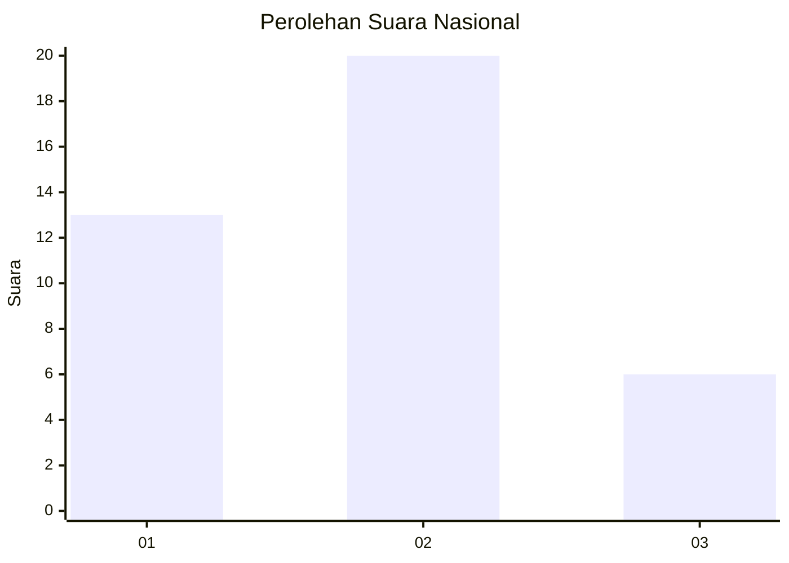
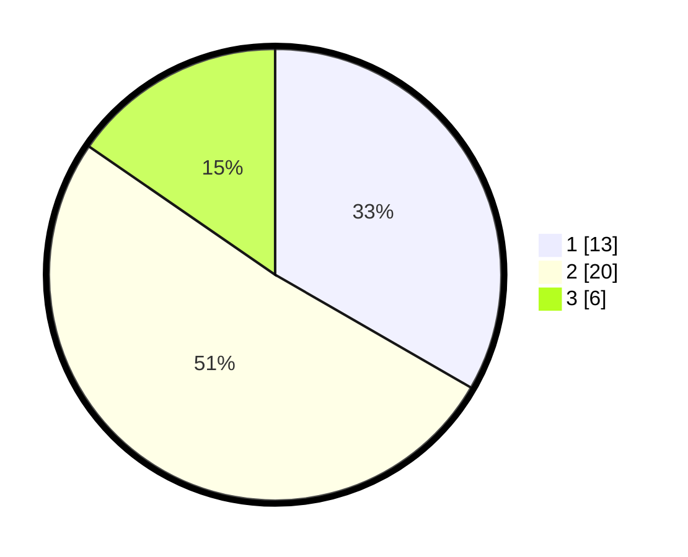

# Hasil

## Grafik

## Tabel

| No. | Nama Paslon    | Suara | Suara (raw) | Persentase |
|:--- |:-------------- | -----:| -----------:| ----------:|
| 1   | ANIES MUHAIMIN | 13    | [13][p-1]   | 33,33      |
| 2   | PRABOWO GIBRAN | 20    | [20][p-2]   | 51,28      |
| 3   | GANJAR MAHFUD  | 6     | [6][p-3]    | 15,38      |

[p-1]: https://github.com/gigit-pemilu/pemilu-2024/blob/main/pilpres/hitung-suara/sub/99-luar-negeri/sub/89-penang-malaysia/sub/01-penang-malaysia/sub/0001-penang-malaysia/sub/005-pos-005/sub/paslon-1.txt
[p-2]: https://github.com/gigit-pemilu/pemilu-2024/blob/main/pilpres/hitung-suara/sub/99-luar-negeri/sub/89-penang-malaysia/sub/01-penang-malaysia/sub/0001-penang-malaysia/sub/005-pos-005/sub/paslon-2.txt
[p-3]: https://github.com/gigit-pemilu/pemilu-2024/blob/main/pilpres/hitung-suara/sub/99-luar-negeri/sub/89-penang-malaysia/sub/01-penang-malaysia/sub/0001-penang-malaysia/sub/005-pos-005/sub/paslon-3.txt

## Foto C Plano

https://sirekap-obj-formc.kpu.go.id/d274/pemilu/ppwp/99/89/01/00/01/9989010001005-20240218-100420--73e4cd4a-bd6b-4b5b-9655-3753a5b0b050.jpg

https://sirekap-obj-formc.kpu.go.id/d274/pemilu/ppwp/99/89/01/00/01/9989010001005-20240218-100554--b95f28ba-8a2c-4f3c-8880-f5c79e4195b5.jpg

https://sirekap-obj-formc.kpu.go.id/d274/pemilu/ppwp/99/89/01/00/01/9989010001005-20240218-100636--d9ce45ee-ccdb-4a67-b04d-a273f0c6bba1.jpg

## Metadata

| Key        | Value               |
| ---------- | ------------------- |
| Time Stamp | 2024-02-19 06:16:00 |

## DATA PEMILIH TETAP

Jumlah pemilih dalam DPT: **299**.
 * L: **74**.
 * P: **225**.

## DATA PENGGUNA HAK PILIH

Jumlah pengguna hak pilih dalam DPT: **43**.
 * L: **7**.
 * P: **36**.

Jumlah pengguna hak pilih dalam DPTb: **0**.
 * L: **0**.
 * P: **0**.

Jumlah pengguna hak pilih dalam DPK: **0**.
 * L: **0**.
 * P: **0**.

Jumlah pengguna hak pilih: **43**.
 * L: **7**.
 * P: **36**.

## JUMLAH SUARA SAH DAN TIDAK SAH

JUMLAH SELURUH SUARA SAH: **39**.

JUMLAH SUARA TIDAK SAH: **4**.

JUMLAH SELURUH SUARA SAH DAN SUARA TIDAK SAH: **43**.

