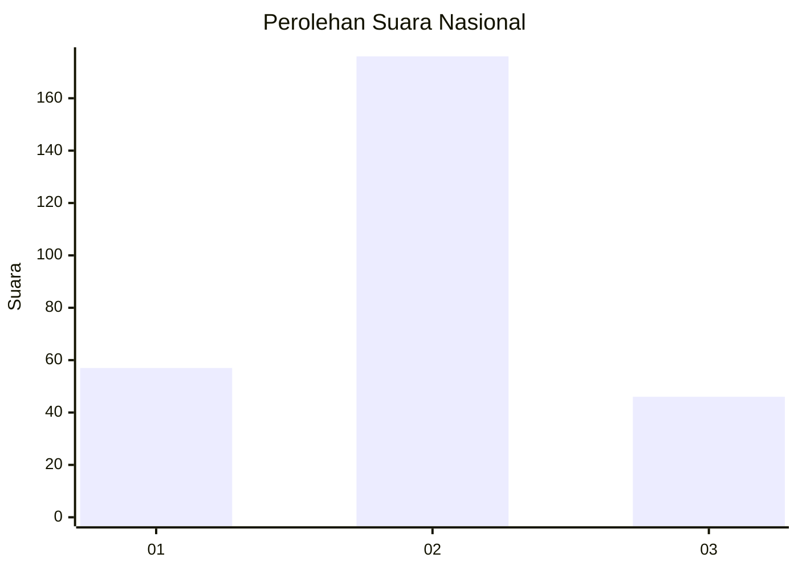

# Hasil

## Grafik

## Tabel

| No. | Nama Paslon    | Suara | Suara (raw) | Persentase |
|:--- |:-------------- | -----:| -----------:| ----------:|
| 1   | ANIES MUHAIMIN | 57    | [57][p-1]   | 20,43      |
| 2   | PRABOWO GIBRAN | 176   | [176][p-2]  | 63,08      |
| 3   | GANJAR MAHFUD  | 46    | [46][p-3]   | 16,49      |

[p-1]: https://github.com/gigit-pemilu/pemilu-2024/blob/main/pilpres/hitung-suara/sub/99-luar-negeri/sub/89-penang-malaysia/sub/01-penang-malaysia/sub/0001-penang-malaysia/sub/009-tps-004/sub/paslon-1.txt
[p-2]: https://github.com/gigit-pemilu/pemilu-2024/blob/main/pilpres/hitung-suara/sub/99-luar-negeri/sub/89-penang-malaysia/sub/01-penang-malaysia/sub/0001-penang-malaysia/sub/009-tps-004/sub/paslon-2.txt
[p-3]: https://github.com/gigit-pemilu/pemilu-2024/blob/main/pilpres/hitung-suara/sub/99-luar-negeri/sub/89-penang-malaysia/sub/01-penang-malaysia/sub/0001-penang-malaysia/sub/009-tps-004/sub/paslon-3.txt

## Foto C Plano

https://sirekap-obj-formc.kpu.go.id/c332/pemilu/ppwp/99/89/01/00/01/9989010001009-20240216-103011--f9511858-d9a2-4693-bc9a-f8b499d40e64.jpg

https://sirekap-obj-formc.kpu.go.id/c332/pemilu/ppwp/99/89/01/00/01/9989010001009-20240216-103807--e3c59b2c-74d5-4f45-8b33-d8ca0ddb71b2.jpg

https://sirekap-obj-formc.kpu.go.id/c332/pemilu/ppwp/99/89/01/00/01/9989010001009-20240216-104107--7fd0944b-3ed8-48ca-a406-8cf8c9709c23.jpg

## Metadata

| Key        | Value               |
| ---------- | ------------------- |
| Time Stamp | 2024-02-21 18:00:00 |

## DATA PEMILIH TETAP

Jumlah pemilih dalam DPT: **575**.
 * L: **178**.
 * P: **397**.

## DATA PENGGUNA HAK PILIH

Jumlah pengguna hak pilih dalam DPT: **20**.
 * L: **9**.
 * P: **11**.

Jumlah pengguna hak pilih dalam DPTb: **76**.
 * L: **17**.
 * P: **59**.

Jumlah pengguna hak pilih dalam DPK: **186**.
 * L: **78**.
 * P: **108**.

Jumlah pengguna hak pilih: **282**.
 * L: **104**.
 * P: **178**.

## JUMLAH SUARA SAH DAN TIDAK SAH

JUMLAH SELURUH SUARA SAH: **279**.

JUMLAH SUARA TIDAK SAH: **3**.

JUMLAH SELURUH SUARA SAH DAN SUARA TIDAK SAH: **282**.

