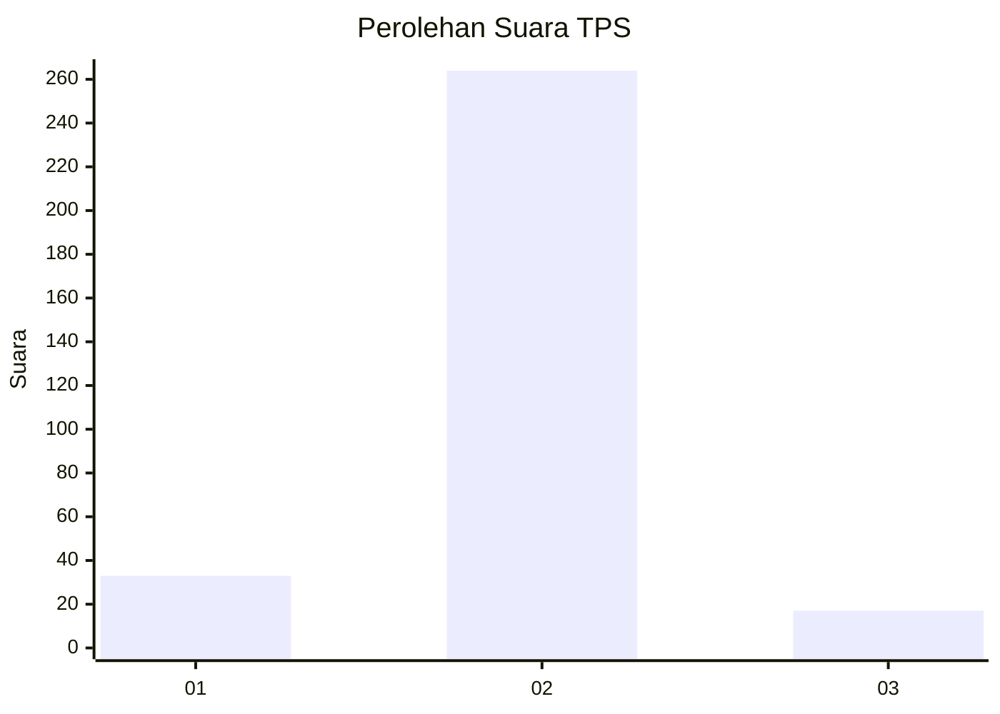
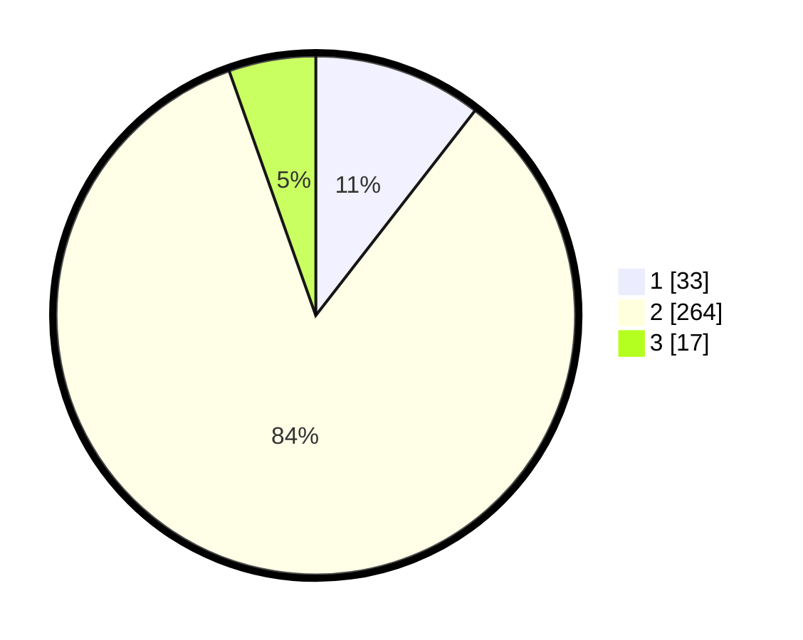

# Hasil

## Grafik

## Tabel

| No. | Nama Paslon    | Suara | Suara (raw) | Persentase |
|:--- |:-------------- | -----:| -----------:| ----------:|
| 1   | ANIES MUHAIMIN | 33    | [33][p-1]   | 10,51      |
| 2   | PRABOWO GIBRAN | 264   | [264][p-2]  | 84,08      |
| 3   | GANJAR MAHFUD  | 17    | [17][p-3]   | 5,41       |

[p-1]: https://github.com/gigit-pemilu/pemilu-2024-99-luar-negeri/blob/main/pilpres/hitung-suara/sub/99-luar-negeri/sub/89-penang-malaysia/sub/01-penang-malaysia/sub/0001-penang-malaysia/sub/018-ksk-003/sub/paslon-1.txt
[p-2]: https://github.com/gigit-pemilu/pemilu-2024-99-luar-negeri/blob/main/pilpres/hitung-suara/sub/99-luar-negeri/sub/89-penang-malaysia/sub/01-penang-malaysia/sub/0001-penang-malaysia/sub/018-ksk-003/sub/paslon-2.txt
[p-3]: https://github.com/gigit-pemilu/pemilu-2024-99-luar-negeri/blob/main/pilpres/hitung-suara/sub/99-luar-negeri/sub/89-penang-malaysia/sub/01-penang-malaysia/sub/0001-penang-malaysia/sub/018-ksk-003/sub/paslon-3.txt

## Foto C Plano

https://sirekap-obj-formc.kpu.go.id/e7c2/pemilu/ppwp/99/89/01/00/01/9989010001018-20240217-131943--dedd17cc-4927-493d-9228-ff8a70e5c667.jpg

https://sirekap-obj-formc.kpu.go.id/e7c2/pemilu/ppwp/99/89/01/00/01/9989010001018-20240217-132445--fc523323-7426-462e-9c18-e465d1c805aa.jpg

https://sirekap-obj-formc.kpu.go.id/e7c2/pemilu/ppwp/99/89/01/00/01/9989010001018-20240217-132605--208830e4-43fa-4c4a-92ad-38f98def3b18.jpg

## Metadata

| Key        | Value               |
| ---------- | ------------------- |
| Time Stamp | 2024-02-17 13:37:34 |

## DATA PEMILIH TETAP

Jumlah pemilih dalam DPT: **309**.
 * L: **78**.
 * P: **231**.

## DATA PENGGUNA HAK PILIH

Jumlah pengguna hak pilih dalam DPT: **70**.
 * L: **0**.
 * P: **70**.

Jumlah pengguna hak pilih dalam DPTb: **110**.
 * L: **10**.
 * P: **105**.

Jumlah pengguna hak pilih dalam DPK: **135**.
 * L: **19**.
 * P: **116**.

Jumlah pengguna hak pilih: **315**.
 * L: **29**.
 * P: **291**.

## JUMLAH SUARA SAH DAN TIDAK SAH

JUMLAH SELURUH SUARA SAH: **314**.

JUMLAH SUARA TIDAK SAH: **1**.

JUMLAH SELURUH SUARA SAH DAN SUARA TIDAK SAH: **315**.

