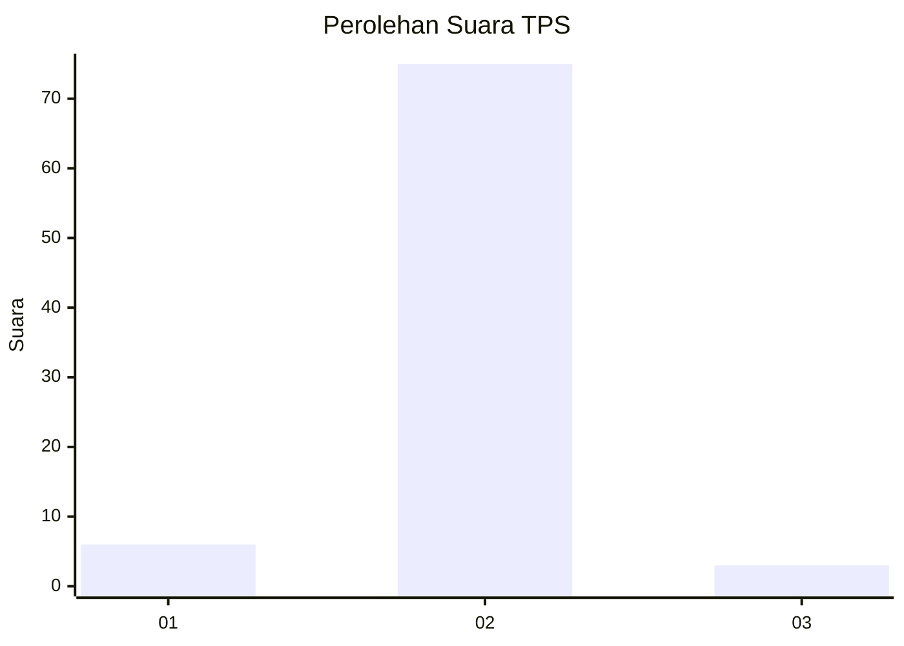
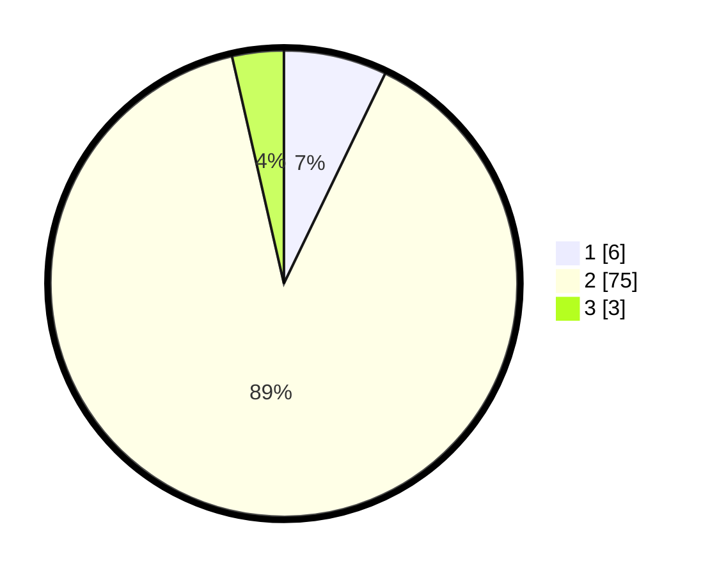

# Hasil

## Grafik

## Tabel

| No. | Nama Paslon    | Suara | Suara (raw) | Persentase |
|:--- |:-------------- | -----:| -----------:| ----------:|
| 1   | ANIES MUHAIMIN | 6     | [6][p-1]    | 7,14       |
| 2   | PRABOWO GIBRAN | 75    | [75][p-2]   | 89,29      |
| 3   | GANJAR MAHFUD  | 3     | [3][p-3]    | 3,57       |

[p-1]: https://github.com/gigit-pemilu/pemilu-2024-99-luar-negeri/blob/main/pilpres/hitung-suara/sub/99-luar-negeri/sub/89-penang-malaysia/sub/01-penang-malaysia/sub/0001-penang-malaysia/sub/027-ksk-012/sub/paslon-1.txt
[p-2]: https://github.com/gigit-pemilu/pemilu-2024-99-luar-negeri/blob/main/pilpres/hitung-suara/sub/99-luar-negeri/sub/89-penang-malaysia/sub/01-penang-malaysia/sub/0001-penang-malaysia/sub/027-ksk-012/sub/paslon-2.txt
[p-3]: https://github.com/gigit-pemilu/pemilu-2024-99-luar-negeri/blob/main/pilpres/hitung-suara/sub/99-luar-negeri/sub/89-penang-malaysia/sub/01-penang-malaysia/sub/0001-penang-malaysia/sub/027-ksk-012/sub/paslon-3.txt

## Foto C Plano

https://sirekap-obj-formc.kpu.go.id/19f7/pemilu/ppwp/99/89/01/00/01/9989010001027-20240215-044345--098c7f8c-cbfc-4e1b-9a5d-7befadc3bcb7.jpg

https://sirekap-obj-formc.kpu.go.id/19f7/pemilu/ppwp/99/89/01/00/01/9989010001027-20240216-161028--7ccf2027-9a6e-48fb-8e22-b6cb4106b7f6.jpg

https://sirekap-obj-formc.kpu.go.id/19f7/pemilu/ppwp/99/89/01/00/01/9989010001027-20240216-161334--3c422022-3dc8-44c4-996c-6769f8ff0c7f.jpg

## Metadata

| Key        | Value               |
| ---------- | ------------------- |
| Time Stamp | 2024-02-16 16:25:10 |

