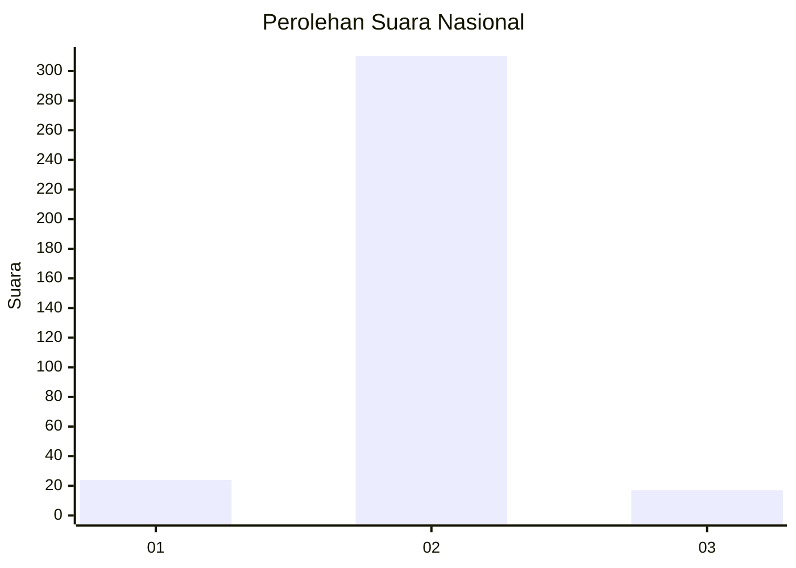
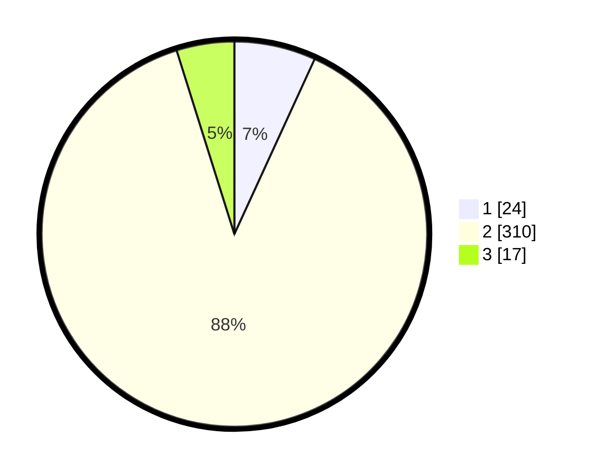

# Hasil

## Grafik

## Tabel

| No. | Nama Paslon    | Suara | Suara (raw) | Persentase |
|:--- |:-------------- | -----:| -----------:| ----------:|
| 1   | ANIES MUHAIMIN | 24    | [24][p-1]   | 6,84       |
| 2   | PRABOWO GIBRAN | 310   | [310][p-2]  | 88,32      |
| 3   | GANJAR MAHFUD  | 17    | [17][p-3]   | 4,84       |

[p-1]: https://github.com/gigit-pemilu/pemilu-2024/blob/main/pilpres/hitung-suara/sub/99-luar-negeri/sub/89-penang-malaysia/sub/01-penang-malaysia/sub/0001-penang-malaysia/sub/028-ksk-013/sub/paslon-1.txt
[p-2]: https://github.com/gigit-pemilu/pemilu-2024/blob/main/pilpres/hitung-suara/sub/99-luar-negeri/sub/89-penang-malaysia/sub/01-penang-malaysia/sub/0001-penang-malaysia/sub/028-ksk-013/sub/paslon-2.txt
[p-3]: https://github.com/gigit-pemilu/pemilu-2024/blob/main/pilpres/hitung-suara/sub/99-luar-negeri/sub/89-penang-malaysia/sub/01-penang-malaysia/sub/0001-penang-malaysia/sub/028-ksk-013/sub/paslon-3.txt

## Foto C Plano

https://sirekap-obj-formc.kpu.go.id/b2b3/pemilu/ppwp/99/89/01/00/01/9989010001028-20240217-122240--b49d70d8-faa7-47d2-afa2-1b1f4c989574.jpg

https://sirekap-obj-formc.kpu.go.id/b2b3/pemilu/ppwp/99/89/01/00/01/9989010001028-20240217-122647--06618e36-3bca-4be9-8270-2e23afccb94b.jpg

https://sirekap-obj-formc.kpu.go.id/b2b3/pemilu/ppwp/99/89/01/00/01/9989010001028-20240217-122946--e5446a2f-322b-4007-9e17-f151ef7fd8a4.jpg

## Metadata

| Key        | Value               |
| ---------- | ------------------- |
| Time Stamp | 2024-02-17 13:37:34 |

## DATA PEMILIH TETAP

Jumlah pemilih dalam DPT: **355**.
 * L: **0**.
 * P: **355**.

## DATA PENGGUNA HAK PILIH

Jumlah pengguna hak pilih dalam DPT: **112**.
 * L: **0**.
 * P: **112**.

Jumlah pengguna hak pilih dalam DPTb: **159**.
 * L: **1**.
 * P: **158**.

Jumlah pengguna hak pilih dalam DPK: **81**.
 * L: **0**.
 * P: **81**.

Jumlah pengguna hak pilih: **352**.
 * L: **1**.
 * P: **351**.

## JUMLAH SUARA SAH DAN TIDAK SAH

JUMLAH SELURUH SUARA SAH: **351**.

JUMLAH SUARA TIDAK SAH: **1**.

JUMLAH SELURUH SUARA SAH DAN SUARA TIDAK SAH: **352**.

