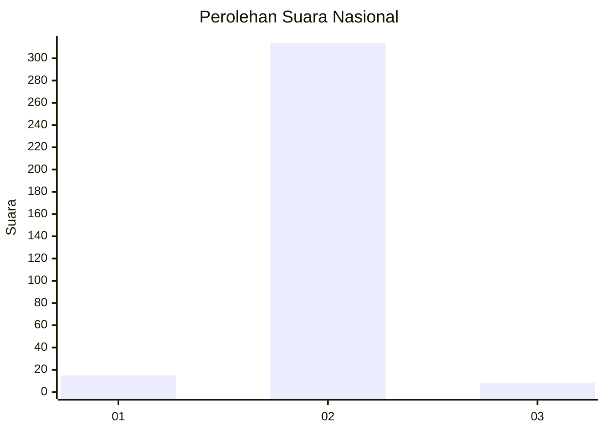
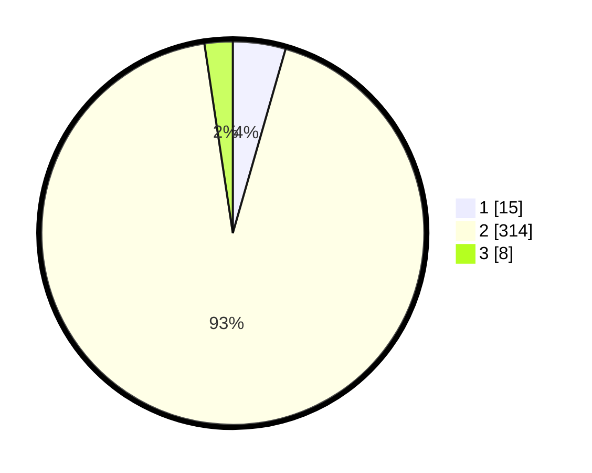

# Hasil

## Grafik

## Tabel

| No. | Nama Paslon    | Suara | Suara (raw) | Persentase |
|:--- |:-------------- | -----:| -----------:| ----------:|
| 1   | ANIES MUHAIMIN | 15    | [15][p-1]   | 4,45       |
| 2   | PRABOWO GIBRAN | 314   | [314][p-2]  | 93,18      |
| 3   | GANJAR MAHFUD  | 8     | [8][p-3]    | 2,37       |

[p-1]: https://github.com/gigit-pemilu/pemilu-2024/blob/main/pilpres/hitung-suara/sub/99-luar-negeri/sub/89-penang-malaysia/sub/01-penang-malaysia/sub/0001-penang-malaysia/sub/031-ksk-016/sub/paslon-1.txt
[p-2]: https://github.com/gigit-pemilu/pemilu-2024/blob/main/pilpres/hitung-suara/sub/99-luar-negeri/sub/89-penang-malaysia/sub/01-penang-malaysia/sub/0001-penang-malaysia/sub/031-ksk-016/sub/paslon-2.txt
[p-3]: https://github.com/gigit-pemilu/pemilu-2024/blob/main/pilpres/hitung-suara/sub/99-luar-negeri/sub/89-penang-malaysia/sub/01-penang-malaysia/sub/0001-penang-malaysia/sub/031-ksk-016/sub/paslon-3.txt

## Foto C Plano

https://sirekap-obj-formc.kpu.go.id/5b6c/pemilu/ppwp/99/89/01/00/01/9989010001031-20240217-154023--48a2d41e-97b0-46af-a6af-757166dc253c.jpg

https://sirekap-obj-formc.kpu.go.id/5b6c/pemilu/ppwp/99/89/01/00/01/9989010001031-20240217-154307--3106b115-dd8c-47fa-a457-e4cd4c0a5740.jpg

https://sirekap-obj-formc.kpu.go.id/5b6c/pemilu/ppwp/99/89/01/00/01/9989010001031-20240217-154446--434da7b8-ffea-41a0-ba16-301f8d9fcd6c.jpg

## Metadata

| Key        | Value               |
| ---------- | ------------------- |
| Time Stamp | 2024-02-17 16:00:02 |

## DATA PEMILIH TETAP

Jumlah pemilih dalam DPT: **417**.
 * L: **0**.
 * P: **417**.

## DATA PENGGUNA HAK PILIH

Jumlah pengguna hak pilih dalam DPT: **13**.
 * L: **0**.
 * P: **13**.

Jumlah pengguna hak pilih dalam DPTb: **247**.
 * L: **9**.
 * P: **238**.

Jumlah pengguna hak pilih dalam DPK: **80**.
 * L: **4**.
 * P: **76**.

Jumlah pengguna hak pilih: **340**.
 * L: **13**.
 * P: **327**.

## JUMLAH SUARA SAH DAN TIDAK SAH

JUMLAH SELURUH SUARA SAH: **337**.

JUMLAH SUARA TIDAK SAH: **3**.

JUMLAH SELURUH SUARA SAH DAN SUARA TIDAK SAH: **340**.

