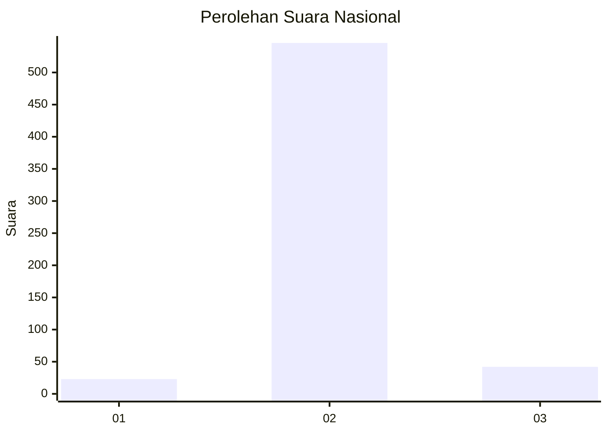
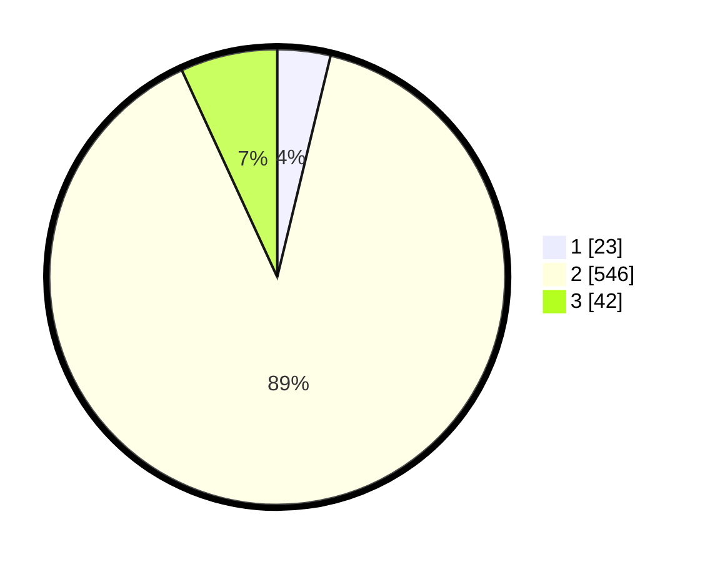

# Hasil

## Grafik

## Tabel

| No. | Nama Paslon    | Suara | Suara (raw) | Persentase |
|:--- |:-------------- | -----:| -----------:| ----------:|
| 1   | ANIES MUHAIMIN | 23    | [23][p-1]   | 3,76       |
| 2   | PRABOWO GIBRAN | 546   | [546][p-2]  | 89,36      |
| 3   | GANJAR MAHFUD  | 42    | [42][p-3]   | 6,87       |

[p-1]: https://github.com/gigit-pemilu/pemilu-2024/blob/main/pilpres/hitung-suara/sub/99-luar-negeri/sub/89-penang-malaysia/sub/01-penang-malaysia/sub/0001-penang-malaysia/sub/032-ksk-017/sub/paslon-1.txt
[p-2]: https://github.com/gigit-pemilu/pemilu-2024/blob/main/pilpres/hitung-suara/sub/99-luar-negeri/sub/89-penang-malaysia/sub/01-penang-malaysia/sub/0001-penang-malaysia/sub/032-ksk-017/sub/paslon-2.txt
[p-3]: https://github.com/gigit-pemilu/pemilu-2024/blob/main/pilpres/hitung-suara/sub/99-luar-negeri/sub/89-penang-malaysia/sub/01-penang-malaysia/sub/0001-penang-malaysia/sub/032-ksk-017/sub/paslon-3.txt

## Foto C Plano

https://sirekap-obj-formc.kpu.go.id/2cf8/pemilu/ppwp/99/89/01/00/01/9989010001032-20240217-214417--fc827d14-94c9-4f88-8ba3-12f02d3b5bfe.jpg

https://sirekap-obj-formc.kpu.go.id/2cf8/pemilu/ppwp/99/89/01/00/01/9989010001032-20240217-214748--eb77e0e8-ef0a-4ee0-95dd-2fb97b6fe4f5.jpg

https://sirekap-obj-formc.kpu.go.id/2cf8/pemilu/ppwp/99/89/01/00/01/9989010001032-20240217-214931--22be7b34-eb50-415c-9800-912b9ef76ac2.jpg

## Metadata

| Key        | Value               |
| ---------- | ------------------- |
| Time Stamp | 2024-02-19 06:16:00 |

## DATA PEMILIH TETAP

Jumlah pemilih dalam DPT: **1192**.
 * L: **0**.
 * P: **1192**.

## DATA PENGGUNA HAK PILIH

Jumlah pengguna hak pilih dalam DPT: **95**.
 * L: **0**.
 * P: **95**.

Jumlah pengguna hak pilih dalam DPTb: **127**.
 * L: **0**.
 * P: **127**.

Jumlah pengguna hak pilih dalam DPK: **391**.
 * L: **0**.
 * P: **391**.

Jumlah pengguna hak pilih: **613**.
 * L: **0**.
 * P: **613**.

## JUMLAH SUARA SAH DAN TIDAK SAH

JUMLAH SELURUH SUARA SAH: **611**.

JUMLAH SUARA TIDAK SAH: **2**.

JUMLAH SELURUH SUARA SAH DAN SUARA TIDAK SAH: **613**.

