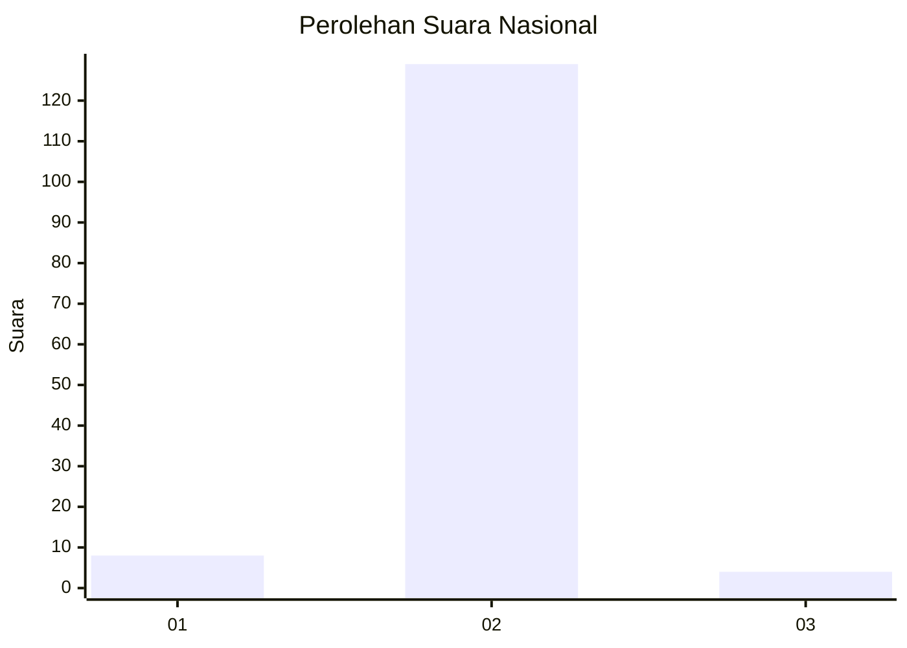
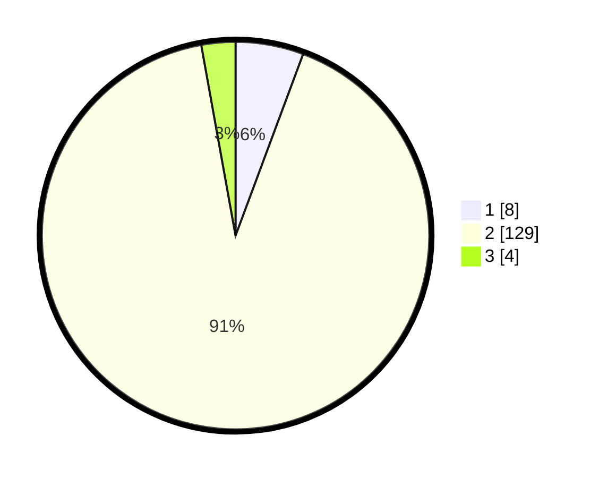

# Hasil

## Grafik

## Tabel

| No. | Nama Paslon    | Suara | Suara (raw) | Persentase |
|:--- |:-------------- | -----:| -----------:| ----------:|
| 1   | ANIES MUHAIMIN | 8     | [8][p-1]    | 5,67       |
| 2   | PRABOWO GIBRAN | 129   | [129][p-2]  | 91,49      |
| 3   | GANJAR MAHFUD  | 4     | [4][p-3]    | 2,84       |

[p-1]: https://github.com/gigit-pemilu/pemilu-2024/blob/main/pilpres/hitung-suara/sub/99-luar-negeri/sub/89-penang-malaysia/sub/01-penang-malaysia/sub/0001-penang-malaysia/sub/033-ksk-018/sub/paslon-1.txt
[p-2]: https://github.com/gigit-pemilu/pemilu-2024/blob/main/pilpres/hitung-suara/sub/99-luar-negeri/sub/89-penang-malaysia/sub/01-penang-malaysia/sub/0001-penang-malaysia/sub/033-ksk-018/sub/paslon-2.txt
[p-3]: https://github.com/gigit-pemilu/pemilu-2024/blob/main/pilpres/hitung-suara/sub/99-luar-negeri/sub/89-penang-malaysia/sub/01-penang-malaysia/sub/0001-penang-malaysia/sub/033-ksk-018/sub/paslon-3.txt

## Foto C Plano

https://sirekap-obj-formc.kpu.go.id/0e5e/pemilu/ppwp/99/89/01/00/01/9989010001033-20240215-011219--22c31b21-11f3-4564-9832-a2e305da08e2.jpg

https://sirekap-obj-formc.kpu.go.id/0e5e/pemilu/ppwp/99/89/01/00/01/9989010001033-20240215-011358--09988f0f-6542-4434-8097-30f1672b1439.jpg

https://sirekap-obj-formc.kpu.go.id/0e5e/pemilu/ppwp/99/89/01/00/01/9989010001033-20240215-011512--8a5ecaac-0c52-41aa-8403-4a7c9ad8163f.jpg

## Metadata

| Key        | Value               |
| ---------- | ------------------- |
| Time Stamp | 2024-02-16 17:00:00 |

## DATA PEMILIH TETAP

Jumlah pemilih dalam DPT: **356**.
 * L: **134**.
 * P: **222**.

## DATA PENGGUNA HAK PILIH

Jumlah pengguna hak pilih dalam DPT: **15**.
 * L: **1**.
 * P: **14**.

Jumlah pengguna hak pilih dalam DPTb: **106**.
 * L: **4**.
 * P: **102**.

Jumlah pengguna hak pilih dalam DPK: **20**.
 * L: **1**.
 * P: **19**.

Jumlah pengguna hak pilih: **141**.
 * L: **6**.
 * P: **135**.

## JUMLAH SUARA SAH DAN TIDAK SAH

JUMLAH SELURUH SUARA SAH: **141**.

JUMLAH SUARA TIDAK SAH: **0**.

JUMLAH SELURUH SUARA SAH DAN SUARA TIDAK SAH: **141**.

