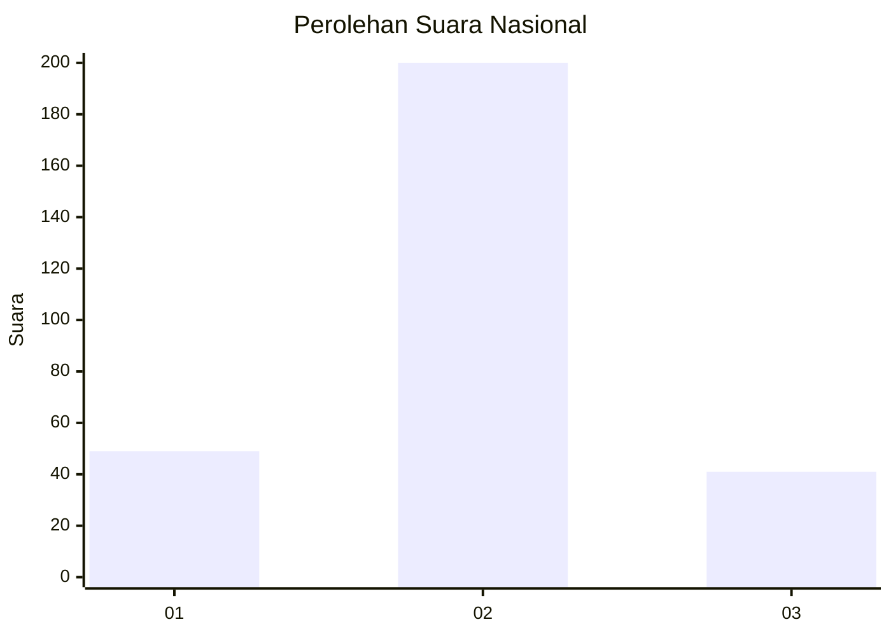
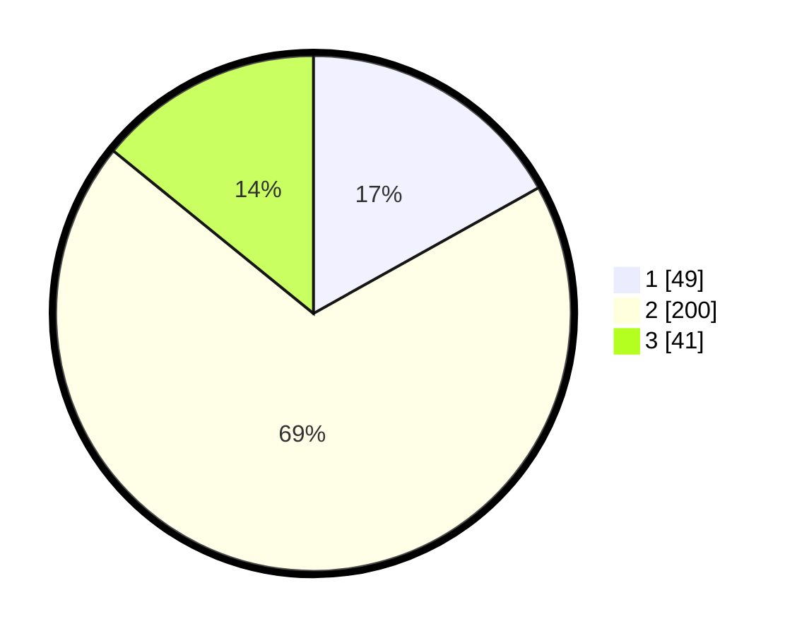

# Hasil

## Grafik

## Tabel

| No. | Nama Paslon    | Suara | Suara (raw) | Persentase |
|:--- |:-------------- | -----:| -----------:| ----------:|
| 1   | ANIES MUHAIMIN | 49    | [49][p-1]   | 16,90      |
| 2   | PRABOWO GIBRAN | 200   | [200][p-2]  | 68,97      |
| 3   | GANJAR MAHFUD  | 41    | [41][p-3]   | 14,14      |

[p-1]: https://github.com/gigit-pemilu/pemilu-2024/blob/main/pilpres/hitung-suara/sub/99-luar-negeri/sub/89-penang-malaysia/sub/01-penang-malaysia/sub/0001-penang-malaysia/sub/035-ksk-020/sub/paslon-1.txt
[p-2]: https://github.com/gigit-pemilu/pemilu-2024/blob/main/pilpres/hitung-suara/sub/99-luar-negeri/sub/89-penang-malaysia/sub/01-penang-malaysia/sub/0001-penang-malaysia/sub/035-ksk-020/sub/paslon-2.txt
[p-3]: https://github.com/gigit-pemilu/pemilu-2024/blob/main/pilpres/hitung-suara/sub/99-luar-negeri/sub/89-penang-malaysia/sub/01-penang-malaysia/sub/0001-penang-malaysia/sub/035-ksk-020/sub/paslon-3.txt

## Foto C Plano

https://sirekap-obj-formc.kpu.go.id/0b1d/pemilu/ppwp/99/89/01/00/01/9989010001035-20240217-132624--6bdce59f-0732-47df-ae6b-bba1f1c99a5f.jpg

https://sirekap-obj-formc.kpu.go.id/0b1d/pemilu/ppwp/99/89/01/00/01/9989010001035-20240217-133342--26a231ce-369b-4190-a396-a871584e7fd4.jpg

https://sirekap-obj-formc.kpu.go.id/0b1d/pemilu/ppwp/99/89/01/00/01/9989010001035-20240217-133557--88737300-a4b7-4529-80b3-8388cd79a278.jpg

## Metadata

| Key        | Value               |
| ---------- | ------------------- |
| Time Stamp | 2024-02-17 13:37:34 |

## DATA PEMILIH TETAP

Jumlah pemilih dalam DPT: **679**.
 * L: **38**.
 * P: **641**.

## DATA PENGGUNA HAK PILIH

Jumlah pengguna hak pilih dalam DPT: **37**.
 * L: **0**.
 * P: **37**.

Jumlah pengguna hak pilih dalam DPTb: **65**.
 * L: **13**.
 * P: **52**.

Jumlah pengguna hak pilih dalam DPK: **189**.
 * L: **71**.
 * P: **118**.

Jumlah pengguna hak pilih: **291**.
 * L: **84**.
 * P: **207**.

## JUMLAH SUARA SAH DAN TIDAK SAH

JUMLAH SELURUH SUARA SAH: **290**.

JUMLAH SUARA TIDAK SAH: **1**.

JUMLAH SELURUH SUARA SAH DAN SUARA TIDAK SAH: **291**.

