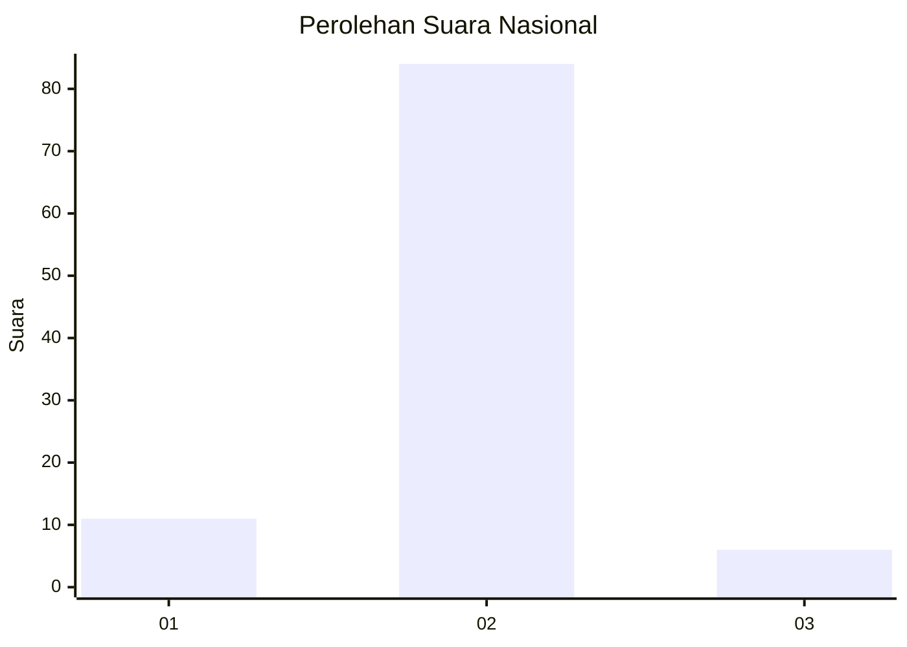
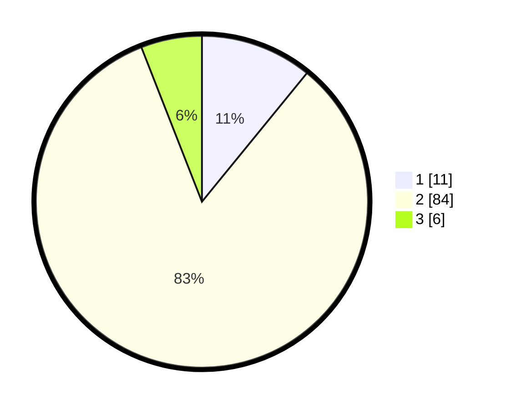

# Hasil

## Grafik

## Tabel

| No. | Nama Paslon    | Suara | Suara (raw) | Persentase |
|:--- |:-------------- | -----:| -----------:| ----------:|
| 1   | ANIES MUHAIMIN | 11    | [11][p-1]   | 10,89      |
| 2   | PRABOWO GIBRAN | 84    | [84][p-2]   | 83,17      |
| 3   | GANJAR MAHFUD  | 6     | [6][p-3]    | 5,94       |

[p-1]: https://github.com/gigit-pemilu/pemilu-2024/blob/main/pilpres/hitung-suara/sub/99-luar-negeri/sub/89-penang-malaysia/sub/01-penang-malaysia/sub/0001-penang-malaysia/sub/036-ksk-021/sub/paslon-1.txt
[p-2]: https://github.com/gigit-pemilu/pemilu-2024/blob/main/pilpres/hitung-suara/sub/99-luar-negeri/sub/89-penang-malaysia/sub/01-penang-malaysia/sub/0001-penang-malaysia/sub/036-ksk-021/sub/paslon-2.txt
[p-3]: https://github.com/gigit-pemilu/pemilu-2024/blob/main/pilpres/hitung-suara/sub/99-luar-negeri/sub/89-penang-malaysia/sub/01-penang-malaysia/sub/0001-penang-malaysia/sub/036-ksk-021/sub/paslon-3.txt

## Foto C Plano

https://sirekap-obj-formc.kpu.go.id/4773/pemilu/ppwp/99/89/01/00/01/9989010001036-20240215-043318--348f5ae4-5da8-453e-a6b3-bd8c68ed069a.jpg

https://sirekap-obj-formc.kpu.go.id/4773/pemilu/ppwp/99/89/01/00/01/9989010001036-20240215-043437--1c0630c0-ed27-4c94-aa81-4cc94b328cfb.jpg

https://sirekap-obj-formc.kpu.go.id/4773/pemilu/ppwp/99/89/01/00/01/9989010001036-20240215-043549--64f24c7b-4d39-42d2-825b-86232ce307bf.jpg

## Metadata

| Key        | Value               |
| ---------- | ------------------- |
| Time Stamp | 2024-02-15 22:00:27 |

## DATA PEMILIH TETAP

Jumlah pemilih dalam DPT: **345**.
 * L: **68**.
 * P: **277**.

## DATA PENGGUNA HAK PILIH

Jumlah pengguna hak pilih dalam DPT: **7**.
 * L: **0**.
 * P: **7**.

Jumlah pengguna hak pilih dalam DPTb: **38**.
 * L: **8**.
 * P: **30**.

Jumlah pengguna hak pilih dalam DPK: **58**.
 * L: **6**.
 * P: **52**.

Jumlah pengguna hak pilih: **103**.
 * L: **14**.
 * P: **89**.

## JUMLAH SUARA SAH DAN TIDAK SAH

JUMLAH SELURUH SUARA SAH: **101**.

JUMLAH SUARA TIDAK SAH: **2**.

JUMLAH SELURUH SUARA SAH DAN SUARA TIDAK SAH: **103**.

