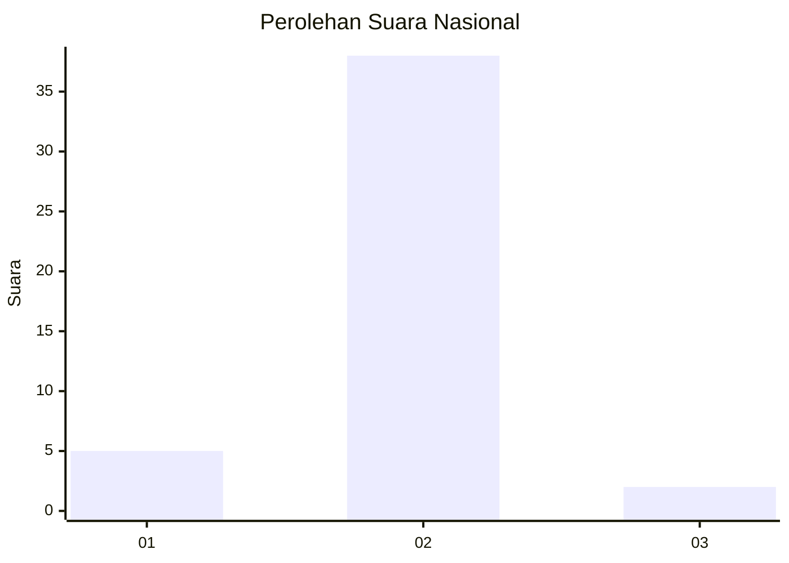
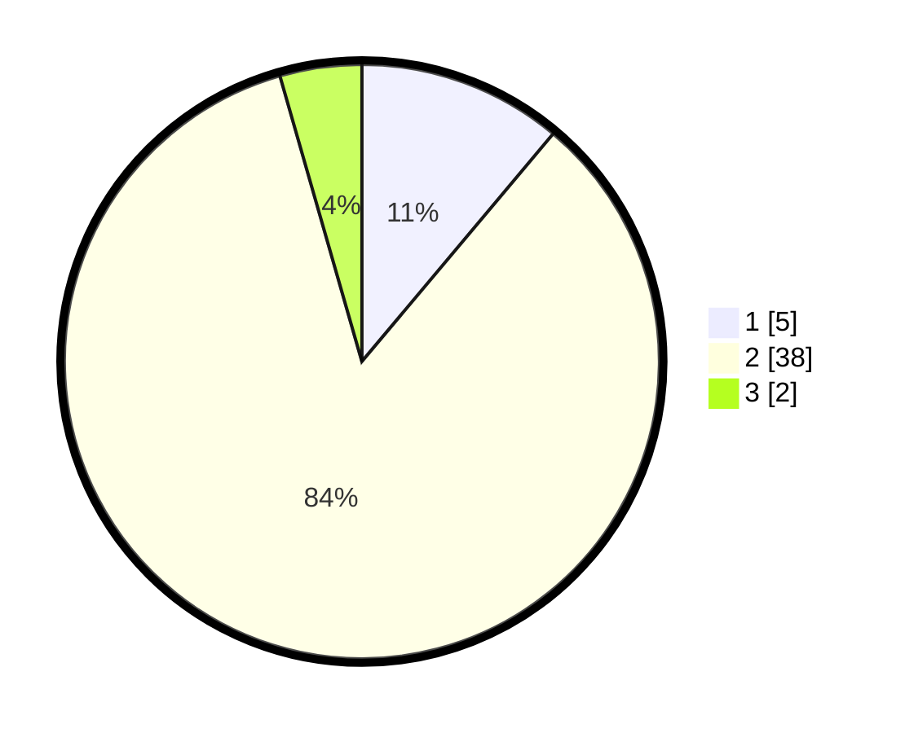

# Hasil

## Grafik

## Tabel

| No. | Nama Paslon    | Suara | Suara (raw) | Persentase |
|:--- |:-------------- | -----:| -----------:| ----------:|
| 1   | ANIES MUHAIMIN | 5     | [5][p-1]    | 11,11      |
| 2   | PRABOWO GIBRAN | 38    | [38][p-2]   | 84,44      |
| 3   | GANJAR MAHFUD  | 2     | [2][p-3]    | 4,44       |

[p-1]: https://github.com/gigit-pemilu/pemilu-2024/blob/main/pilpres/hitung-suara/sub/99-luar-negeri/sub/89-penang-malaysia/sub/01-penang-malaysia/sub/0001-penang-malaysia/sub/038-ksk-023/sub/paslon-1.txt
[p-2]: https://github.com/gigit-pemilu/pemilu-2024/blob/main/pilpres/hitung-suara/sub/99-luar-negeri/sub/89-penang-malaysia/sub/01-penang-malaysia/sub/0001-penang-malaysia/sub/038-ksk-023/sub/paslon-2.txt
[p-3]: https://github.com/gigit-pemilu/pemilu-2024/blob/main/pilpres/hitung-suara/sub/99-luar-negeri/sub/89-penang-malaysia/sub/01-penang-malaysia/sub/0001-penang-malaysia/sub/038-ksk-023/sub/paslon-3.txt

## Foto C Plano

https://sirekap-obj-formc.kpu.go.id/79fe/pemilu/ppwp/99/89/01/00/01/9989010001038-20240217-135741--478137f3-03c9-481f-bb76-b2e2f80058cb.jpg

https://sirekap-obj-formc.kpu.go.id/79fe/pemilu/ppwp/99/89/01/00/01/9989010001038-20240217-140204--2361d3d3-ec67-4dc8-b2ce-6b8b0e0d4412.jpg

https://sirekap-obj-formc.kpu.go.id/79fe/pemilu/ppwp/99/89/01/00/01/9989010001038-20240217-140350--10722f1a-ff6f-4496-ac3d-07ed7f5f7185.jpg

## Metadata

| Key        | Value               |
| ---------- | ------------------- |
| Time Stamp | 2024-02-17 14:45:18 |

## DATA PEMILIH TETAP

Jumlah pemilih dalam DPT: **378**.
 * L: **0**.
 * P: **378**.

## DATA PENGGUNA HAK PILIH

Jumlah pengguna hak pilih dalam DPT: **16**.
 * L: **0**.
 * P: **16**.

Jumlah pengguna hak pilih dalam DPTb: **26**.
 * L: **0**.
 * P: **26**.

Jumlah pengguna hak pilih dalam DPK: **3**.
 * L: **0**.
 * P: **3**.

Jumlah pengguna hak pilih: **45**.
 * L: **0**.
 * P: **45**.

## JUMLAH SUARA SAH DAN TIDAK SAH

JUMLAH SELURUH SUARA SAH: **45**.

JUMLAH SUARA TIDAK SAH: **0**.

JUMLAH SELURUH SUARA SAH DAN SUARA TIDAK SAH: **45**.

