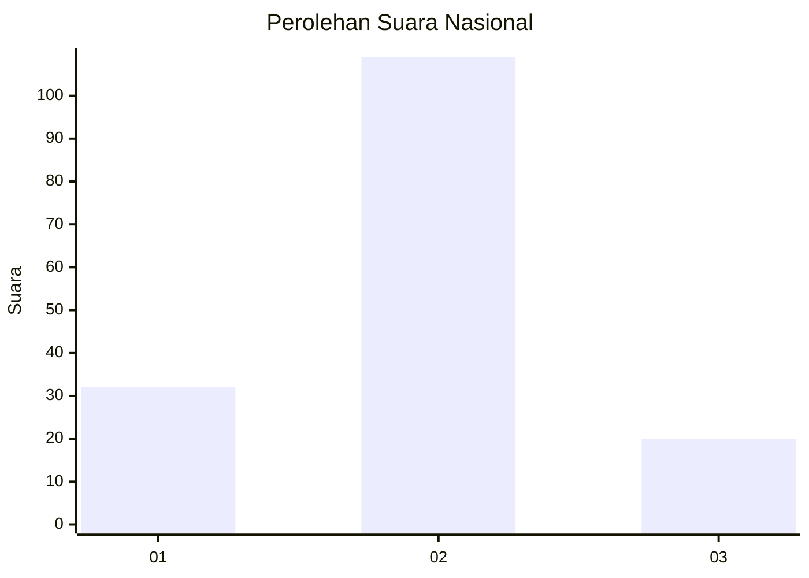
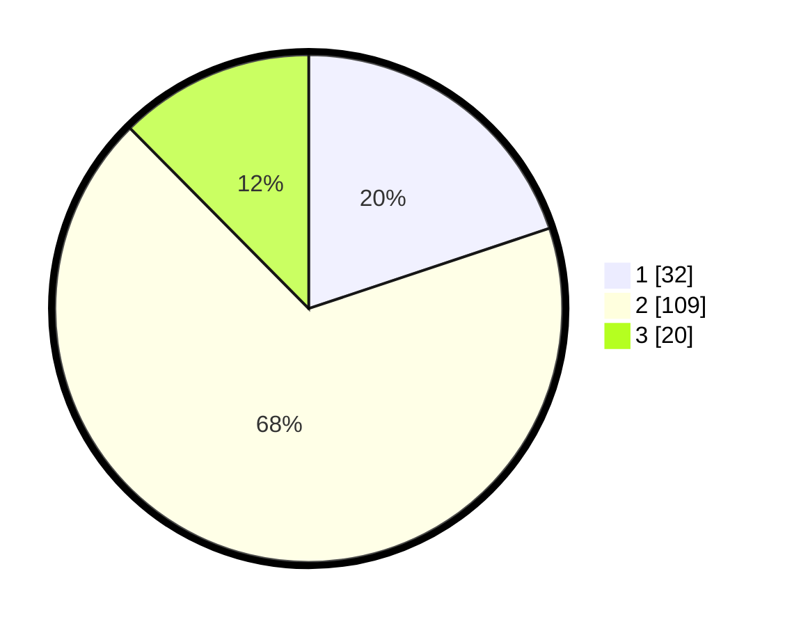

# Hasil

## Grafik

## Tabel

| No. | Nama Paslon    | Suara | Suara (raw) | Persentase |
|:--- |:-------------- | -----:| -----------:| ----------:|
| 1   | ANIES MUHAIMIN | 32    | [32][p-1]   | 19,88      |
| 2   | PRABOWO GIBRAN | 109   | [109][p-2]  | 67,70      |
| 3   | GANJAR MAHFUD  | 20    | [20][p-3]   | 12,42      |

[p-1]: https://github.com/gigit-pemilu/pemilu-2024/blob/main/pilpres/hitung-suara/sub/99-luar-negeri/sub/89-penang-malaysia/sub/01-penang-malaysia/sub/0001-penang-malaysia/sub/040-ksk-025/sub/paslon-1.txt
[p-2]: https://github.com/gigit-pemilu/pemilu-2024/blob/main/pilpres/hitung-suara/sub/99-luar-negeri/sub/89-penang-malaysia/sub/01-penang-malaysia/sub/0001-penang-malaysia/sub/040-ksk-025/sub/paslon-2.txt
[p-3]: https://github.com/gigit-pemilu/pemilu-2024/blob/main/pilpres/hitung-suara/sub/99-luar-negeri/sub/89-penang-malaysia/sub/01-penang-malaysia/sub/0001-penang-malaysia/sub/040-ksk-025/sub/paslon-3.txt

## Foto C Plano

https://sirekap-obj-formc.kpu.go.id/f458/pemilu/ppwp/99/89/01/00/01/9989010001040-20240216-161033--70e8157d-1ad3-415e-9672-04c172db7553.jpg

https://sirekap-obj-formc.kpu.go.id/f458/pemilu/ppwp/99/89/01/00/01/9989010001040-20240214-232829--f8efa1bc-2f82-4f5c-a37c-e3a66541e99f.jpg

https://sirekap-obj-formc.kpu.go.id/f458/pemilu/ppwp/99/89/01/00/01/9989010001040-20240214-233024--98844b88-d281-4f3b-8d80-616b9b1791fc.jpg

## Metadata

| Key        | Value               |
| ---------- | ------------------- |
| Time Stamp | 2024-02-21 18:00:00 |

## DATA PEMILIH TETAP

Jumlah pemilih dalam DPT: **162**.
 * L: **104**.
 * P: **58**.

## DATA PENGGUNA HAK PILIH

Jumlah pengguna hak pilih dalam DPT: **35**.
 * L: **17**.
 * P: **18**.

Jumlah pengguna hak pilih dalam DPTb: **50**.
 * L: **35**.
 * P: **15**.

Jumlah pengguna hak pilih dalam DPK: **81**.
 * L: **46**.
 * P: **35**.

Jumlah pengguna hak pilih: **166**.
 * L: **98**.
 * P: **68**.

## JUMLAH SUARA SAH DAN TIDAK SAH

JUMLAH SELURUH SUARA SAH: **161**.

JUMLAH SUARA TIDAK SAH: **5**.

JUMLAH SELURUH SUARA SAH DAN SUARA TIDAK SAH: **166**.

