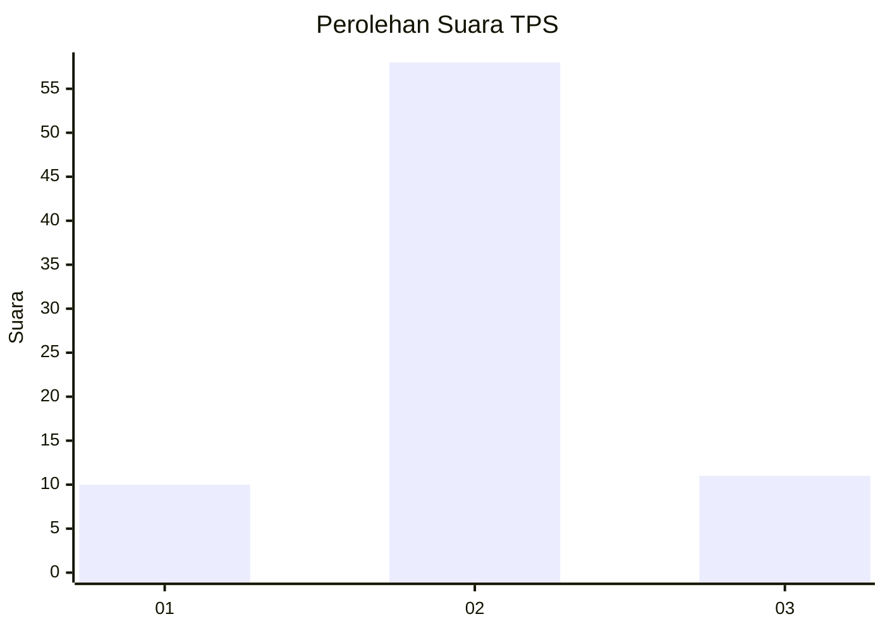
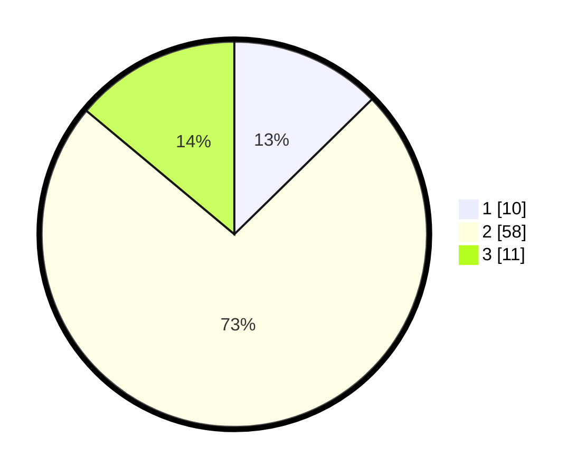

# Hasil

## Grafik

## Tabel

| No. | Nama Paslon    | Suara | Suara (raw) | Persentase |
|:--- |:-------------- | -----:| -----------:| ----------:|
| 1   | ANIES MUHAIMIN | 10    | [10][p-1]   | 12,66      |
| 2   | PRABOWO GIBRAN | 58    | [58][p-2]   | 73,42      |
| 3   | GANJAR MAHFUD  | 11    | [11][p-3]   | 13,92      |

[p-1]: https://github.com/gigit-pemilu/pemilu-2024-99-luar-negeri/blob/main/pilpres/hitung-suara/sub/99-luar-negeri/sub/89-penang-malaysia/sub/01-penang-malaysia/sub/0001-penang-malaysia/sub/041-ksk-026/sub/paslon-1.txt
[p-2]: https://github.com/gigit-pemilu/pemilu-2024-99-luar-negeri/blob/main/pilpres/hitung-suara/sub/99-luar-negeri/sub/89-penang-malaysia/sub/01-penang-malaysia/sub/0001-penang-malaysia/sub/041-ksk-026/sub/paslon-2.txt
[p-3]: https://github.com/gigit-pemilu/pemilu-2024-99-luar-negeri/blob/main/pilpres/hitung-suara/sub/99-luar-negeri/sub/89-penang-malaysia/sub/01-penang-malaysia/sub/0001-penang-malaysia/sub/041-ksk-026/sub/paslon-3.txt

## Foto C Plano

https://sirekap-obj-formc.kpu.go.id/7e87/pemilu/ppwp/99/89/01/00/01/9989010001041-20240215-031211--8a306901-277d-43e7-9f26-3d0abffc949e.jpg

https://sirekap-obj-formc.kpu.go.id/7e87/pemilu/ppwp/99/89/01/00/01/9989010001041-20240216-185144--5d3b68e5-a076-4c55-a085-a60c1be96d48.jpg

https://sirekap-obj-formc.kpu.go.id/7e87/pemilu/ppwp/99/89/01/00/01/9989010001041-20240215-031524--272d9e1e-1473-4f40-a311-a8f2b2bd8054.jpg

## Metadata

| Key        | Value               |
| ---------- | ------------------- |
| Time Stamp | 2024-02-21 18:00:00 |

## DATA PEMILIH TETAP

Jumlah pemilih dalam DPT: **627**.
 * L: **267**.
 * P: **360**.

## DATA PENGGUNA HAK PILIH

Jumlah pengguna hak pilih dalam DPT: **0**.
 * L: **0**.
 * P: **0**.

Jumlah pengguna hak pilih dalam DPTb: **36**.
 * L: **6**.
 * P: **30**.

Jumlah pengguna hak pilih dalam DPK: **43**.
 * L: **9**.
 * P: **34**.

Jumlah pengguna hak pilih: **79**.
 * L: **15**.
 * P: **64**.

## JUMLAH SUARA SAH DAN TIDAK SAH

JUMLAH SELURUH SUARA SAH: **79**.

JUMLAH SUARA TIDAK SAH: **0**.

JUMLAH SELURUH SUARA SAH DAN SUARA TIDAK SAH: **79**.

