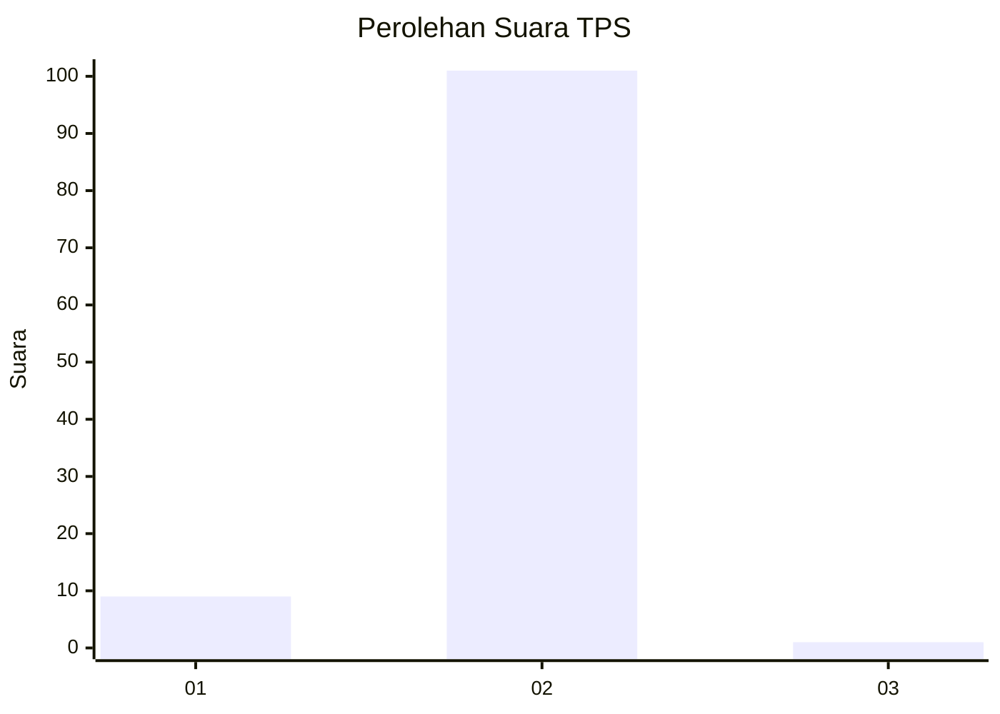
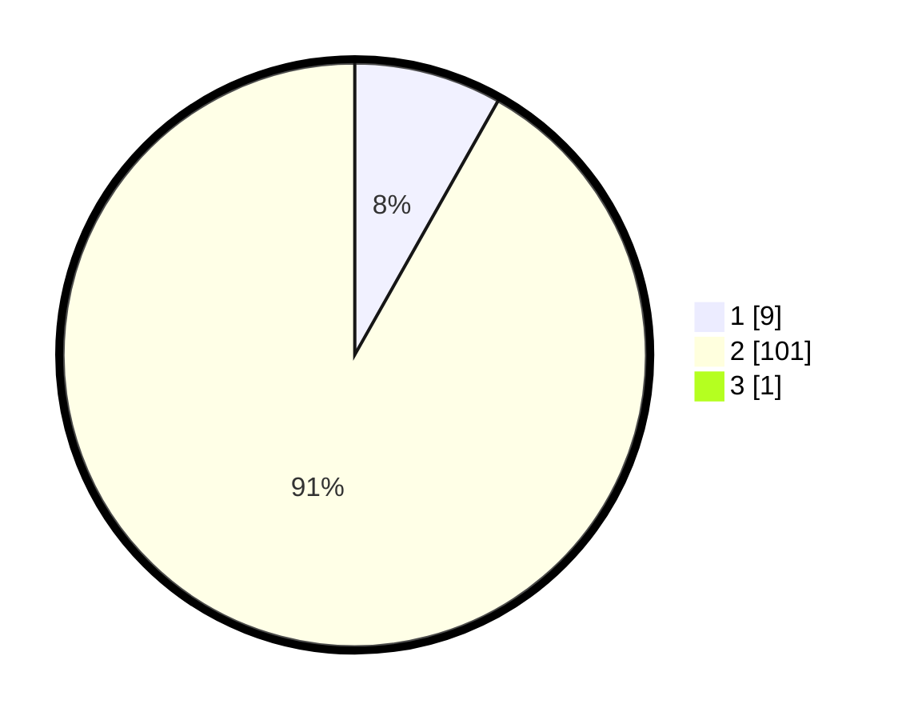

# Hasil

## Grafik

## Tabel

| No. | Nama Paslon    | Suara | Suara (raw) | Persentase |
|:--- |:-------------- | -----:| -----------:| ----------:|
| 1   | ANIES MUHAIMIN | 9     | [9][p-1]    | 8,11       |
| 2   | PRABOWO GIBRAN | 101   | [101][p-2]  | 90,99      |
| 3   | GANJAR MAHFUD  | 1     | [1][p-3]    | 0,90       |

[p-1]: https://github.com/gigit-pemilu/pemilu-2024-99-luar-negeri/blob/main/pilpres/hitung-suara/sub/99-luar-negeri/sub/89-penang-malaysia/sub/01-penang-malaysia/sub/0001-penang-malaysia/sub/046-ksk-031/sub/paslon-1.txt
[p-2]: https://github.com/gigit-pemilu/pemilu-2024-99-luar-negeri/blob/main/pilpres/hitung-suara/sub/99-luar-negeri/sub/89-penang-malaysia/sub/01-penang-malaysia/sub/0001-penang-malaysia/sub/046-ksk-031/sub/paslon-2.txt
[p-3]: https://github.com/gigit-pemilu/pemilu-2024-99-luar-negeri/blob/main/pilpres/hitung-suara/sub/99-luar-negeri/sub/89-penang-malaysia/sub/01-penang-malaysia/sub/0001-penang-malaysia/sub/046-ksk-031/sub/paslon-3.txt

## Foto C Plano

https://sirekap-obj-formc.kpu.go.id/e82a/pemilu/ppwp/99/89/01/00/01/9989010001046-20240216-193839--1ba9b292-ea69-4ae9-b86d-0834a46078b7.jpg

https://sirekap-obj-formc.kpu.go.id/e82a/pemilu/ppwp/99/89/01/00/01/9989010001046-20240216-195036--64ffd10b-08be-4e78-aeef-d94d4acc66f0.jpg

https://sirekap-obj-formc.kpu.go.id/e82a/pemilu/ppwp/99/89/01/00/01/9989010001046-20240216-195215--6336e4c1-efc9-4aaa-9402-5670ec4a6a95.jpg

## Metadata

| Key        | Value               |
| ---------- | ------------------- |
| Time Stamp | 2024-02-16 21:01:00 |

## DATA PEMILIH TETAP

Jumlah pemilih dalam DPT: **710**.
 * L: **270**.
 * P: **440**.

## DATA PENGGUNA HAK PILIH

Jumlah pengguna hak pilih dalam DPT: **6**.
 * L: **1**.
 * P: **5**.

Jumlah pengguna hak pilih dalam DPTb: **45**.
 * L: **2**.
 * P: **43**.

Jumlah pengguna hak pilih dalam DPK: **62**.
 * L: **5**.
 * P: **57**.

Jumlah pengguna hak pilih: **113**.
 * L: **8**.
 * P: **105**.

## JUMLAH SUARA SAH DAN TIDAK SAH

JUMLAH SELURUH SUARA SAH: **111**.

JUMLAH SUARA TIDAK SAH: **2**.

JUMLAH SELURUH SUARA SAH DAN SUARA TIDAK SAH: **113**.

