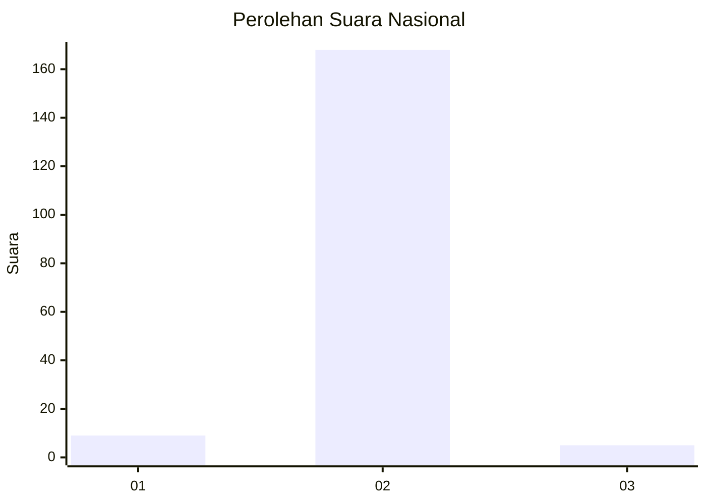
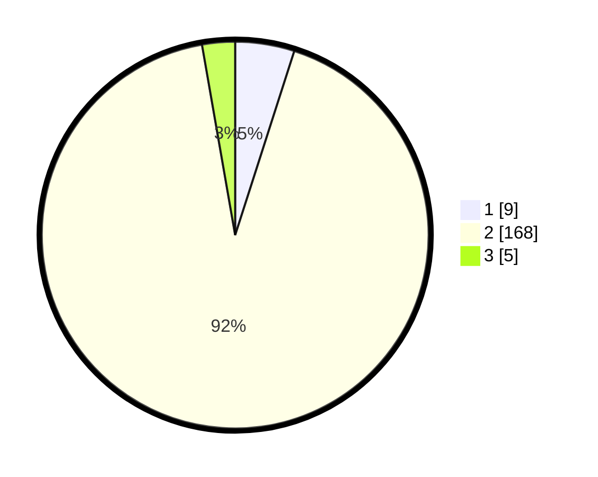

# Hasil

## Grafik

## Tabel

| No. | Nama Paslon    | Suara | Suara (raw) | Persentase |
|:--- |:-------------- | -----:| -----------:| ----------:|
| 1   | ANIES MUHAIMIN | 9     | [9][p-1]    | 4,95       |
| 2   | PRABOWO GIBRAN | 168   | [168][p-2]  | 92,31      |
| 3   | GANJAR MAHFUD  | 5     | [5][p-3]    | 2,75       |

[p-1]: https://github.com/gigit-pemilu/pemilu-2024/blob/main/pilpres/hitung-suara/sub/99-luar-negeri/sub/89-penang-malaysia/sub/01-penang-malaysia/sub/0001-penang-malaysia/sub/049-ksk-034/sub/paslon-1.txt
[p-2]: https://github.com/gigit-pemilu/pemilu-2024/blob/main/pilpres/hitung-suara/sub/99-luar-negeri/sub/89-penang-malaysia/sub/01-penang-malaysia/sub/0001-penang-malaysia/sub/049-ksk-034/sub/paslon-2.txt
[p-3]: https://github.com/gigit-pemilu/pemilu-2024/blob/main/pilpres/hitung-suara/sub/99-luar-negeri/sub/89-penang-malaysia/sub/01-penang-malaysia/sub/0001-penang-malaysia/sub/049-ksk-034/sub/paslon-3.txt

## Foto C Plano

https://sirekap-obj-formc.kpu.go.id/2e02/pemilu/ppwp/99/89/01/00/01/9989010001049-20240217-205733--b461cb77-3061-49b9-bdbb-cdc5054a3bbb.jpg

https://sirekap-obj-formc.kpu.go.id/2e02/pemilu/ppwp/99/89/01/00/01/9989010001049-20240217-205432--d2e75482-46e5-40ae-8c21-e2bedb61576b.jpg

https://sirekap-obj-formc.kpu.go.id/2e02/pemilu/ppwp/99/89/01/00/01/9989010001049-20240217-210128--fbb949fe-3af7-4fc2-b3f0-f5cb364e7ede.jpg

## Metadata

| Key        | Value               |
| ---------- | ------------------- |
| Time Stamp | 2024-02-19 06:16:00 |

## DATA PEMILIH TETAP

Jumlah pemilih dalam DPT: **356**.
 * L: **0**.
 * P: **356**.

## DATA PENGGUNA HAK PILIH

Jumlah pengguna hak pilih dalam DPT: **67**.
 * L: **0**.
 * P: **67**.

Jumlah pengguna hak pilih dalam DPTb: **108**.
 * L: **1**.
 * P: **107**.

Jumlah pengguna hak pilih dalam DPK: **10**.
 * L: **0**.
 * P: **10**.

Jumlah pengguna hak pilih: **185**.
 * L: **1**.
 * P: **184**.

## JUMLAH SUARA SAH DAN TIDAK SAH

JUMLAH SELURUH SUARA SAH: **182**.

JUMLAH SUARA TIDAK SAH: **3**.

JUMLAH SELURUH SUARA SAH DAN SUARA TIDAK SAH: **185**.

