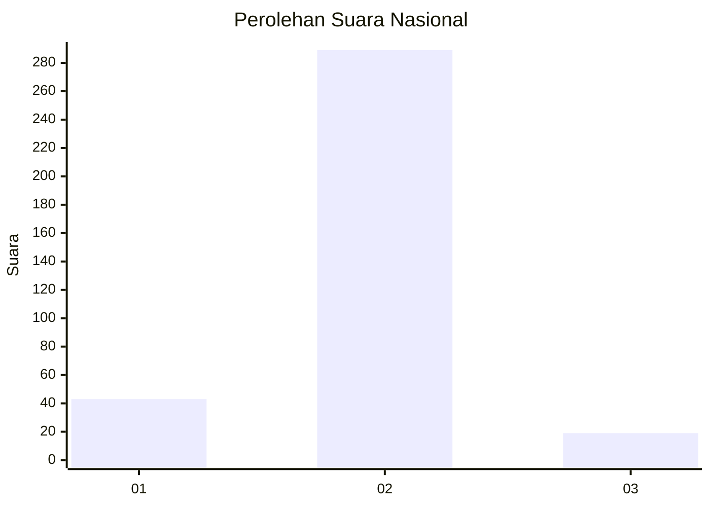
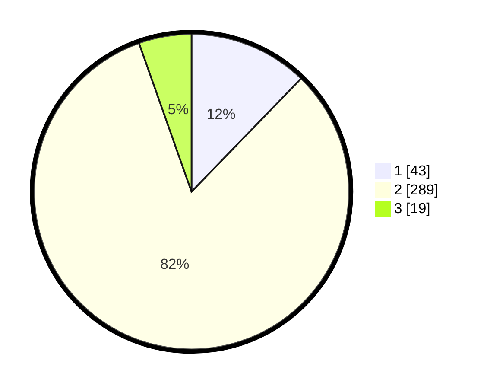

# Hasil

## Grafik

## Tabel

| No. | Nama Paslon    | Suara | Suara (raw) | Persentase |
|:--- |:-------------- | -----:| -----------:| ----------:|
| 1   | ANIES MUHAIMIN | 43    | [43][p-1]   | 12,25      |
| 2   | PRABOWO GIBRAN | 289   | [289][p-2]  | 82,34      |
| 3   | GANJAR MAHFUD  | 19    | [19][p-3]   | 5,41       |

[p-1]: https://github.com/gigit-pemilu/pemilu-2024/blob/main/pilpres/hitung-suara/sub/99-luar-negeri/sub/89-penang-malaysia/sub/01-penang-malaysia/sub/0001-penang-malaysia/sub/051-ksk-036/sub/paslon-1.txt
[p-2]: https://github.com/gigit-pemilu/pemilu-2024/blob/main/pilpres/hitung-suara/sub/99-luar-negeri/sub/89-penang-malaysia/sub/01-penang-malaysia/sub/0001-penang-malaysia/sub/051-ksk-036/sub/paslon-2.txt
[p-3]: https://github.com/gigit-pemilu/pemilu-2024/blob/main/pilpres/hitung-suara/sub/99-luar-negeri/sub/89-penang-malaysia/sub/01-penang-malaysia/sub/0001-penang-malaysia/sub/051-ksk-036/sub/paslon-3.txt

## Foto C Plano

https://sirekap-obj-formc.kpu.go.id/66d7/pemilu/ppwp/99/89/01/00/01/9989010001051-20240217-192524--6f44aec4-d433-41df-aa7f-418cc2759bec.jpg

https://sirekap-obj-formc.kpu.go.id/66d7/pemilu/ppwp/99/89/01/00/01/9989010001051-20240217-193517--57dfc8f2-8c56-4116-a6a9-c83074071655.jpg

https://sirekap-obj-formc.kpu.go.id/66d7/pemilu/ppwp/99/89/01/00/01/9989010001051-20240217-193932--b33e105c-549d-4514-bff0-4902db4a2895.jpg

## Metadata

| Key        | Value               |
| ---------- | ------------------- |
| Time Stamp | 2024-02-21 19:00:00 |

## DATA PEMILIH TETAP

Jumlah pemilih dalam DPT: **351**.
 * L: **0**.
 * P: **351**.

## DATA PENGGUNA HAK PILIH

Jumlah pengguna hak pilih dalam DPT: **351**.
 * L: **90000**.
 * P: **351**.

Jumlah pengguna hak pilih dalam DPTb: **351**.
 * L: **0**.
 * P: **351**.

Jumlah pengguna hak pilih dalam DPK: **351**.
 * L: **0**.
 * P: **351**.

Jumlah pengguna hak pilih: **351**.
 * L: **10110**.
 * P: **0**.

## JUMLAH SUARA SAH DAN TIDAK SAH

JUMLAH SELURUH SUARA SAH: **351**.

JUMLAH SUARA TIDAK SAH: **1**.

JUMLAH SELURUH SUARA SAH DAN SUARA TIDAK SAH: **351**.

