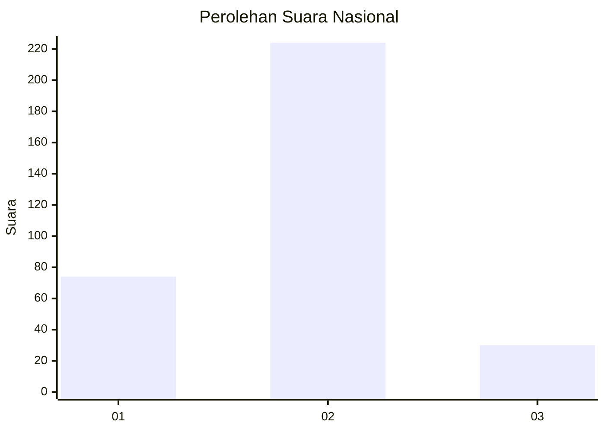

# Hasil

## Grafik

```mermaid
%%{init: {"pie": {"textPosition": 0.5}, "themeVariables": {"pieOuterStrokeWidth": "5px"}} }%%
pie showData
    "1" : 74
    "2" : 224
    "3" : 30
```

## Tabel

| No. | Nama Paslon    | Suara | Suara (raw) | Persentase |
|:--- |:-------------- | -----:| -----------:| ----------:|
| 1   | ANIES MUHAIMIN | 74    | [74][p-1]   | 22,56      |
| 2   | PRABOWO GIBRAN | 224   | [224][p-2]  | 68,29      |
| 3   | GANJAR MAHFUD  | 30    | [30][p-3]   | 9,15       |

[p-1]: https://github.com/gigit-pemilu/pemilu-2024/blob/main/pilpres/hitung-suara/sub/99-luar-negeri/sub/89-penang-malaysia/sub/01-penang-malaysia/sub/0001-penang-malaysia/sub/058-ksk-043/sub/paslon-1.txt
[p-2]: https://github.com/gigit-pemilu/pemilu-2024/blob/main/pilpres/hitung-suara/sub/99-luar-negeri/sub/89-penang-malaysia/sub/01-penang-malaysia/sub/0001-penang-malaysia/sub/058-ksk-043/sub/paslon-2.txt
[p-3]: https://github.com/gigit-pemilu/pemilu-2024/blob/main/pilpres/hitung-suara/sub/99-luar-negeri/sub/89-penang-malaysia/sub/01-penang-malaysia/sub/0001-penang-malaysia/sub/058-ksk-043/sub/paslon-3.txt

## Foto C Plano

https://sirekap-obj-formc.kpu.go.id/ed62/pemilu/ppwp/99/89/01/00/01/9989010001058-20240217-120227--adf10d30-b1b9-4188-8fbb-4ac6e7ef3ad1.jpg

https://sirekap-obj-formc.kpu.go.id/ed62/pemilu/ppwp/99/89/01/00/01/9989010001058-20240217-120600--b1730139-5fac-4af9-b223-9854bfb4060a.jpg

https://sirekap-obj-formc.kpu.go.id/ed62/pemilu/ppwp/99/89/01/00/01/9989010001058-20240217-120647--893ff8d5-9cbe-459a-b2c8-b77aded7fda3.jpg

## Metadata

| Key        | Value               |
| ---------- | ------------------- |
| Time Stamp | 2024-02-17 13:37:34 |

## DATA PEMILIH TETAP

Jumlah pemilih dalam DPT: **647**.
 * L: **0**.
 * P: **0**.

## DATA PENGGUNA HAK PILIH

Jumlah pengguna hak pilih dalam DPT: **34**.
 * L: **13**.
 * P: **25**.

Jumlah pengguna hak pilih dalam DPTb: **21**.
 * L: **1**.
 * P: **20**.

Jumlah pengguna hak pilih dalam DPK: **283**.
 * L: **8**.
 * P: **195**.

Jumlah pengguna hak pilih: **338**.
 * L: **102**.
 * P: **236**.

## JUMLAH SUARA SAH DAN TIDAK SAH

JUMLAH SELURUH SUARA SAH: **328**.

JUMLAH SUARA TIDAK SAH: **10**.

JUMLAH SELURUH SUARA SAH DAN SUARA TIDAK SAH: **338**.

