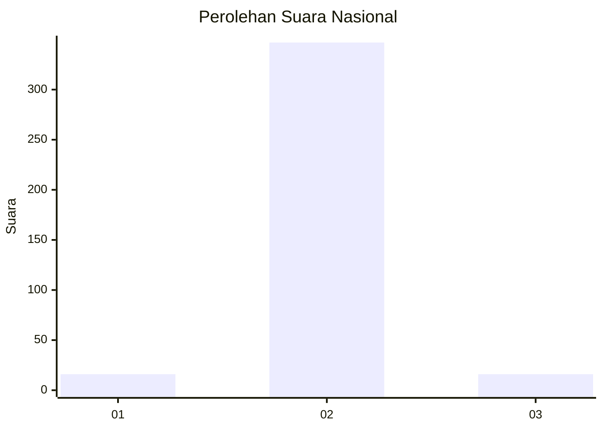
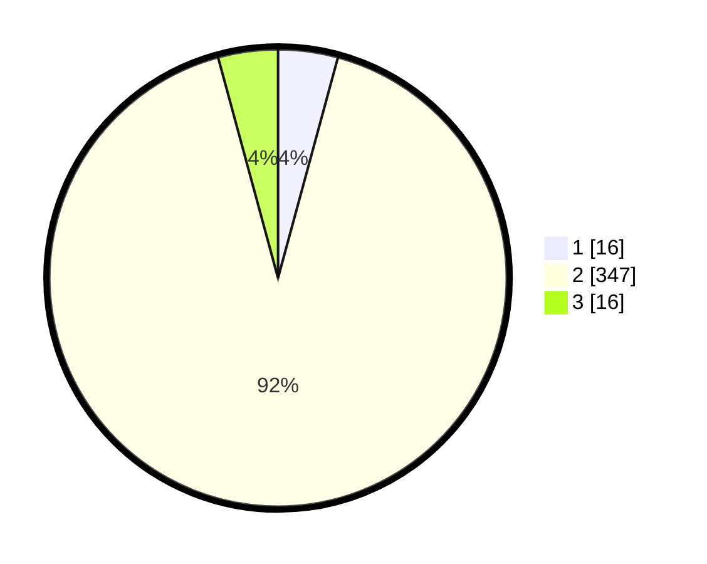

# Hasil

## Grafik

## Tabel

| No. | Nama Paslon    | Suara | Suara (raw) | Persentase |
|:--- |:-------------- | -----:| -----------:| ----------:|
| 1   | ANIES MUHAIMIN | 16    | [16][p-1]   | 4,22       |
| 2   | PRABOWO GIBRAN | 347   | [347][p-2]  | 91,56      |
| 3   | GANJAR MAHFUD  | 16    | [16][p-3]   | 4,22       |

[p-1]: https://github.com/gigit-pemilu/pemilu-2024/blob/main/pilpres/hitung-suara/sub/99-luar-negeri/sub/89-penang-malaysia/sub/01-penang-malaysia/sub/0001-penang-malaysia/sub/068-ksk-053/sub/paslon-1.txt
[p-2]: https://github.com/gigit-pemilu/pemilu-2024/blob/main/pilpres/hitung-suara/sub/99-luar-negeri/sub/89-penang-malaysia/sub/01-penang-malaysia/sub/0001-penang-malaysia/sub/068-ksk-053/sub/paslon-2.txt
[p-3]: https://github.com/gigit-pemilu/pemilu-2024/blob/main/pilpres/hitung-suara/sub/99-luar-negeri/sub/89-penang-malaysia/sub/01-penang-malaysia/sub/0001-penang-malaysia/sub/068-ksk-053/sub/paslon-3.txt

## Foto C Plano

https://sirekap-obj-formc.kpu.go.id/6a77/pemilu/ppwp/99/89/01/00/01/9989010001068-20240216-091347--207eea1e-2a18-47ac-b1c0-f1f641d3b109.jpg

https://sirekap-obj-formc.kpu.go.id/6a77/pemilu/ppwp/99/89/01/00/01/9989010001068-20240216-091503--f7202295-377f-4485-88d5-588b9c5ae1fc.jpg

https://sirekap-obj-formc.kpu.go.id/6a77/pemilu/ppwp/99/89/01/00/01/9989010001068-20240216-091602--1544d256-be44-42c8-a6f9-7d4f54949d70.jpg

## Metadata

| Key        | Value               |
| ---------- | ------------------- |
| Time Stamp | 2024-02-21 18:00:00 |

## DATA PEMILIH TETAP

Jumlah pemilih dalam DPT: **349**.
 * L: **0**.
 * P: **349**.

## DATA PENGGUNA HAK PILIH

Jumlah pengguna hak pilih dalam DPT: **58**.
 * L: **0**.
 * P: **58**.

Jumlah pengguna hak pilih dalam DPTb: **40**.
 * L: **0**.
 * P: **40**.

Jumlah pengguna hak pilih dalam DPK: **288**.
 * L: **0**.
 * P: **288**.

Jumlah pengguna hak pilih: **386**.
 * L: **0**.
 * P: **386**.

## JUMLAH SUARA SAH DAN TIDAK SAH

JUMLAH SELURUH SUARA SAH: **379**.

JUMLAH SUARA TIDAK SAH: **6**.

JUMLAH SELURUH SUARA SAH DAN SUARA TIDAK SAH: **385**.

