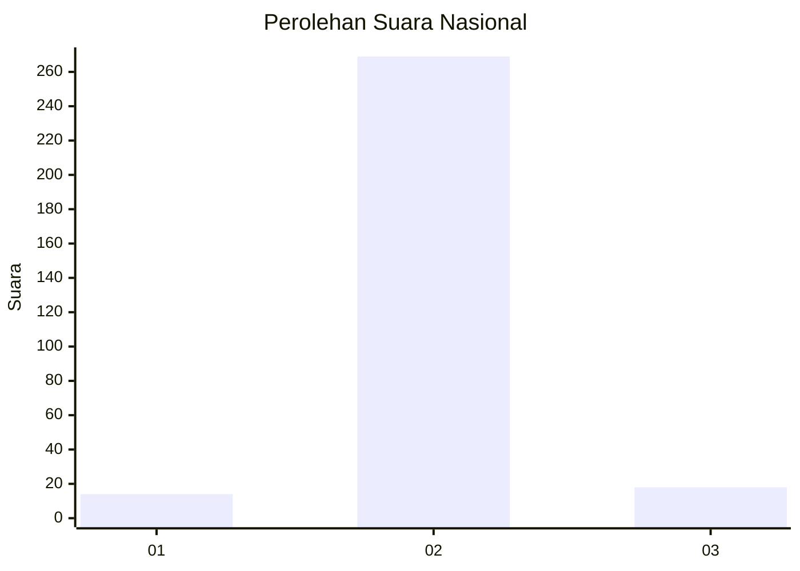
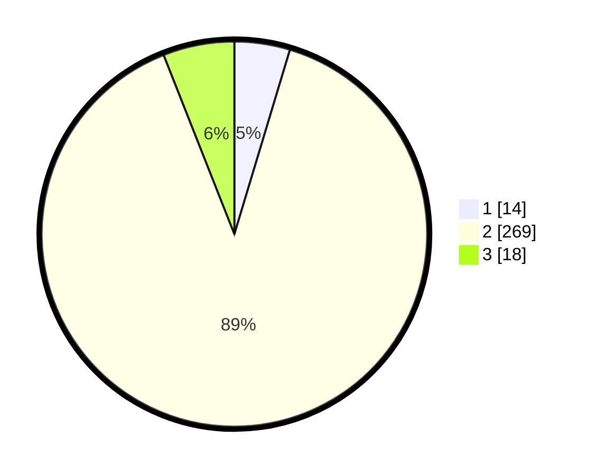

# Hasil

## Grafik

## Tabel

| No. | Nama Paslon    | Suara | Suara (raw) | Persentase |
|:--- |:-------------- | -----:| -----------:| ----------:|
| 1   | ANIES MUHAIMIN | 14    | [14][p-1]   | 4,65       |
| 2   | PRABOWO GIBRAN | 269   | [269][p-2]  | 89,37      |
| 3   | GANJAR MAHFUD  | 18    | [18][p-3]   | 5,98       |

[p-1]: https://github.com/gigit-pemilu/pemilu-2024/blob/main/pilpres/hitung-suara/sub/99-luar-negeri/sub/89-penang-malaysia/sub/01-penang-malaysia/sub/0001-penang-malaysia/sub/070-ksk-055/sub/paslon-1.txt
[p-2]: https://github.com/gigit-pemilu/pemilu-2024/blob/main/pilpres/hitung-suara/sub/99-luar-negeri/sub/89-penang-malaysia/sub/01-penang-malaysia/sub/0001-penang-malaysia/sub/070-ksk-055/sub/paslon-2.txt
[p-3]: https://github.com/gigit-pemilu/pemilu-2024/blob/main/pilpres/hitung-suara/sub/99-luar-negeri/sub/89-penang-malaysia/sub/01-penang-malaysia/sub/0001-penang-malaysia/sub/070-ksk-055/sub/paslon-3.txt

## Foto C Plano

https://sirekap-obj-formc.kpu.go.id/32a3/pemilu/ppwp/99/89/01/00/01/9989010001070-20240216-202123--fada15ca-ea95-4b4d-ba93-a0f1af9f526e.jpg

https://sirekap-obj-formc.kpu.go.id/32a3/pemilu/ppwp/99/89/01/00/01/9989010001070-20240216-203518--52566ca2-4eda-46dd-9a83-237fdbc793ef.jpg

https://sirekap-obj-formc.kpu.go.id/32a3/pemilu/ppwp/99/89/01/00/01/9989010001070-20240216-175935--a99bd691-b0e2-4fb9-bfa3-ddd47b44cb94.jpg

## Metadata

| Key        | Value               |
| ---------- | ------------------- |
| Time Stamp | 2024-02-16 21:01:00 |

## DATA PEMILIH TETAP

Jumlah pemilih dalam DPT: **349**.
 * L: **194**.
 * P: **155**.

## DATA PENGGUNA HAK PILIH

Jumlah pengguna hak pilih dalam DPT: **0**.
 * L: **0**.
 * P: **0**.

Jumlah pengguna hak pilih dalam DPTb: **98**.
 * L: **0**.
 * P: **98**.

Jumlah pengguna hak pilih dalam DPK: **204**.
 * L: **1**.
 * P: **203**.

Jumlah pengguna hak pilih: **302**.
 * L: **1**.
 * P: **301**.

## JUMLAH SUARA SAH DAN TIDAK SAH

JUMLAH SELURUH SUARA SAH: **301**.

JUMLAH SUARA TIDAK SAH: **1**.

JUMLAH SELURUH SUARA SAH DAN SUARA TIDAK SAH: **302**.

