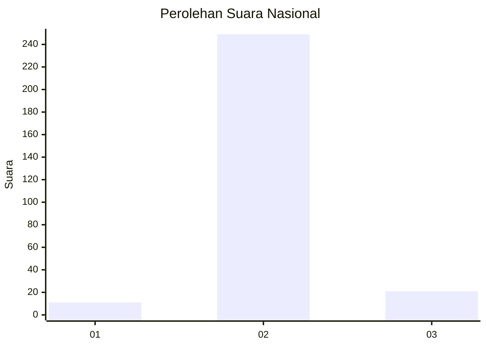
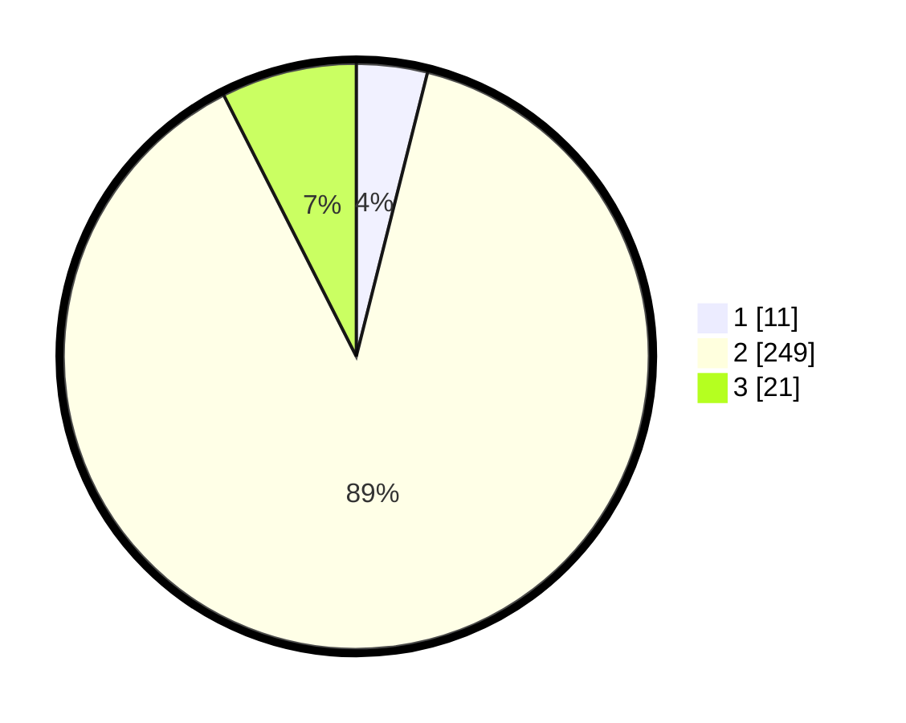

# Hasil

## Grafik

## Tabel

| No. | Nama Paslon    | Suara | Suara (raw) | Persentase |
|:--- |:-------------- | -----:| -----------:| ----------:|
| 1   | ANIES MUHAIMIN | 11    | [11][p-1]   | 3,91       |
| 2   | PRABOWO GIBRAN | 249   | [249][p-2]  | 88,61      |
| 3   | GANJAR MAHFUD  | 21    | [21][p-3]   | 7,47       |

[p-1]: https://github.com/gigit-pemilu/pemilu-2024/blob/main/pilpres/hitung-suara/sub/99-luar-negeri/sub/89-penang-malaysia/sub/01-penang-malaysia/sub/0001-penang-malaysia/sub/075-ksk-060/sub/paslon-1.txt
[p-2]: https://github.com/gigit-pemilu/pemilu-2024/blob/main/pilpres/hitung-suara/sub/99-luar-negeri/sub/89-penang-malaysia/sub/01-penang-malaysia/sub/0001-penang-malaysia/sub/075-ksk-060/sub/paslon-2.txt
[p-3]: https://github.com/gigit-pemilu/pemilu-2024/blob/main/pilpres/hitung-suara/sub/99-luar-negeri/sub/89-penang-malaysia/sub/01-penang-malaysia/sub/0001-penang-malaysia/sub/075-ksk-060/sub/paslon-3.txt

## Foto C Plano

https://sirekap-obj-formc.kpu.go.id/e890/pemilu/ppwp/99/89/01/00/01/9989010001075-20240217-120303--06e91b96-4cdb-4b0f-a418-13e37f02119b.jpg

https://sirekap-obj-formc.kpu.go.id/e890/pemilu/ppwp/99/89/01/00/01/9989010001075-20240217-122228--6291101a-b171-45ce-84e3-b832b7a1a12d.jpg

https://sirekap-obj-formc.kpu.go.id/e890/pemilu/ppwp/99/89/01/00/01/9989010001075-20240217-122524--896afb31-df72-4341-a405-d4d028adb5b0.jpg

## Metadata

| Key        | Value               |
| ---------- | ------------------- |
| Time Stamp | 2024-02-17 13:37:34 |

## DATA PEMILIH TETAP

Jumlah pemilih dalam DPT: **1139**.
 * L: **0**.
 * P: **1139**.

## DATA PENGGUNA HAK PILIH

Jumlah pengguna hak pilih dalam DPT: **264**.
 * L: **0**.
 * P: **264**.

Jumlah pengguna hak pilih dalam DPTb: **10**.
 * L: **0**.
 * P: **10**.

Jumlah pengguna hak pilih dalam DPK: **10**.
 * L: **0**.
 * P: **10**.

Jumlah pengguna hak pilih: **284**.
 * L: **0**.
 * P: **284**.

## JUMLAH SUARA SAH DAN TIDAK SAH

JUMLAH SELURUH SUARA SAH: **281**.

JUMLAH SUARA TIDAK SAH: **3**.

JUMLAH SELURUH SUARA SAH DAN SUARA TIDAK SAH: **284**.

