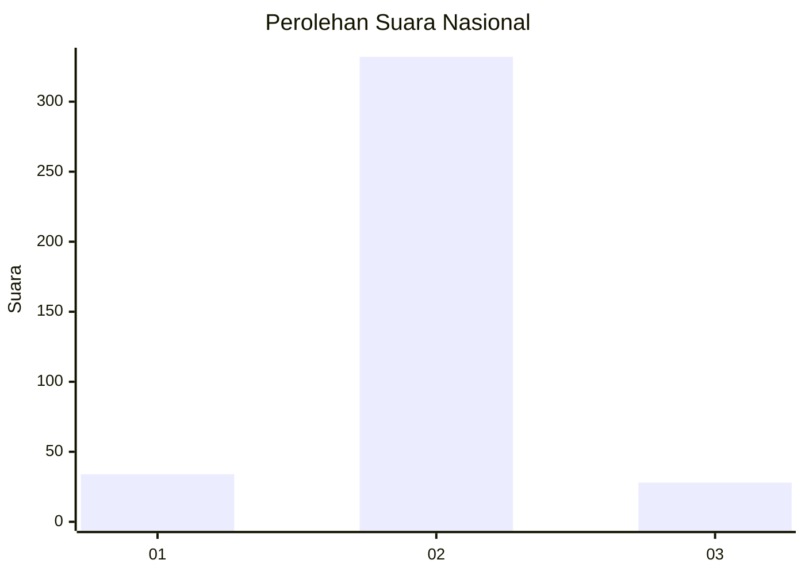
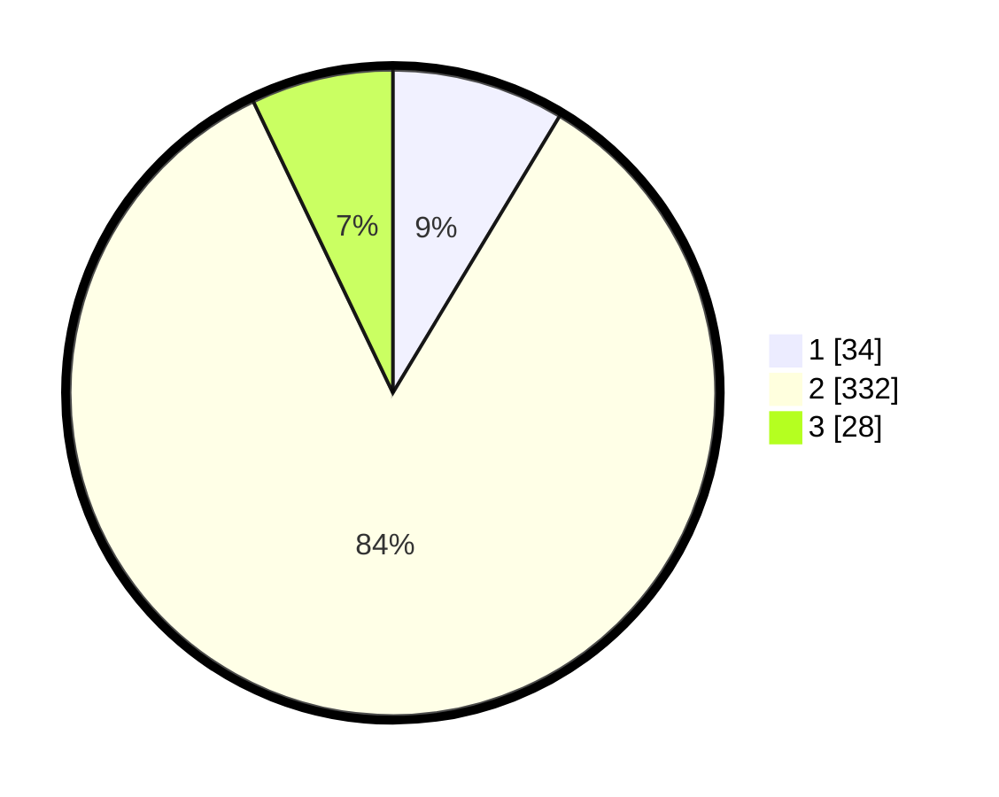

# Hasil

## Grafik

## Tabel

| No. | Nama Paslon    | Suara | Suara (raw) | Persentase |
|:--- |:-------------- | -----:| -----------:| ----------:|
| 1   | ANIES MUHAIMIN | 34    | [34][p-1]   | 8,63       |
| 2   | PRABOWO GIBRAN | 332   | [332][p-2]  | 84,26      |
| 3   | GANJAR MAHFUD  | 28    | [28][p-3]   | 7,11       |

[p-1]: https://github.com/gigit-pemilu/pemilu-2024/blob/main/pilpres/hitung-suara/sub/99-luar-negeri/sub/89-penang-malaysia/sub/01-penang-malaysia/sub/0001-penang-malaysia/sub/077-ksk-062/sub/paslon-1.txt
[p-2]: https://github.com/gigit-pemilu/pemilu-2024/blob/main/pilpres/hitung-suara/sub/99-luar-negeri/sub/89-penang-malaysia/sub/01-penang-malaysia/sub/0001-penang-malaysia/sub/077-ksk-062/sub/paslon-2.txt
[p-3]: https://github.com/gigit-pemilu/pemilu-2024/blob/main/pilpres/hitung-suara/sub/99-luar-negeri/sub/89-penang-malaysia/sub/01-penang-malaysia/sub/0001-penang-malaysia/sub/077-ksk-062/sub/paslon-3.txt

## Foto C Plano

https://sirekap-obj-formc.kpu.go.id/eb1c/pemilu/ppwp/99/89/01/00/01/9989010001077-20240217-100701--2ec622de-1424-40c6-8c8e-8960ec0398fd.jpg

https://sirekap-obj-formc.kpu.go.id/eb1c/pemilu/ppwp/99/89/01/00/01/9989010001077-20240217-101415--e9c5e3f7-52a4-427f-be18-d58360d23c8c.jpg

https://sirekap-obj-formc.kpu.go.id/eb1c/pemilu/ppwp/99/89/01/00/01/9989010001077-20240217-101626--820072ef-422b-43ec-9c18-f51632f3725f.jpg

## Metadata

| Key        | Value               |
| ---------- | ------------------- |
| Time Stamp | 2024-02-17 10:30:03 |

## DATA PEMILIH TETAP

Jumlah pemilih dalam DPT: **624**.
 * L: **190**.
 * P: **434**.

## DATA PENGGUNA HAK PILIH

Jumlah pengguna hak pilih dalam DPT: **23**.
 * L: **0**.
 * P: **23**.

Jumlah pengguna hak pilih dalam DPTb: **29**.
 * L: **6**.
 * P: **23**.

Jumlah pengguna hak pilih dalam DPK: **354**.
 * L: **6**.
 * P: **348**.

Jumlah pengguna hak pilih: **406**.
 * L: **12**.
 * P: **394**.

## JUMLAH SUARA SAH DAN TIDAK SAH

JUMLAH SELURUH SUARA SAH: **394**.

JUMLAH SUARA TIDAK SAH: **12**.

JUMLAH SELURUH SUARA SAH DAN SUARA TIDAK SAH: **406**.

